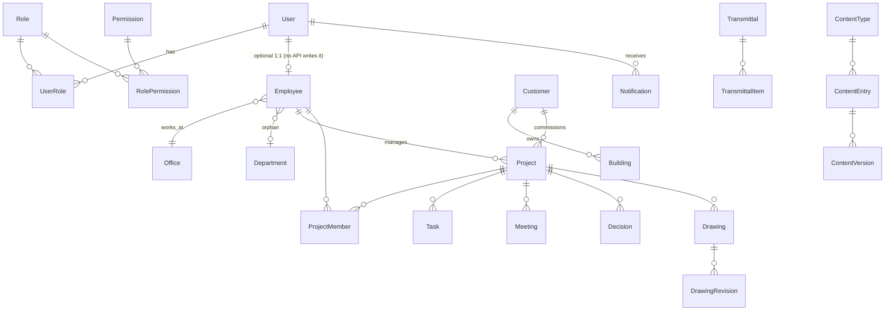

# Complete application audit — 23 September 2026

The central technical and product map of the IEM platform: what exists, how it fits together,
where it hurts, and what should happen next. Read from the source, not from the documentation;
where the two disagree the source wins and the disagreement is listed in Appendix B.

> **This is an audit, not a change.** Nothing in `src/`, `server/`, `e2e/` or `deploy/` was
> modified to write it. Every proposal in Parts 6, 7, 9, 14, 26–32 is a proposal for review, and
> the UX redesign does not begin until this document has been reviewed.
>
> **P0 update, 23 September 2026.** The P0 band of Part 32 — SEC-1 to SEC-5 — has since been
> implemented. The findings below are left exactly as the audit found them; **Part 34** records
> what was resolved, in which commit, and what proves it.
>
> **P1A update, 23 September 2026.** The UX defect sweep — the `UX-0` band of Part 27 — has been
> implemented. Resolved rows in the Part 24 register carry **✅ P1A** (or **◐ P1A** where part of
> the finding remains); the text of each finding is unchanged. **Part 35** records the
> reconciliation against HEAD, the commits, the tests and what is still open.
>
> **P1B update, 23 September 2026.** The role-aware workspace navigation — Part 6's proposal — has
> been implemented. Resolved rows carry **✅ P1B** / **◐ P1B**; **Part 36** records the matrix taken
> before the change, the registry, the audiences, what each role now sees, and the verification.
>
> **P1C update, 23 September 2026.** The forms, actions and interaction standard — the `UX-2`
> band of Part 27 — has been implemented. Resolved rows carry **✅ P1C** / **◐ P1C**; **Part 37**
> records the inventory taken before the change, the standard itself (the rule for every future
> module), what changed and what it was verified with. The Edit Website workspace (P2) has not
> been started.

**Relationship to the other audits.** `docs/CURRENT_APPLICATION_AUDIT.md` (19 September) is the
platform-maturity audit that drove P0–P2; it is still correct about what it covers and is not
repeated here. `docs/system-audit.md` predates the foundation. `docs/PROJECT_IMPLEMENTATION_CHECKLIST.md`
covers the public site only. This document is wider than all three: it adds the **product**
view — navigation, roles, forms, website editing, responsive, accessibility — and a **threat
model** that the earlier audits did not attempt.

**Method.** Seven parallel read-only passes, each over one slice of the tree (public site;
dashboard shell and navigation; RBAC and row scope; security; forms, components and states;
API and data model; responsive, accessibility, performance and tests), followed by direct
re-verification of every finding rated High or above. The build and both unit suites were run
on the day:

| Measured on 23 September 2026 | |
| --- | --- |
| `npm run build` | passes, 13.1 s, 307 modules |
| Client vitest | 38 files, **861 tests**, all green |
| Server vitest | 60 files, **1'636 tests**, all green |
| `npm audit` (root / server) | 9 advisories (4 high) / 2 moderate — **all dev or build tooling**, none in a runtime dependency |
| e2e | not run (needs live servers); 28 specs read |

**Verification markers.** A finding marked **✔ verified** was re-read in the source by the
author of this document after the slice audit reported it. **◇ by reading** means it follows
from the code but was not reproduced in a running system. Everything else is counted.

**Contents**

| | | | |
| --- | --- | --- | --- |
| 1 [Executive summary](#part-1--executive-summary) | 10 [Form UX](#part-10--form-ux-audit) | 19 [API inventory](#part-19--api-inventory) | 28 [Security migration](#part-28--security-migration-plan) · 34 [P0 record](#part-34--p0-resolution-record) · 35 [P1A record](#part-35--p1a-resolution-record) · 36 [P1B record](#part-36--p1b-navigation-record) · 37 [P1C record](#part-37--p1c-forms-actions-and-interaction-standard) |
| 2 [Application map](#part-2--complete-application-map) | 11 [Buttons & actions](#part-11--button--action-audit) | 20 [Components](#part-20--global-component--design-system-audit) | 29 [Role migration](#part-29--role--permission-migration-plan) |
| 3 [Public website](#part-3--public-website-audit) | 12 [Tabs](#part-12--tabs--sub-navigation-audit) | 21 [Layers](#part-21--architectural-layers) | 30 [Website Editor blueprint](#part-30--edit-website-target-architecture) |
| 4 [Route map](#part-4--dashboard-route-map) | 13 [Tables](#part-13--table-ux-audit) | 22 [Performance](#part-22--performance) | 31 [User journeys](#part-31--user-journeys) |
| 5 [Navigation audit](#part-5--current-navigation-audit) | 14 [Home by role](#part-14--dashboard-home-by-role) | 23 [Error handling](#part-23--error-handling) | 32 [Priority order](#part-32--recommended-priority-order) |
| 6 [Proposed IA](#part-6--proposed-enterprise-information-architecture) | 15 [Responsive](#part-15--responsive-design-audit) | 24 [UX register](#part-24--complete-ux-problem-register) | 33 [What must not change](#part-33--what-must-not-change) |
| 7 [Roles](#part-7--role-based-dashboard-experience) | 16 [Accessibility](#part-16--accessibility-audit) | 25 [Security register](#part-25--security-risk-register) | A [Validation](#appendix-a--validation) |
| 8 [RBAC](#part-8--rbac--permission-audit) | 17 [Security](#part-17--security-architecture-review) | 26 [Future architecture](#part-26--proposed-future-dashboard-architecture) | B [Documentation drift](#appendix-b--documentation-drift) |
| 9 [Edit Website](#part-9--edit-website-master-experience) | 18 [Data model](#part-18--data-model--database) | 27 [UX migration](#part-27--ux-migration-plan) | |

---

## Part 1 — Executive summary

### 1.1 What the application is today

IEM is three products sharing one repository and one database:

1. **A public website** for IEM AG (Gebäudetechnik-Planung, Thun and Bern) — a single-page
   React site plus a job-advert page, rendering a published `ContentSnapshot` over a copy
   compiled into the bundle. Every visible text is editable; the 3D Guglera model and the SIA
   phase animations are generated from CAD.
2. **A CMS** for that site — 35 content types, a draft → review → approve → publish workflow,
   versioned snapshots, scheduled publishing, media library, applicant dossiers.
3. **An enterprise platform** that has grown out of the CMS — Projects (reference module),
   Aufgaben, Sitzungen und Entscheide, Pläne und Planversand, with read-only slices of
   Customers, Buildings, Employees and Disciplines; and the platform services around them:
   RBAC with row-level scope, MFA, sessions, notifications, e-mail operations, backup and
   recovery with drills, a job queue, a System Control Center, versioning with optimistic locks,
   module metrics and an event-derived audit log.

In numbers: **33 dashboard route patterns** (26 distinct screens), **237 API route handlers** in
31 controllers, **60 Prisma models** and 51 enums over 17 migrations, **120 permission keys** from
24 resources, **15 seeded roles**, **98 domain events** (73 raised), 17 job types (9 with a
handler), 28 Playwright specs and 2'497 unit tests.

### 1.2 Maturity by domain

| Domain | State | Why |
| --- | --- | --- |
| Architecture & layering | **MATURE** | Five layers on both sides, enforced by two architecture tests; shrink-only debt lists; one reference implementation per pattern |
| Authentication (sessions, rotation, MFA) | **MATURE** | Argon2id, hashed opaque tokens, rotation with family revocation and a grace window, TOTP with atomic replay guard, re-authentication window |
| Publishing workflow | **GOOD** | Snapshot model, derived publish effect, transition matrix under test, e2e against the public document. Weak in the *editor's* experience, not in the engine |
| Backup & recovery | **GOOD** | Verified artifacts, retention that cannot reach zero, recovery drill. One defect: a failed in-place restore **retries itself** (Part 25, SEC-R4) |
| Notifications & mail | **GOOD** | One platform, typed catalogue, sanitized failures, encrypted credential |
| Business modules (Projects, Tasks, Meetings, Drawings) | **GOOD** | Full pattern, events, versioning, metrics. Row scope has gaps (create, one history route) |
| Authorization (RBAC) | **HIGH-RISK** | Deny-by-default holds, but **role assignment has no ceiling**: any `user.assign` holder — the seeded `administrator` — can make anyone Super Admin. Scope defaults fail open |
| Customer / external access | **MISSING** | No user↔customer link, no membership model for outsiders, master data and audit unscoped. RBAC alone cannot isolate a customer |
| Website editing UX | **WEAK** | 35 technical content types, four screens and eleven clicks for one headline, no draft preview, broken reorder, SEO type that affects nothing |
| Dashboard navigation | **WEAK** | 21 top-level rows and 73 destinations for a Super Admin; website content and administration mixed in one rail; "Unternehmen" twice |
| Forms & actions | **PARTIAL** | Good primitives (`useForm`, `SaveBar`, `FilterBar`) used by 1–3 screens each; three form generations side by side; silent failures reported as success |
| Role-specific experience | **WEAK** | One home page, website-only KPIs; no role concept in the UI beyond hiding rows |
| Responsive | **PARTIAL** | Rail, drawers and tables adapt; no card layout for tables; 14-tab strip; hover-only controls |
| Accessibility | **GOOD** (dashboard) / **PARTIAL** (site) | axe WCAG 2.1 AA on 30 screens × 2 themes, native `<dialog>`, contrast tests. Gaps: clickable rows not keyboard-operable, off-canvas rail not inert, public site never scanned |
| Production deployment (`deploy/`) | **HIGH-RISK** | Installer omits `TRUST_PROXY` and both encryption keys the API reads; nginx drops security headers on the HTML documents |
| Public site SEO | **WEAK** | Client-rendered only; `seo` content type consumed by nothing; no OG, canonical, sitemap, robots |
| Operations visibility | **GOOD** | System Control Center, diagnostics, job operations, metrics. No log store (stated, not hidden) |

### 1.3 Strengths

- **Self-enforcing architecture.** `src/architecture.test.ts` and `server/src/architecture.test.ts`
  make layering, feature isolation, route guards and metrics a build failure rather than a
  convention. This is why most of the roadmap is addition rather than repair.
- **Deny-by-default server.** Global `JwtAuthGuard`, permissions resolved from the database per
  request (revocation is immediate), only eight `@Public()` routes.
- **Honest failure design.** Health is a maximum plus reasons, never a score; skipped is not
  failed; absent subsystems are reported as absent.
- **A real design-system foundation.** `shared/ui` in six families, native dialogs, token contrast
  under test, `Field` wiring `aria-describedby` for real.

### 1.4 Weaknesses, one sentence each

| | The single biggest… | |
| --- | --- | --- |
| **UX problem** | Website editing is organised around the *data model* (35 content types, 13 of them label blocks) rather than around *pages*, and the path from change to live crosses four screens with no preview of the draft | Parts 9, 30 |
| **Security concern** | **Privilege escalation through role assignment**: `PUT /users/:id/roles` and `POST /users` accept any role id with no ceiling, so the `administrator` role — built specifically *not* to publish, restore or change legal identity — can grant itself `super_admin` in one request | ✔ verified, SEC-R1 |
| **Architectural concern** | **Row-level scope fails open.** 32 repository signatures default `scope = {}` (all rows); one history route already forgot it, creates never check reach, and there is no model for an external user. The platform cannot safely admit a customer | ✔ verified, Part 8.5 |
| **Operational concern** | **The production installer produces a system that half-works**: no `TRUST_PROXY` (every rate limit becomes one site-wide bucket; every audit IP is 127.0.0.1), no `MFA_ENCRYPTION_KEY`/`APP_SECRETS_ENCRYPTION_KEY` (MFA answers 503, the SMTP password cannot be stored), and nginx drops CSP and frame protection on the HTML | ✔ verified, SEC-R2, R3, R5 |

### 1.5 What should happen next

1. **P0 — close four authorization defects before any UX work** (Part 32): role-assignment
   ceiling, fail-closed scope, reach checks on create and the drawing history route, and the
   deployment trio (proxy, keys, headers). None needs schema change; all are small.
2. **P1 — UX foundations**: navigation split into workspaces with a role-aware rail, and one
   form/action/table standard adopted by the existing screens, fixing the silent-success class.
3. **P2 — Edit Website workspace**: page-based editing with draft preview, built on the existing
   content engine rather than beside it.
4. **P3 — role-specific workspaces and homes**, then the external-user model (membership +
   resource policy) *before* any customer is given an account.

---

## Part 2 — Complete application map

### 2.1 System

```text
IEM Platform
│
├── Public Website  (index.html → src/main.tsx → App)
│   ├── Header / Navigation / Site search / Anmelden-link
│   ├── Hero (+ 3D Guglera model, phase readout, KPIs)
│   ├── #leistungen   Dienstleistungen × Fachgebiete (HLKSE)
│   ├── #ablauf       Ablauf-Akte + 3D ModelScene + SIA-Phasenbalken
│   ├── #referenzen   Referenzprojekte (filter, search, dialog)
│   ├── #ueber-uns    Leitbild + Unternehmensdaten
│   ├── #team         Geschäftsleitung + Team (office / Fachgruppe filters)
│   ├── #sponsoring
│   ├── #karriere     Stellen + Bewerbungsformular (upload or mailto)
│   ├── #standorte    ← injected from the Office table, not from content
│   ├── #kontakt      Kontaktfeld
│   ├── Footer        (legal links point to "#": no Impressum/Datenschutz)
│   ├── stelle.html?id=…   job advert page (own React root)
│   └── CodeGate      optional display barrier (VITE_ACCESS_CODE)
│
├── Admin Dashboard  (admin.html → src/admin/main.tsx → App)
│   ├── Sign-in: Login · MFA challenge · Passwort vergessen · Zurücksetzen · Einladung
│   ├── Übersicht (home)
│   ├── Work:      Projekte(14 tabs) · Aufgaben(board/list+drawer) · Sitzungen(5 tabs)
│   │              · Entscheide · Pläne(3 tabs) · Planversand · Freigaben · Veröffentlichen
│   ├── Website:   Website bearbeiten(/inhalte) + 6 groups over 35 content types
│   ├── Verwaltung: Medien · Bewerbungen · Benutzer & Rollen · Unternehmen(5) · System(10)
│   │   ├── Einstellungen workspace (12 sections)
│   │   ├── System Control Center (Übersicht · Hintergrundaufgaben · Diagnose)
│   │   ├── Sicherungen
│   │   └── Audit-Log
│   └── Hidden:    Benachrichtigungen(+Einstellungen) · Mein Konto
│
├── API  (NestJS, /api/v1, :3100)
│   ├── Guards: Throttler → JwtAuth (deny by default) → Permissions → Maintenance
│   ├── Interceptors: EventFlush → Envelope {data} → Metrics
│   ├── /media/* static, positive allowlist, CSP sandbox (outside Nest)
│   └── 31 controllers / 237 routes (Part 19)
│
├── Platform services (server/src/core)
│   ├── events (98 names) → audit (derived) → notifications (11 types, 2 channels)
│   ├── jobs (durable queue, 17 types / 9 handlers, capped backoff) + scheduler (8 crons)
│   ├── settings (28 typed defs, 1 secret) · organisation (+ offices)
│   ├── crypto (KeyedCipher, 2 keys) · redaction · versioning · list · metrics · health
│   ├── backup (pg_dump + tar + manifest, verify, retention, restore, drill, maintenance gate)
│   └── diagnostics (8 active checks)
│
├── Database  (PostgreSQL via Prisma 7 + pg adapter; 60 models)
│
├── Deployment  (deploy/: install.sh + lib/{env,nginx,ssl,security,backup}.sh)
│
└── CAD toolchain (cad/, Python → src/generated/*, never hand-edited)
```

### 2.2 Repository map

| Path | What | Lines / files |
| --- | --- | --- |
| `src/components`, `src/content`, `src/lib`, `src/generated` | Public site | 28 + 5 + 4 + 2 files |
| `src/admin` | Dashboard shell + **legacy pages** (`pages/*`, `lib/api.ts`, `lib/navigation.ts`) | 25 files, 9'537 lines |
| `src/core` | api (query cache, client), auth, router | 19 files |
| `src/shared` | ui (six families) + hooks | 52 files |
| `src/entities` | domain presentation (labels, badges) | 24 files |
| `src/features` | 12 feature modules | 167 files, 34'917 lines |
| `src/widgets` | ActivityFeed only (search palette documented, **not built**) | 2 files |
| `src/app` | README only — **empty** | 0 |
| `server/src/<feature>` | 16 feature folders | |
| `server/src/{core,common,auth,rbac,mail,media,scheduler}` | infrastructure | |
| `server/prisma` | schema, 17 migrations, seed | |
| `e2e/` | 28 specs + fixtures | |
| `deploy/` | production installer (bash, nginx, certbot, ufw) | not covered by any earlier audit |

### 2.3 Domains documented

Eighteen application domains are documented below: public website, CMS content, publishing,
media, applications (recruitment), identity & authentication, MFA & sessions, RBAC & row scope,
organisation & offices, settings, notifications, mail, jobs & scheduler, backup & recovery,
System Control Center & diagnostics, audit & versioning, business modules (projects, tasks,
meetings/decisions, drawings/transmittals, master data), and deployment.

---

## Part 3 — Public website audit

### 3.1 Page model

- **No router.** `index.html` is one page of in-page anchors; `stelle.html?id=<opening.id>` is a
  second React root that reads `location.search` once (`src/stelle.tsx:24`).
- **Content flow.** The store starts with `defaultContent` (`src/content/defaults.ts`, compiled
  into the `globals-*.js` chunk, 65 kB), paints, then `hydrate()` fetches
  `GET /api/v1/content/published` and swaps the document in if its version is newer
  (`src/content/store.ts:128-187`). API down, non-2xx, malformed body or nothing published:
  the build copy stays, with a `console.debug`/`warn` only.
- **Consequence:** a visitor sees the compiled copy for a moment and then the published one; if
  they differ the page visibly changes after load. `setContent` replaces the document wholesale
  with no merge, and **the site has no error boundary** (`src/main.tsx:8-14`), so a snapshot
  lacking a key the running build reads would blank the page (◇ by reading; `REQUIRED_KEYS`
  prevents it at publish time only).
- **`SiteContent`** has 38 keys (`src/content/schema.ts:525-731`); `REQUIRED_KEYS` in
  `server/src/content/snapshot.builder.ts:181-189` lists the same 38; `assertComplete` refuses an
  incomplete publish; `crossCheck` only warns.
- **`offices` is injected**, not authored: `buildSnapshot` receives
  `OrganisationService.siteOffices()` (public, non-archived, by position) and `telHref()` derives
  `phoneHref`. It is edited at `/einstellungen/standorte`, outside the content workflow, and
  reaches the site only at the next content publish.

### 3.2 Section inventory

| Section | Anchor | Source | `SiteContent` keys | Content types (dashboard `/inhalte/<key>`) | Hard-coded in code | Usability concerns |
| --- | --- | --- | --- | --- | --- | --- |
| Header / Nav | fixed | `components/Nav.tsx` | `navItems`, `navLabels`, `offices[0]` | Navigation, Beschriftungen — Kopf, **Standorte (settings)** | "Anmelden" fallback, `/admin.html` target, SVGs | `navItems` also drives the footer "Dienstleistungen" column; >6 items break the tablet header (only a description says so); `offices[0].phoneHref` throws on an empty array |
| Hero | (none) | `Hero.tsx`, `HeroModel.tsx`, `KPI.tsx` | `hero`, `phases` | Hero, SIA-Phasen, + KPI tokens from Unternehmensdaten/Referenzen/Standorte | 3D model; six-phase opacity tables (`HeroModel.tsx:51-81`) | **CTA `label` is marked `tokens: true` but rendered raw** (`Hero.tsx:103,113`); changing the number of phases desyncs the animation |
| Leistungen | `#leistungen` | `ServiceIndex.tsx` | `sections.leistungen`, `services`, `disciplines`, `serviceLabels` | Abschnitts-Überschriften, Dienstleistungen, Fachgebiete, Beschriftungen — Dienstleistungen | HLKSE order, tones | Heading lives in a different type from the content |
| Ablauf | `#ablauf` | `Bauablauf.tsx`, `ModelScene.tsx`, `PhaseTrack.tsx` | `bauakte`, `phases`, `phaseTrack`, `ablaufControls` | Ablauf-Akte, SIA-Phasen, 2 label blocks | Exactly three acts (`act: 0\|1\|2`); ModelScene's German strings (`ModelScene.tsx:709` etc.) not editable | Four types for one band |
| Referenzen | `#referenzen` | `ProjectRegister.tsx`, `ProjectDialog.tsx` | `projects`, `referenzLabels`, `projectDialogLabels`, `disciplines` | Referenzprojekte (30 seeded), 2 label blocks | Four use categories (closed set, labels not editable) | **Card alt text reads "…, undefined"** for a project without `place` (`ProjectRegister.tsx:146`) |
| Über uns | `#ueber-uns` | `CompanyProfile.tsx` | `leitbild`, `facts`, `ueberUnsLabels` | Leitbild, Unternehmensdaten, label block | Fact labels and suffixes (`derive.ts:157-168`) | `facts.legalForm/vatId/founded` duplicate `Organisation` columns — seeded once, never reconciled |
| Team | `#team` | `TeamGrid.tsx` | `team`, `teamImage`, `teamLabels`, `offices` | Team (41), Team-Bild, label block, **Standorte (settings)** | `trades` set | Five places to edit one section; "sortieren" label on a control that filters |
| Sponsoring | `#sponsoring` | inline `App.tsx:86-109` | `sponsorships` | Sponsoring | | Two names appear both as sponsor and team member, so the inline preview switch refuses them |
| Karriere | `#karriere` | `JobRegister.tsx`, `BewerbungButton.tsx`, `BewerbungDialog.tsx` | `openings`, `jobCategoryNotes`, `jobLabels`, `bewerbung`, `contactEmail`, `jobTexts` | Stellen, Hinweise…, Beschriftungen — Stellen, **Bewerbungsformular (64 fields)**, Bewerbungsadresse, Gemeinsame Inseratstexte | "Spontan bewerben", ProfisMark images | Six types in two rail groups; the index page files `bewerbung` under Beschriftungen, the rail under Karriere |
| Stelle page | `stelle.html` | `stelle.tsx`, `StelleDetail.tsx` | `openings[].detail`, `jobTexts`, `stelleLabels`, `offices` | as above + Beschriftungen — Inseratsseite | | No JobPosting structured data; "Original-PDF" links to the old site |
| Standorte | `#standorte` | inline `App.tsx:121-156` | `offices` (injected) | **Einstellungen → Standorte** | Google-Maps URL shape | The only section not edited under "Website" |
| Kontakt | `#kontakt` | inline `App.tsx:158-197` | `contact` | Kontaktfeld | Blueprint background | CTA `info@iem.ch` typed literally, independent of `contactEmail` and `Organisation.mainEmail` |
| Footer | | `Footer.tsx` | `footer`, `navItems`, `socials`, `offices` | Fussbereich, Navigation, Soziale Netzwerke | | **Legal links are `#`** — no Impressum/Datenschutz exists |
| Site search | header | `SiteSearch.tsx`, `lib/search.ts` | index over 8 kinds | Beschriftungen — Suche / Suchindex | Kind headings (`search.ts:41-49`) | |
| SEO | `<head>` | `index.html`, `stelle.html` | — | **SEO type exists and is read by nothing** ✔ verified | Title, description, theme colour | Seed `seo` values disagree with the HTML; `Organisation.seoTitlePattern/ogImageUrl/faviconUrl` are a second unconsumed store |

### 3.3 Content types

35 types in `server/src/content/content-types.ts`: 22 authored (hero, sections, disciplines,
services, phases, bauakte, projects, team, openings, sponsorships, socials, navItems, leitbild,
jobCategoryNotes, facts, jobTexts, contact, footer, seo, teamImage, contactEmail, bewerbung), the
hand-written `navLabels`, and **12 `labelBlock()` types** — so **13 "Beschriftungen"** blocks plus
the 64-field `bewerbung`. Two use loose `__` content keys (`__jobTexts`, `__contactEmail`); two are
keyed maps (`disciplines`, `jobCategoryNotes`).

**Tokens.** `derive.ts` resolves 13 global `{tokens}` (`{jahre}`, `{mitarbeitende}`,
`{standorte}`, `{telefonThun}`, …); an unknown token renders as itself. A second, *local*
placeholder syntax (`{query}`, `{n}`, `{bytes}`…) in label blocks looks identical and is filled by
components. `{telefonThun}` is really "first public office by position" — reordering offices
silently changes the phone number in header, contact band and footer.

### 3.4 Responsive, media, SEO

- **Responsive:** Tailwind defaults (sm 640, md 768, lg 1024, xl 1280); desktop nav from `md`,
  phone number from `lg`, search from `sm`; section grids 1→2→3/4/5/6 columns.
- **Media:** seed images are static `public/img/*`; uploads are root-relative `/media/<year>/…`,
  served by the API behind the allowlist (dev: Vite proxy). An image field is free text plus a
  picker; nothing validates existence. Images have `loading="lazy"` but no `width`/`height`.
- **External:** Google Fonts from `fonts.googleapis.com` in both heads, with no consent layer
  (a Swiss nFADP / GDPR consideration, not a code defect).
- **SEO:** client-rendered only, no SSR/prerender/`<noscript>`; no OG, canonical, robots meta,
  favicon, `robots.txt`, `sitemap.xml` or JSON-LD. `public/` contains only `img/`.
- **Tests:** no unit tests for `src/components|content|lib`; e2e visits `/` once
  (`publishing.spec.ts:213`); `stelle.html` and the public site's accessibility are never tested.

### 3.5 Permissions involved

Only two: the public site is anonymous; `POST /applications` is `@Public()` at 5/hour/IP; the
published document is `@Public()`. Editing requires `content.*` (Part 8), offices `office.*`.

---

## Part 4 — Dashboard route map

The route table is `src/admin/routes.tsx`. "Perm" is **any-of** and a courtesy — the server's
guard is the control (Part 8.7 lists where the two disagree). All screens are `lazy()`.

| # | Route | Nav group | Page (file) | Purpose | Primary roles | Perm (any) | Main actions | APIs | Entities | Status | UX concerns |
| --- | --- | --- | --- | --- | --- | --- | --- | --- | --- | --- | --- |
| 1 | `/` | — | `pages/Dashboard.tsx` | Home | all | system.health, content.read | Publish N, review banner | `/dashboard/overview`, `/dashboard/health` | many | legacy | Website KPIs only; `readyToPublish` = APPROVED count ✔ verified; "Entwürfe" tile's `?status=DRAFT` ignored; audit rows reach anyone with `system.health` |
| 2 | `/inhalte` | Website | `pages/Content.tsx` Index | Pick a content type; published-site iframe with hide switches | editors | content.read | hide/show | `/content/entries?perPage=500`, `/content/published` | ContentEntry | legacy | Groups by rank band, not by the rail's groups; iframe shows *published* not draft |
| 3 | `/inhalte/:type` | Website | `Content.tsx` List | Entries of one type | editors | content.read | + Neu, Duplizieren, Löschen, Reihenfolge | `/content/entries*` | ContentEntry | legacy | **Reorder renders no arrows — can never save** ✔ verified; singleton redirects so "back" bounces |
| 4 | `/inhalte/:type/:id` | Website | `pages/ContentEditor.tsx` | Edit one entry | editors | content.read | Speichern, Zur Freigabe, Verlauf | `/content/entries/:id*` | ContentEntry, ContentVersion | legacy | No preview, no lock (last write wins), save in scrolling header |
| 5 | `/freigaben` | Work | `pages/Workflow.tsx` Reviews | Approve/reject | approvers | content.approve, content.read | Prüfen → Freigeben/Ablehnen | `/content/reviews*` | ReviewRequest | legacy | Opens for viewers/guests who cannot decide |
| 6 | `/veroeffentlichen` | Work | `Workflow.tsx` Publish | Publish, schedule, withdraw, restore snapshot | publishers | content.publish, content.history | Jetzt veröffentlichen, Terminieren, Zurückziehen, Wiederherstellen | `/content/pending|queue|publish|snapshots*` | ContentSnapshot | legacy | Three actions drop their errors silently |
| 7 | `/medien` | Verwaltung | `pages/Media.tsx` | Library | editors | media.read | Hochladen, edit, replace, delete, bulk delete | `/media*` | MediaAsset… | legacy | Save errors never rendered; comma in tags swallowed; folders API has no screen |
| 8 | `/bewerbungen` | Verwaltung | `features/applications` | Applicant dossiers | HR | application.read | status, note, download, delete, bulk, CSV | `/applications*` | JobApplication | pattern | Bulk "Abgelehnt" without confirm |
| 9–11 | `/projekte`, `/:id`, `/:id/:tab` | Work | `features/projects` + `pages/ProjectPage.tsx` | Projects list and 14-tab detail | PL, GL | project.read | Neues Projekt, Bearbeiten, Status, Löschen, team, Gewerke, milestones | `/projects*` + pickers | Project… | reference | 4 of 14 tabs are placeholders; no title published → trail "Projekte / Projekt" |
| 12 | `/aufgaben` | Work | `features/tasks` | Board/list + drawer | all staff | task.read | Neue Aufgabe, status, checklist, comment, block | `/tasks*` | Task… | pattern | No task URL (by design); board truncates at 200 silently |
| 13–15 | `/sitzungen`, `/:id`, `/:id/:tab` | Work | `features/meetings` | Meetings, 5-tab protocol | PL | meeting.read | Neue Sitzung, attendance, agenda, lines, approve, send | `/meetings*` | Meeting… | pattern | Unsaved attendance lost on any refetch |
| 16–17 | `/entscheide`, `/:id` | Work | `features/meetings` | Decision register | PL, GL | decision.read | festhalten, korrigieren, status, aufheben/ersetzen | `/decisions*` | Decision | pattern | Status select starts on a filtered-out option |
| 18–20 | `/plaene`, `/:id`, `/:id/:tab` | Work | `features/drawings` | Drawing register, revisions | Zeichner, PL | drawing.read | Neuer Plan, Revision, status (check/release/withdraw) | `/drawings*` | Drawing, DrawingRevision | pattern | Status button shown without the transition key → 403 |
| 21–22 | `/planversand`, `/:id` | Work | `features/drawings` | Transmittals (read + acknowledge) | PL | transmittal.read | Bestätigen | `/transmittals*` | Transmittal… | pattern | Created only from plans; no column picker |
| 23 | `/benutzer` | Verwaltung › Benutzer & Rollen | `pages/People.tsx` Users | Users | admin | user.read | Einladen, edit (roles, status, MFA reset, sessions), Passwortlink, Löschen | `/users*` | User… | legacy | Edit dialog only opens with `user.assign`; offers `super_admin` to any assigner |
| 24 | `/rollen` | Verwaltung › Benutzer & Rollen | `People.tsx` Roles | Role editor | SA | role.read | Eigene Rolle, edit grid, delete | `/roles`, `/permissions` | Role… | legacy | 120-checkbox grid; system-role edits reverted by next seed |
| 25 | `/sicherungen` | Verwaltung › System | `features/backup` | Backups & restores | SA | system.backup | Jetzt sichern ×3, protect, restore, delete | `/backups*` | BackupRun… | pattern | Restore unusable with MFA (no `requiresCode`) ✔ verified |
| 26–27 | `/system`, `/system/:section` | Verwaltung › System | `features/system` | Control Center | SA/ops | system.health | diagnostics, job retry/cancel | `/dashboard/system/overview`, `/jobs*`, `/diagnostics` | Job | pattern | Third of four health views |
| 28–29 | `/einstellungen`, `/:section` | Verwaltung › Unternehmen / System | `features/organisation` + `pages/SettingsPage.tsx` | 12 settings sections | admin | 7 keys | SaveBar forms, offices, mail tests, secrets | `/organisation`, `/offices`, `/settings*`, `/notifications/rules`… | Organisation, Office, Setting… | pattern | Bare `/einstellungen` lights no rail row; spread across two rail groups |
| 30 | `/audit` | Verwaltung › System | `pages/Operations.tsx` Audit | Audit log | admin, support | audit.read | filter, CSV export | `/audit*` | AuditLog | legacy | No correlation-id filter although Jobs tells you to use one |
| 31–32 | `/benachrichtigungen`, `/einstellungen` | hidden | `features/notifications` | Inbox + personal prefs | everyone | — | read, read-all, prefs | `/notifications*` | Notification… | pattern | Reached only via bell or search |
| 33 | `/profil` | hidden | `Operations.tsx` Profile | Account, theme, password, MFA, sessions, own activity | everyone | — | change password, MFA, sessions | `/auth/*`, `/audit?actorId=` | | legacy | "Ihre letzten Aktionen" 403s silently for anyone without `audit.read` |

**Non-routed screens:** Login, MFA step, Passwort vergessen (`/passwort-vergessen`), Zurücksetzen
(`/passwort-zuruecksetzen?token=`), Einladung (`/einladung?token=`) — all in `pages/Login.tsx`;
NoAccess, NotFound and "Server antwortet nicht" in `admin/App.tsx`. Signed-in users reaching a
`SPENT_AUTH_ROUTES` link go to `/`.

**Totals:** 33 route patterns, 26 distinct screens, 5 auth modes, 3 state screens.
**Legacy vs pattern:** 9 of the 26 screens (Home, three content screens, Freigaben, Publish,
Media, Users/Roles, Audit, Profile) are pre-pattern pages on `useAsync` with no cache.

---

## Part 5 — Current navigation audit

### 5.1 Structure

Navigation is data in `src/admin/lib/navigation.ts` (828 lines), rendered by
`src/admin/ui/Sidebar.tsx` (674 lines). Sections carry a `zone`; `buildNavigation` sorts by zone
and drops what the user may not see; groups with more than one child are accordions, one open at
a time (`iem.nav.openGroup`), the group containing the current route always open. Favourites
(`iem.nav.favorites`), recent (`iem.nav.recent`, 5, shown only while the search box is focused)
and a substring filter over menu labels. **No ⌘K palette and no record search** —
`src/widgets/README.md:15` documents one that does not exist.

### 5.2 Every item

**Zone `work` (no heading)**

| Title | Route | Children | Visible with | Intended users | Frequency | Top level? | Duplicates | Could be contextual? |
| --- | --- | --- | --- | --- | --- | --- | --- | --- |
| Übersicht | `/` | — | system.health, content.read | all | daily | yes | health card duplicates `/system` | — |
| Projekte | `/projekte` | — | project.read | PL, GL, staff | daily | **yes** | — | — |
| Aufgaben | `/aufgaben` | — | task.read | all staff | daily | **yes** | project tab | also per project |
| Sitzungen | `/sitzungen` | — | meeting.read | PL | weekly | group under Projekte | project tab | mostly contextual |
| Entscheide | `/entscheide` | — | decision.read | PL, GL | weekly | group under Projekte | project tab | mostly contextual |
| Pläne | `/plaene` | — | drawing.read | Zeichner, PL | daily for Zeichner | yes for Zeichner | project tab | per project |
| Planversand | `/planversand` | — | transmittal.read | PL | weekly | group with Pläne | — | yes |
| Freigaben | `/freigaben` | — | content.approve, **content.read** | approvers | on demand | **no** — belongs to Website | — | badge in Website |
| Veröffentlichen | `/veroeffentlichen` | — | content.publish, content.history | publishers | weekly | **no** — belongs to Website | dashboard banner | yes |

**Zone `website` (heading "Website")**

| Title | Route | Children | Visible with | Notes |
| --- | --- | --- | --- | --- |
| Website bearbeiten | `/inhalte` | — | content.read | `exact`, `hideBarTitle` |
| Hauptinhalte | group | Hero, Abschnitts-Überschriften, Referenzprojekte, Team, Team-Bild (5) | content.read | |
| Leistungen | group | Fachgebiete, Dienstleistungen, SIA-Phasen, Ablauf-Akte (4) | content.read | |
| Karriere | group | Stellen, Hinweise…, Inseratstexte, Bewerbungsadresse, Bewerbungsformular (5) | content.read | |
| **Unternehmen** | group | Sponsoring, Soziale Netzwerke, Leitbild, Unternehmensdaten, Kontaktfeld (5) | content.read | **Same label and icon as the admin group below** |
| Struktur & SEO | group | Navigation, Fussbereich, SEO (3) | content.read | SEO does nothing on the site |
| Beschriftungen | group | 13 label blocks | content.read | Technical; sr-only strings not findable |

**Zone `admin` (heading "Verwaltung")**

| Title | Route | Children | Visible with |
| --- | --- | --- | --- |
| Medien | `/medien` | — | media.read |
| Bewerbungen | `/bewerbungen` | — | application.read |
| Benutzer & Rollen | group | Benutzer, Rollen | user.read, role.read |
| **Unternehmen** | group | Allgemein, Recht und Identität, Standorte, Kontakt, Website-Vorgaben (all `/einstellungen/*`) | organisation.read, office.read |
| System | group | Systemzustand, E-Mail, Sicherungen, Sicherung einrichten, Bewerbungen, Freigabe, Sicherheit, Benachrichtigungen, System, Audit-Log (10) | six keys |

**Zone `hidden`:** Benachrichtigungen, Mein Konto — searchable, never drawn.

### 5.3 Counts for a Super Admin

| | |
| --- | --- |
| Top-level rows | **21** (9 work + 7 website + 5 admin) |
| Child rows | 52 (35 content types + 2 + 5 + 10) |
| Destinations in search | **75** |
| Most rows on screen at once | 34 (with Beschriftungen open) |

### 5.4 Why it feels too long — causes, not symptoms

1. **The rail mirrors the data model, not the job.** Each content type is a destination, so the
   Website zone alone is 35 destinations. An editor thinks "Team section"; the rail offers Team,
   Team-Bild, Abschnitts-Überschriften and Beschriftungen — Team in three different groups.
2. **Website workflow is split across zones.** Freigaben and Veröffentlichen sit in *Work*, the
   content in *Website*, media and Standorte in *Verwaltung*. One act — getting a change live —
   spans three zones.
3. **Settings are exposed as destinations.** Twelve settings sections appear as rail rows under two
   groups (Unternehmen: 5, System: 7), and "Bewerbungen" appears twice (module and its settings).
4. **Duplicated names.** "Unternehmen" twice (same icon); "System" inside "System"; "Sicherungen"
   and "Sicherung einrichten"; "Benachrichtigungen" as a settings row and a hidden page with
   mirrored URLs (`/einstellungen/benachrichtigungen` vs `/benachrichtigungen/einstellungen`).
5. **Low-frequency operations are permanent.** Audit, Sicherungen, Systemzustand, Sicherheit,
   E-Mail are touched monthly by one or two people and occupy rows for everyone who can see them.
6. **Visibility is permission-shaped, not role-shaped.** `system.health` is held by 11 of 15 roles,
   so engineers, finance, HR and sales see a System group. `content.read` opens Freigaben for
   viewers and guests who can decide nothing.
7. **Business sub-registers are top-level.** Sitzungen, Entscheide, Planversand are also tabs of
   every project; as top-level rows they double the Work zone.
8. **The two groupings of content disagree** — rail by `GROUP_OF`, index page by rank band — so
   what the rail teaches does not match what the index page shows.
9. **Actions don't use the sticky bar.** `usePageActions` has one caller (Audit); every other
   screen's buttons scroll away, so the rail is the only constant orientation.

### 5.5 Classification

| Kind | Items |
| --- | --- |
| Duplicated categories | Unternehmen ×2; Bewerbungen ×2; System health ×4 (home card, `/system`, Einstellungen → System, Diagnose); Benachrichtigungen ×2; Backups ×2 rows + `/system` card |
| Overly technical naming | Beschriftungen — Suchindex / Ablauf-Steuerung / Phasenbalken; Abschnitts-Überschriften; Ablauf-Akte; Hinweise leerer Stellenkategorien; Systemzustand vs System; Hintergrundaufgaben |
| Admin-only items shown too broadly | System group (via `system.health`), Freigaben (via `content.read`) |
| Low-frequency permanent items | Audit-Log, Sicherungen, Sicherung einrichten, Sicherheit, E-Mail, Freigabe (settings), Rollen |
| Should be contextual tabs | Sitzungen, Entscheide, Planversand (under projects); Freigaben, Veröffentlichen (under Website); Rollen (under Benutzer) |
| Should be grouped | Settings → one "Einstellungen" destination with its own side nav (it already has one) |
| Should be searchable not permanent | Individual content types, label blocks, individual settings sections |

---

## Part 6 — Proposed enterprise information architecture

*Proposal only. Nothing below is implemented.*

### 6.1 Principles

1. **Workspaces, not destinations.** A primary nav row opens a workspace with its own contextual
   sub-navigation (the pattern the settings workspace and the System Control Center already use).
2. **Visibility follows the workspace's *primary* capability, not any read key.** "Website"
   appears for someone who can write content, not for everyone holding `content.read`; "System"
   appears for someone who can operate the system, not for everyone holding `system.health`.
3. **Five to seven rows for anyone.** Low-frequency, single-owner functions live one level down
   and in search.
4. **Nouns the firm uses.** German, domain words; no "Systemzustand" beside "System".
5. **One place per job.** Getting a website change live happens inside Website; operating the
   system happens inside System.

### 6.2 Proposed global navigation

```text
Übersicht                      role home (Part 14)

Aufgaben                       my tasks first; board/list; filters by project
Projekte                       ─ subnav: Projekte · Sitzungen · Entscheide · Pläne · Planversand
                                 (each also a tab inside a project, as today)

Website                        ─ subnav: Seiten bearbeiten · Freigaben (badge) · Veröffentlichen
                                         · Medien · Navigation & SEO
Personal                       ─ subnav: Bewerbungen · Mitarbeitende (Wave 3) · Benutzer & Zugang
Unternehmen                    ─ subnav: Allgemein · Recht & Identität · Standorte · Kontakt

System                         ─ subnav: Übersicht · Hintergrundaufgaben · Diagnose · Sicherungen
                                         · Audit-Log · Einstellungen (Sicherheit, E-Mail,
                                           Benachrichtigungen, Freigabe, Bewerbungen, Sicherung)
─────────────
Bell → Benachrichtigungen      Avatar → Mein Konto · Darstellung · Abmelden      ⌘K → everything
```

| Workspace | Replaces today | Shown when the user holds… (proposal) |
| --- | --- | --- |
| Übersicht | `/` | always |
| Aufgaben | `/aufgaben` | task.read |
| Projekte | `/projekte`, `/sitzungen`, `/entscheide`, `/plaene`, `/planversand` | project.read or drawing.read or meeting.read |
| Website | `/inhalte*`, `/freigaben`, `/veroeffentlichen`, `/medien`, website half of "Unternehmen" | content.update or content.approve or content.publish or media.upload |
| Personal | `/bewerbungen`, `/benutzer`, `/rollen` (as a tab) | application.read or user.read |
| Unternehmen | `/einstellungen/{unternehmen,rechtliches,standorte,kontakt,website}` | organisation.update or office.update (readers reach it via search) |
| System | `/system*`, `/sicherungen`, `/audit`, `/einstellungen/{email,sicherung,bewerbungen,freigabe,sicherheit,benachrichtigungen,system}` | settings.update or system.backup or job.read or audit.read |

Resulting row counts: Super Admin 7; Administrator 7; Geschäftsleitung 5 (Übersicht, Aufgaben,
Projekte, Unternehmen, + Personal if granted); Projektleitung 3; Zeichner 3; Content Editor 2
(Übersicht, Website); Customer 2 (Part 7).

### 6.3 What moves where

| Today | Proposed | Reason |
| --- | --- | --- |
| Website zone: 6 groups / 35 types | Website › Seiten bearbeiten (page selector, Part 30) | Edit by page, not by type |
| Freigaben, Veröffentlichen in Work | Website subnav | One workflow, one place |
| Unternehmen (content group) | Split: Leitbild/Sponsoring/Soziale Netzwerke → *pages* in the editor; Unternehmensdaten → merged into Unternehmen › Allgemein & Recht (single source) | Removes the duplicate label and the facts/Organisation drift |
| System group (10 rows) | System workspace with one subnav | Low-frequency, one owner |
| Einstellungen › Bewerbungen | System › Einstellungen, *and* a link from Personal › Bewerbungen | Settings near their module, without a second rail row |
| Rollen (rail row) | Tab in Personal › Benutzer & Zugang | Low frequency |
| Benachrichtigungen (hidden) | Bell + avatar menu (unchanged); firm rules in System › Einstellungen | Mirrored URLs removed |
| Sitzungen/Entscheide/Planversand top rows | Projekte subnav + project tabs | Halves the Work zone |

---

## Part 7 — Role-based dashboard experience

### 7.1 The fifteen current roles

From `SYSTEM_ROLES` in `server/src/rbac/permissions.catalog.ts:70-575`; all `isSystem: true`, no
inheritance (rank is display order only), a user may hold several and receives the union
(`guards.ts:100-104`). Full grants in Part 8.3.

| Role (rank) | Purpose (seed description) | Read | Create | Edit | Delete | Approve | Publish | Admin | Security-sensitive |
| --- | --- | --- | --- | --- | --- | --- | --- | --- | --- |
| `super_admin` (0) | Everything | all | all | all | all | all | all | all | all, incl. restore, secrets, roles |
| `management` (5) | GL: whole book, no team management | all projects, business modules, org, users, roles, audit | projects, tasks, meetings, decisions, drawings, transmittals, offices | same + organisation incl. **legal** | office | meetings (protocol) | — | offices | `office.delete`, `organisation.updateLegal` |
| `administrator` (10) | Content, media, users, settings — does not publish | content, media, users, apps, settings, org, projects/tasks/meetings (readAll) | content, users (invite), offices | content, media, settings, org (non-legal) | content, media | **content** | — (schedule only) | users, roles *assign*, settings, backups | **user.assign → can reach Super Admin** (SEC-R1), sessions, MFA reset, backup create/delete |
| `project_manager` (15) | Own projects | own projects & their modules | projects, tasks, meetings, decisions, drawings, transmittals | same + team, Gewerke, milestones | tasks, meetings, drawings | meetings, drawings (check/release) | — | — | — |
| `manager` (20) | Content approver | content, media, users, roles, apps, settings, audit | content | content, media | — | **content** | — | — | reads settings & audit |
| `finance` (25) | Whole book, read/export | all projects & modules | — | — | — | — | — | — | — |
| `hr` (30) | Jobs, team, applications | content, apps, all projects | content | content | — | — | — | — | dossiers (download/export) |
| `marketing` (40) | Texts, references, media, SEO | content, media | content | content, media | — | — | — | — | — |
| `engineer` (45) | Own projects, technical work | own projects & modules | tasks, decisions, drawings | own tasks, drawings (check/release) | — | drawings | — | — | — |
| `engineering` (50) | Technical website content | content, media | content | content | — | — | — | — | — |
| `sales` (60) | References, offices (text) | content, media | content | content | — | — | — | — | — |
| `support` (70) | Reads all, handles applications | content, media, apps, audit | — | apps | — | — | — | — | audit |
| `content_editor` (80) | Writes and submits | content, media | content | content, media | — | — | — | — | — |
| `viewer` (90) | Reads | content, media | — | — | — | — | — | — | — |
| `guest` (100) | "Preview of an approved state" | content (incl. drafts via `content.read`) | — | — | — | — | — | — | — |

**Observations**

- **The role list is two lists pasted together.** Ranks 20–100 (`manager`, `hr`, `marketing`,
  `engineering`, `sales`, `support`, `content_editor`, `viewer`, `guest`) are *website-CMS* roles
  from before the platform; ranks 5–15, 25, 45 are *business* roles added with Projects. They
  overlap in name (`engineer` vs `engineering`, `manager` vs `management` vs `project_manager`)
  and in nothing else.
- **No role matches four of the personas the firm named**: Kunde, Lernende, Zeichner,
  Abteilungsleiter. `guest` is described in `docs/permissions.md` §3.8 as the external partner
  role; in code it reads drafts.
- **`system.health` in 11 roles** means a System group, the security posture, 25 audit rows and
  the diagnostics button for engineers, finance, HR, marketing and sales.
- **The seed overwrites system-role grants on every run** (`seed.ts:87-94`), so a role edited in
  the role editor silently reverts on the next `server:seed`.

### 7.2 Proposed experience per persona

For each persona: what the rail shows, what the home shows, and what must be impossible — not
merely hidden.

| Persona | Rail (proposal) | Home | Must be impossible (server-side) | Today's closest role | Gap |
| --- | --- | --- | --- | --- | --- |
| **Kunde** (customer, external) | Übersicht · Meine Projekte | My project(s): status, phase, next milestone, released drawings, decisions awaiting me, documents shared with me | Any other customer or project; internal notes, tasks, budgets, rates, contract value, team e-mails; employee directory; audit; any enumeration by id | none | **Needs Part 29's membership model and a resource policy; RBAC alone is insufficient** (Part 8.6) |
| **Lernende** (apprentice) | Übersicht · Aufgaben · Projekte (assigned, read) · Pläne (read) | My tasks, my projects, recent drawings, (later) my hours | Security, settings, users, restore, SMTP, publishing; project finances | `engineer` minus create/release | Needs a narrower role; `hourlyRate`/`contractValue` field redaction |
| **Mitarbeitende** (employee) | Übersicht · Aufgaben · Projekte | Assigned work, project info, meetings I attend | Admin & system | `engineer` | OK once scope defects are fixed |
| **Zeichner** (drafter) | Übersicht · Pläne · Aufgaben · Projekte | Plans awaiting my revision; rejected checks; recent transmittals on my projects | Releasing a plan they drew (four-eyes rule exists in `refuseFourEyes`) | `engineer` | A dedicated role with `drawing.create/update` and no `release` |
| **Projektleitung** | Übersicht · Aufgaben · Projekte (all subnav) | My projects (health, next milestone), tasks due, pending decisions, protocols unsent, plans awaiting check | Other PLs' projects unless member; system; users; publishing | `project_manager` | Writes are firm-wide over *reach* — an ENGINEER-member can update another PL's project (Part 8.5) |
| **Abteilungsleitung** | Übersicht · Aufgaben · Projekte · Personal (read) | Department projects, workload by person, overdue, approvals | Other departments' projects if the firm so decides; system | none | `Department` has a table and no API; no department scope predicate |
| **Geschäftsleitung** | Übersicht · Projekte · Personal · Unternehmen | Company overview: project health, pipeline, staffing, applications, website status, operational warnings (one line, not system internals) | Technical administration by default | `management` | Home shows none of this today |
| **Administrator** | Übersicht · Website · Personal · Unternehmen · System (settings, not restore) | Pending approvals, new applications, users needing attention, system warnings | **Granting a role above its own**; restore; secrets; legal identity (as designed) | `administrator` | SEC-R1 makes the designed limits unenforceable |
| **Super Admin** | all 7 workspaces | Warnings first (backups, jobs, mail, security), then the admin home | — | `super_admin` | Organised, not flat: technical depth one level down |

---

## Part 8 — RBAC / permission audit

### 8.1 Mechanism

- `server/src/rbac/resources.ts` declares **24 resources**; `permissions.catalog.ts` derives
  **120 keys** as `resource.action`. The seeder reconciles and reports orphans.
- Global `JwtAuthGuard` (deny by default) → `PermissionsGuard` (**AND** over
  `@RequirePermissions`); permissions resolved from the database **per request**; Super Admin
  short-circuits on the role key (`guards.ts:112, 146`) — and that short-circuit is re-implemented
  by hand in ~12 in-handler checks.
- Row-level: `*.scope.ts` builds a Prisma `where` (Part 8.5).
- Field-level: `permissions.has()` inside handlers — `organisation.updateLegal`, `settings.secrets`
  (delete only), drawing status transitions, `task.update`/`updateOwn` via `requireWritable`.
- Client: `routes.tsx` any-of keys, `navigation.ts` any-of keys, `can()` on buttons —
  `routes.test.ts` checks the menu and the table agree in both directions.

### 8.2 Keys by resource

| Resource | Actions |
| --- | --- |
| content (17) | read, create, update, delete, reorder, submit, approve, publish, unpublish, archive, schedule, rollback, duplicate, preview, history, export, import |
| contentType (2) | read, update |
| media (7) | read, upload, update, replace, delete, download, folder |
| user (9) | read, create, update, delete, assign, impersonate, readSessions, revokeSessions, resetMfa |
| role (4) | read, create, update, delete |
| application (5) | read, update, download, delete, export |
| settings (3) | read, update, secrets |
| organisation (3) | read, update, updateLegal |
| office (5) | read, create, update, archive, delete |
| seo (2) | read, update |
| audit (2) | read, export |
| system (4) | health, backup, restore, api |
| notification (2) | configure, readDeliveries |
| job (3) | read, retry, cancel |
| project (10) | read, readAll, create, update, delete, archive, manageTeam, manageDisciplines, manageMilestones, export |
| task (9) | read, readAll, create, update, updateOwn, assign, delete, comment, export |
| meeting (9) | read, readAll, create, update, hold, approve, sendMinutes, delete, export |
| decision (6) | read, create, update, supersede, delete, export |
| drawing (10) | read, readAll, create, update, check, release, issue, withdraw, delete, export |
| transmittal (4) | read, create, acknowledge, export |
| customer, building, employee, discipline (1 each) | read |

**Naming.** `<singular resource>.<camelCase action>`. Inconsistencies: nouns as actions
(`media.folder`, `content.history`, `system.health`, `system.backup`, `meeting.hold`);
`notification.configure` vs `settings.update` for the same kind of act; `archive` covers restore;
`readAll` exists on four resources but decisions and transmittals widen on `project.readAll`;
`updateOwn` only on tasks; `employee.compensation` is referenced by the schema, the mapper and
`docs/permissions.md` but **not declared** — `hourlyRate` is dropped for everyone.

### 8.3 Enforcement status

**`KNOWN_UNENFORCED`** (`server/src/rbac/permissions.agreement.test.ts:102-131`), eight keys:
`content.export`, `content.import`, `contentType.update`, `media.download`, `seo.read`,
`seo.update`, `system.api`, `user.impersonate`.

**Dead grants** — seeded roles holding unenforced keys: `administrator` (content.export,
media.download, seo.read, seo.update), `marketing` (seo.read, seo.update — its description "SEO
pflegen" grants nothing), `manager` (seo.read). The role editor makes promises the server does not
keep.

**Keys that open more than their name** (all ✔ against controllers):

| Key | Also opens | Held by |
| --- | --- | --- |
| `system.health` | `/dashboard/overview` incl. **25 latest audit rows** with actor e-mails; security posture (failed logins, lockouts, MFA coverage, privileged users); `/metrics/modules`; **`POST /diagnostics`** (real SMTP connection, writes to the backup volume) | 11 of 15 roles |
| `settings.update` | every settings group: mail host (redirects all mail incl. reset links), **replacing the SMTP password** ✔ verified, backup schedule/retention, application retention (a deletion deadline), security policy, **`workflow.requireApproval`** (switches off four-eyes) | administrator |
| `project.readAll` | all decisions and transmittals as well | administrator, management, finance, hr |
| `job.retry` | notification delivery retry, without `notification.readDeliveries` | super_admin |
| `system.restore` | **backup artifact download** (entire DB + every CV), without re-auth | super_admin |
| `user.update` | suspension of any account **including Super Admins** (only self-suspension blocked); send password reset | administrator |
| `meeting.update` | creating a Pendenz task assigned to anyone, without `task.create`/`task.assign` | management, PL |
| `task.delete` | moderating other people's comments | PL |
| `drawing.read` / `task.read` | open write routes whose real gate is inside the handler | many |

### 8.4 Critical RBAC findings

| # | Finding | Evidence | Status |
| --- | --- | --- | --- |
| R1 | **No role-assignment ceiling.** `setRoles` checks only "keep one Super Admin" and "SA cannot drop own SA"; `invite()` checks nothing. Any `user.assign`/`user.create` holder grants `super_admin`. The UI's `RolePicker` offers it. No re-auth | `users.service.ts:171-212, 268-298`; `People.tsx:515-541` | ✔ verified |
| R2 | **`role.update` has no ceiling.** A custom role holding it can add `user.assign` to itself | `rbac.service.ts:91-132` | ◇ |
| R3 | **Any `user.update` holder can suspend every Super Admin** — `JwtAuthGuard` admits only ACTIVE users; nothing in the UI recovers | `users.service.ts:214-258, 384-388` | ◇ |
| R4 | **`settings.update` replaces secrets.** `settings.secrets` guards only `DELETE /settings/secrets/:key`; `PATCH /settings` seals whatever it is given | `settings.rules.ts:270-274`, `settings.service.ts:690` | ✔ verified |
| R5 | **Scope defaults fail open.** 32 repository signatures default `scope = {}` | drawings (13), meetings (10), tasks (5), projects (4) repositories | ✔ verified |
| R6 | **`GET /drawings/:id/versions` is unscoped** — any `drawing.read` holder reads full snapshots of any plan | `drawings.controller.ts:107-111`, `drawings.service.ts:137-139` | ✔ verified |
| R7 | **Creates never check reach.** `POST /tasks|meetings|decisions|drawings` accept any `projectId`; `PATCH /tasks/:id` can move a task into any project; error text reveals whether ids exist | `tasks.service.ts:155-181` ✔; meetings, drawings ◇ | ✔ / ◇ |
| R8 | **Protocol lines read across scope.** `dto.taskId` stored unchecked and its title/status rendered; foreign decisions citable | `meetings.service.ts:571, 1159-1171` | ◇ |
| R9 | **Membership ignores end dates.** `ProjectMember.to` is not in the predicate | `projects.scope.ts:56-66` | ◇ |
| R10 | **Writes are firm-wide over reach.** Any member (any member role) of a project may update, archive, re-team it; attendance at a meeting grants write reach | `projects.scope.ts:27-33`, `meetings.scope.ts` | ◇ (design, contradicts `docs/permissions.md` §4) |
| R11 | **Audit log unscoped** — `before`/`after` JSON of every resource to `audit.read` holders (manager, support) | `audit.controller.ts:61-80` | ◇ |
| R12 | **Master data unscoped by design** — employee e-mail, phone, hire/exit dates to any `employee.read` | `employees.mapper.ts:20-38` | ◇ |
| R13 | **Four-eyes can be switched off by the person it constrains.** `administrator` holds `content.approve` and `settings.update` (→ `workflow.requireApproval`) | `content.service.ts:852-861` | ◇ |
| R14 | **Frontend offers what the backend refuses**: task move/edit on cards the engineer does not own; drawing status button without the transition key; settings forms on `settings.read`; Freigaben to viewers | `TaskBoard.tsx:71`, `DrawingDetail.tsx:111` | ◇ |
| R15 | **Frontend hides what it should reach**: MFA reset and session management for another user live only in `EditUserDialog`, which opens only with `user.assign` | `People.tsx:172` | ◇ |
| R16 | **Website menu depends on a second key.** Rail groups need `content.read` but the types list needs `contentType.read`; a role without it loses the Website zone silently | `App.tsx` `.catch(() => [])`, `content.controller.ts:169` | ◇ |
| R17 | `PRIVILEGED_ROLES` hard-coded to three role keys — a custom role with `user.assign` is not counted as privileged | `system-overview.service.ts:636` | ◇ |

### 8.5 Row-level scope as built

| Module | Reach predicate | Widened by | Write gate |
| --- | --- | --- | --- |
| Project | `managerId = me OR members.some(me, not deleted)` via `Employee.userId` | project.readAll | firm-wide key over reach |
| Task | creator OR assignee OR reachable project | task.readAll | `task.update`, or `task.updateOwn` + (assignee **or creator**) |
| Meeting | creator OR organiser OR attendee OR reachable project | meeting.readAll | key over reach |
| Decision | reachable project | project.readAll | key over reach |
| Drawing | reachable project | drawing.readAll | status transitions per key |
| Transmittal | reachable project | project.readAll | create needs `transmittal.create` + `drawing.issue` |
| Customer / Building / Employee / Discipline | none | — | read-only |
| Audit | none | — | read-only |

A user with no `Employee` link and no `readAll` sees nothing — and **no API writes
`Employee.userId`** (only the seed). In production every non-`readAll` user sees an empty project
list until someone edits the database.

Correctly scoped (404 on miss): every `/projects/:id*`, `/tasks/:id*`, `/meetings/:id*`,
`/decisions/:id*`, `/drawings/:id` + status + revisions, `/transmittals/:id*`, exports. Nested ids
are compared against their parent.

### 8.6 Customer isolation — can RBAC alone do it?

**No.** Evidence:

- `User` has no customer link; `Customer` links to an `Employee` owner only; there is no
  `Contact`; `ProjectMember` references **employees**.
- To give an outsider project access today one would make them an `Employee` — which puts them in
  the staff directory and shows them contract value, budgets, rates, all team e-mails, every task,
  meeting and decision of the project.
- Master data, audit and the dashboard overview are unscoped; creates do not check reach; scope
  defaults are open.
- A role is a *set of verbs*. "Customer A may see project A and not project B" is a statement
  about *data*, and needs a relationship the verbs are evaluated against.

**Required** (Part 29): a principal type (internal / external), an external-party link
(User → Contact → Customer), project membership that can reference an external contact with a
project role, a resource policy that every repository call must pass (fail closed), field-level
redaction for money, rates and internal notes, and an explicit share model for documents and
drawings.

### 8.7 Role × capability matrix

From the seed. SA = Super Admin only. `own` = row-scoped. Blank = no.

| Capability | admin | GL | PL | eng | fin | hr | manager | mktg | engin. | sales | support | editor | viewer | guest |
| --- | --- | --- | --- | --- | --- | --- | --- | --- | --- | --- | --- | --- | --- | --- |
| Content read | ✓ | ✓ | ✓ | ✓ | ✓ | ✓ | ✓ | ✓ | ✓ | ✓ | ✓ | ✓ | ✓ | ✓ |
| Content write/submit | ✓ | | | | | ✓ | ✓ | ✓ | ✓ | ✓ | | ✓ | | |
| Content approve | ✓ | | | | | | ✓ | | | | | | | |
| Content publish/unpublish | SA |
| Media write | ✓ | | | | | ✓ | ✓ | ✓ | ✓ | ✓ | | ✓ | | |
| Applications | ✓ | | | | | ✓ | ✓ | | | | ✓ | | | |
| Users admin (invite/assign/suspend) | **✓** | | | | | | | | | | | | | |
| Sessions / MFA reset (others) | ✓ | | | | | | | | | | | | | |
| Roles write | SA |
| Settings update | ✓ | | | | | | | | | | | | | |
| Secrets delete | SA |
| Organisation update / legal | ✓ / – | ✓ / ✓ | | | | | | | | | | | | |
| Offices write / delete | ✓ / – | ✓ / ✓ | | | | | | | | | | | | |
| Audit read / export | ✓ / SA | ✓ | | | | | ✓ | | | | ✓ | | | |
| system.health | ✓ | ✓ | ✓ | ✓ | ✓ | ✓ | ✓ | ✓ | ✓ | ✓ | ✓ | | | |
| Backups / restore / download | ✓ / SA / SA |
| Jobs | SA |
| Projects read | all | all | own | own | all | all | | | | | | | | |
| Projects write | | ✓ | ✓ | | | | | | | | | | | |
| Tasks write | | ✓ | ✓ | own | | | | | | | | | | |
| Meetings write / approve | | ✓ | ✓ | | | | | | | | | | | |
| Decisions create / supersede | | ✓ | ✓ | ✓ / – | | | | | | | | | | |
| Drawings create / check / release / issue | | ✓/–/–/✓ | ✓ | ✓/✓/✓/– | | | | | | | | | | |
| Master data read | 4 | 4 | 4 | 4 | 4 | 2 | | | | | | | | |

### 8.8 High-risk actions and their gates

| Action | Gate | Re-auth | Audited | Assessment |
| --- | --- | --- | --- | --- |
| Assign roles / invite with roles | `user.assign` / `user.create` | **no** | yes (hand-written) | **Insufficient** — needs ceiling + re-auth |
| Suspend / reset password of another | `user.update` | no | yes | Needs "cannot act above own privilege" |
| Delete user | `user.delete` (SA) | no | yes | OK |
| Role edit | `role.update` (SA) | no | yes | Needs ceiling for custom holders |
| Publish / unpublish / snapshot restore | `content.publish` (+rollback) | no | yes | OK |
| Secret replace | `settings.update` | no | key names only | **Should be `settings.secrets`** |
| Secret delete | `settings.secrets` | no | yes | OK |
| Revoke others' sessions | `user.revokeSessions` | no | yes | OK |
| MFA reset | `user.resetMfa` | **yes** | yes (event) | Good |
| Restore | `system.restore` | **yes** + typed word | yes | Good; retry defect SEC-R4 |
| Backup download | `system.restore` | **no** | yes | Should require re-auth |
| Backup delete | `system.backup` | no | yes | Retention rules protect last verified |
| Job retry / cancel | `job.retry` / `job.cancel` (SA) | no | yes | OK |
| Security settings | `settings.update` | no | yes | Clamped tighten-only — OK |
| Diagnostics | `system.health` | no | yes | Too broad a key |

---

## Part 9 — "Edit Website" master experience

*This Part analyses the current editing experience and states the concept. Part 30 is the
implementation blueprint.*

### 9.1 Why website editing is too complicated — concrete causes

| # | Cause | Where |
| --- | --- | --- |
| 1 | **Destinations are content types.** 35 of them, grouped two different ways (rail `GROUP_OF` vs index rank bands) | `navigation.ts:225-287`, `Content.tsx:200-205` |
| 2 | **One visual section = 3–6 content types.** Team: `sections`, `teamImage`, `team`, `teamLabels`, + offices in Einstellungen. Karriere: six types incl. a 64-field form type | Part 3.2 |
| 3 | **All eight section headings live in one `sections` singleton**, away from their content | `content-types.ts` rank 20 |
| 4 | **13 label blocks** of flat required text fields, many sr-only — an editor cannot tell where they appear, and the preview overlay cannot find them | Part 3.3 |
| 5 | **No draft preview anywhere.** `/inhalte` embeds the *published* site; `GET /content/preview` exists and **no screen calls it** | `api.ts:311` |
| 6 | **Four screens and eleven clicks from change to live** (editor → submit modal → Freigaben → review modal → Veröffentlichen → confirm) | Part 31.1 |
| 7 | **Actions are scattered**: hide (iframe overlay), delete/reorder (list), submit/rollback (editor), approve (Freigaben), publish/schedule/withdraw (Veröffentlichen) | Part 4 |
| 8 | **Broken or missing controls**: reorder never saves ✔; no restore for deleted entries; no lock (last write wins) | `Content.tsx:506-556`, `api.ts:285` |
| 9 | **Workflow vocabulary is database vocabulary**: DRAFT / IN_REVIEW / APPROVED / PUBLISHED / REJECTED badges; editing a published entry silently turns it into a draft (a warning, but no explanation of what visitors see) | `ContentEditor.tsx` |
| 10 | **Things that look editable do nothing**: the SEO type; the hero CTA label's tokens | Part 3.2 |
| 11 | **Part of the site is edited elsewhere**: Standorte in Einstellungen, company facts in two places, e-mail addresses in three | Part 3.2 |
| 12 | **Tokens are powerful and invisible**: `{telefonThun}` = first office by position; two placeholder syntaxes look identical | `derive.ts` |

### 9.2 Concept

The editor thinks *"I want to change the Team section on the homepage."* The workspace answers in
those terms and hides content types, keys and status codes:

```text
Website  ›  Seiten bearbeiten
┌──────────────┬──────────────────────────────────────┬─────────────────────────┐
│ Seiten       │  Vorschau (Entwurf)   ◻ Desktop ▭ Tablet ▯ Mobil   │ Team                 │
│              │                                      │                         │
│ ▾ Startseite │  ┌────────────────────────────────┐  │ Überschrift             │
│   Hero       │  │  … live draft render …          │  │ [Leute, zwei Büros.   ]│
│   Leistungen │  │  ┌── Team ─────────── ✎ ──────┐ │  │ Einleitung              │
│   Ablauf     │  │  │ (selected, outlined)        │ │  │ [……………………………      ]│
│   Referenzen │  │  └─────────────────────────────┘ │  │ Teambild   [🖼 wählen] │
│   Über uns   │  └────────────────────────────────┘  │ ─────────────────────── │
│ ▸ Team       │                                      │ Personen (41)   + Neu   │
│   Sponsoring │                                      │  ≡ Alexander …   ✎ 👁   │
│   Karriere   │                                      │  ≡ …                    │
│   Standorte ↗│                                      │ ─────────────────────── │
│   Kontakt    │                                      │ ▸ Beschriftungen (14)   │
│ ▸ Stelleninserat │                                  │                         │
│ ▸ Kopf & Fuss│                                      │                         │
│ ▸ Suche & SEO│                                      │                         │
├──────────────┴──────────────────────────────────────┴─────────────────────────┤
│ ● 3 Änderungen im Entwurf · Sie   [Verwerfen] [Speichern]  → [Zur Freigabe]   │
└───────────────────────────────────────────────────────────────────────────────┘
```

- **Page selector → section list** mirrors the site's own order (anchors in `App.tsx`).
- **Selecting a section** (in the list or by clicking it in the preview) opens one panel that
  composes every content type that feeds it: heading fields from `sections.<key>`, the section's
  collection as a repeater, its media, and its label block collapsed under "Beschriftungen".
- **Standorte** shows the injected data read-only with "In Unternehmen bearbeiten ↗", because
  offices are master data, not copy.
- **The workflow bar** is the single place that says what state the work is in and offers only
  the next step the user may take (Part 30.7).

### 9.3 Editing modes

| Mode | What the user sees | Who |
| --- | --- | --- |
| **Bearbeiten** | Panel editable, preview shows the draft, unsaved marker | `content.update` |
| **Vorschau** | Full-width draft render at a chosen width, no panel | `content.preview` |
| **Prüfen** | Side-by-side live vs draft per section, change list, Freigeben / Zurückweisen | `content.approve` |
| **Veröffentlichen** | The *effect list* (`GET /content/pending` + `/queue`: goes live / updated / disappears), note, now or scheduled | `content.publish` / `content.schedule` |

### 9.4 The workflow, as the user should read it

```text
Ändern → Entwurf speichern → Zur Freigabe → Freigegeben → Veröffentlicht
                                   ↘ Zurückgewiesen (mit Begründung) → Ändern
```

Status words shown to editors: *Entwurf · In Prüfung · Freigegeben, noch nicht live · Live ·
Zurückgewiesen*. The engine's `WorkflowState` stays as is; only the vocabulary and placement
change. Steps a role cannot perform are not shown as buttons; they are shown as text
("Wird von der Geschäftsleitung freigegeben").

### 9.5 Global editor components (to be built once, Part 30.4)

`EditorWorkspace`, `PageSelector`, `SectionList`, `PreviewFrame` (draft, device widths,
selectable sections), `SectionPanel`, `EditorField` (= existing `FieldRenderer` field),
`RichTextField` (not needed yet — no rich text exists), `LinkField` (scheme-validated, fixing
SEC-R8), `MediaPicker` (exists as `MediaPickerDialog`), `Repeater` (collection with add, order,
hide, delete), `VisibilityControl`, `OrderControl` (the missing reorder), `SaveBar` (exists),
`WorkflowBar`, `ChangeList`, `RevisionDrawer`.

---

## Part 10 — Form UX audit

### 10.1 Three form generations

| Generation | Mechanism | Where |
| --- | --- | --- |
| Legacy | `useAsync` + `useMutation` (`admin/lib`), mostly no `<form>` | Login, Profile, Users, Roles, ContentEditor, Media, Workflow, Dashboard |
| Feature (Wave 1–2) | hand-rolled `useState` + `try/catch`, `Form` + `Field` in a `Modal` | every project, task, meeting, decision, drawing dialog |
| Platform (F5) | `useForm` + `SaveBar` + `useUnsavedGuard` | OrganisationSection, OfficeDialog (useForm); SettingsGroupSection (SaveBar + guard) |

`useForm` has **2** callers, `SaveBar` **2**, `useUnsavedGuard` **3**; `EntityForm`, `FormSection`,
`FormActions` and the labelled `DatePicker` have **0** — built in F5/F9 and never adopted.

### 10.2 Form consistency matrix

HR = hand-rolled state; UF = `useForm`. "Enter" = does Enter submit.

| Form | File | Container | Mechanism | Required / client validation | Server errors | Buttons | Dirty / guard | 409 | Destructive confirm | Success | Enter |
| --- | --- | --- | --- | --- | --- | --- | --- | --- | --- | --- | --- |
| Sign in | `pages/Login.tsx:53-202` | page | HR `<form>`, browser validation | browser | `<p role=alert>` unlinked | lg primary | – | – | – | navigate | ✓ |
| MFA step | `Login.tsx:225-352` | page | HR | 6 digits | via `Field` ✓ | primary + raw text buttons | – | – | – | – | ✓ |
| Forgot / reset / invite | `Login.tsx:354-509` | page | HR | browser; `minLength=12` hard-coded (policy is configurable) | swallowed (forgot, by design) / unlinked `<p>` | primary | – | – | – | panel | ✓ |
| Profile password | `Operations.tsx:502-575` | card | HR + UM | mismatch linked | `<p>` | primary, left | – | – | – | toast — **stale error read (:516)** | ✓ |
| User invite | `People.tsx:273-358` | modal | UM, no form | silent disable | field + `<p>` | ghost / primary | – | – | – | toast | ✗ |
| User edit (+MFA, sessions) | `People.tsx:360-513` | modal | 2 sequential calls — **partial apply possible** | none | `<p>` at the bottom under sessions | ghost / primary | none | – | – | toast; **MFA reset triggers a second false "Gespeichert"** | ✗ |
| Role editor | `People.tsx:663-818` | modal lg | UM ×2 | name | create only | ghost / primary | – | – | delete error shown as page `ErrorState` | toast | ✗ |
| Content entry | `pages/ContentEditor.tsx` | page | draft + manual dirty flag | FieldRenderer | `ErrorState` + fields | Save in scrolling header beside 3 others | text marker + guard ✓ | **no lock — last write wins** | – | toast | no form |
| Submit for review | `ContentEditor.tsx:526-577` | modal | HR | – | **never shown** | ghost / primary | – | – | – | toast regardless | ✗ |
| Media upload / details | `Media.tsx:315-732` | modal | UM / HR | alt error before interaction | **details error never rendered** | ghost Löschen left, ghost Schliessen, primary | – | – | ConfirmDialog | toast **even on failure** | ✗ |
| Application | `ApplicationDetail.tsx` | modal lg | UM | – | `<p>` top | ghost Löschen, ghost *Schliessen*, primary | – | – | typed LÖSCHEN | toast; stale error on delete | ✗ |
| Review decision | `Workflow.tsx:149-262` | modal lg | HR | – | `<p>` | ghost / **danger** Ablehnen / primary | – | – | – | toast; note persists across reviews | ✗ |
| Publish / schedule / unpublish / restore | `Workflow.tsx:546-831` | modal | UM | `min` on time | publish/schedule shown; **restore, cancel, unpublish errors dropped** | primary; unpublish danger | – | unpublish 409 promised, **not handled** | ✓ | toast | ✗ |
| Project create / edit / status | `features/projects/screens/*` | modal lg | HR | "(optional)" marks; silent disable | banner + fields | ghost / **secondary** | – | ✓ via `window.location.reload()` | typed number for delete | toast | ✗ |
| Gewerke / milestones / team | `DisciplinesTab`, `MilestonesTab`, `TeamTab` | modal / inline card | HR | running total ✓ | banner / **toast only** | secondary | – | none | remove w/o busy | toast | ✗ |
| Task create / edit | `TaskCreateDialog`, `TaskEditDialog` | modal over drawer | HR | silent disable | banner; literal Markdown in hint | secondary | – | ✓ reload | – | toast | ✗ |
| Task drawer actions | `TaskDrawer.tsx` | drawer | HR | – | **toast only** | status buttons, secondary | – | – | block reason via drawer-on-drawer | toast | checklist/comment ✓ |
| Meeting create / edit | `MeetingCreateDialog`, `MeetingEditDialog` | modal | HR, raw `datetime-local` | – | banner | secondary | – | edit ✓ | – | toast | ✗ |
| Attendance | `MeetingPanels.tsx:49-236` | card | pending map | – | toast | save appears in card header when dirty | **no guard; lost on refetch** | – | remove attendee **no confirm** | toast | – |
| Protocol line | `ProtocolPanel.tsx:276-436` | inline panel | HR | hint text | toast | ghost / secondary | – | – | remove line **no confirm** | toast | ✗ |
| Approve protocol | `MeetingPanels.tsx:686-773` | modal | HR | note when AMENDED ✓ | banner | **secondary for an irreversible act** | – | – | – | toast | ✗ |
| Decision create / edit / supersede | `DecisionDialogs.tsx`, `DecisionDetail.tsx` | modal | HR | rationale ≥ 20 inline ✓ | banner | secondary; supersede **secondary** | – | edit ✓ | no typed gate | toast | ✗ |
| Drawing create / edit / revision / status | `features/drawings/screens/*` | modal lg | HR; raw file input | withdraw reason | banner | secondary; **withdraw labelled "Ändern", not danger** | – | edit ✓ | – | toast | ✗ |
| Planversand | `TransmittalDialog.tsx` | modal → report | HR, raw checkboxes | disable | banner | secondary, **no confirmation for a liability act** | – | – | – | report modal ✓ | ✗ |
| Organisation | `OrganisationSection.tsx` | inline + SaveBar | **UF** ✓ | `validateOrganisation` | form + fields | SaveBar | ✓ ✓ ✓ | shows error only (doc promises reload) | guard | SaveBar **+ toast** | ✓ |
| Settings groups | `SettingsGroupSection.tsx` | inline + SaveBar | edits map | from declaration | form only (no per-field) | SaveBar | ✓ + dangerous-change confirm | none | ✓ | SaveBar + toast | ✓ |
| Offices | `OfficesSection.tsx`, `OfficeDialog.tsx` | modal | **UF** | `validateOffice` | banner; action errors render **behind** the open confirm | ghost / primary | – | none | archive/delete confirm | toast | ✗ |
| Notification rules / prefs | `NotificationRulesSection`, `NotificationPreferences` | card header buttons | edits map | – | banner | "Speichern (n)" reads **"Gespeichert"** when clean | **no guard** | – | – | toast | – |
| Backup restore | `RestoreDialog.tsx` | modal → reauth | HR | typed word | toast | danger/primary by mode ✓ | – | – | ✓ | toast | – |
| MFA enrol / disable / reset | `features/mfa/*` | modal / reauth | HR `<form>` | – | via `Field` | primary / ghost | – | – | reauth ✓; **recovery-code step closable by Esc** | toast | ✓ |

### 10.3 Inconsistencies — causes

1. **Enter does nothing in almost every modal form** ✔ verified: `Modal` renders `footer` outside
   `children` (`Modal.tsx:95-101`), so the submit button is outside the `<Form>`, and a multi-field
   form without a submit button does not submit implicitly. `ReauthenticationDialog.tsx:127-135`
   documents the trap; only it and `EnrolDialog` avoid it.
2. **Success reported after failure.** `useMutation.run` returns `null` on failure; callers ignore
   the return or read `*.error` from a stale closure: People (:132, :252), Content (:436, :486),
   ContentEditor (:311, :324), Media (:218, :549, :722), Workflow (:133), ApplicationDetail
   (:244), Profile (:516), Jobs (:325); errors dropped outright in Workflow (:623, :675, :705).
3. **The invalidate trap on every Wave-2 detail.** `invalidate()` zeroes `updatedAt`, `useQuery`
   returns `data: null`, detail screens render a skeleton when `!record` — every write flashes the
   page and unmounts panels, which is how unsaved attendance is lost. Only organisation, MFA,
   notifications, sessions and mail prime correctly.
4. **Save lives in seven places**: modal footer, page header, sticky SaveBar, card header, inline
   right, inline left, and a "Gespeichert" label.
5. **Validation is mostly a silently disabled button** with no message.
6. **Confirmation is inconsistent for the same act**: typed (projects, drawings, decisions, users,
   applications), plain (meetings, entries, media, offices, backups), none (protocol lines, agenda,
   attendees, bulk reject).
7. **Dismiss is "Abbrechen", "Schliessen" or "Verwerfen"** depending on the screen; a job-cancel
   confirm shows two buttons labelled "Abbrechen".
8. **Required is never marked** — `Field` marks only `optional`.
9. **409 handling** is five copies of a dialog that calls `window.location.reload()`; content,
   media, users, roles and offices have no lock at all.
10. **Comma-separated inputs swallow the comma** (Media tags, `stringList` settings) because they
   split and filter on every keystroke.

### 10.4 Proposed form standard

```text
Page / Dialog header         title · one-line purpose · status badge (if record)
Section  (Card, h2)          title · description
  Field                      label · control · hint · error (linked) · "optional" marker
  Field
Section
  …
Sticky SaveBar (page forms)  ● Ungespeicherte Änderungen  [Verwerfen]  [Speichern]
Dialog footer (dialogs)      [Abbrechen]  ……  [Primary verb]      ← inside the <form>
```

Rules:

1. **Page forms** (a record that stays open) use `useForm` + `SaveBar` + `useUnsavedGuard`.
   **Dialog forms** (create, one-shot change) use `useForm` + `Modal` with the footer *inside*
   the form (fix `Modal` once: render `footer` within an optional `<form>` wrapper).
2. **One mutation helper** returning a discriminated result (`{ ok: true, data } | { ok: false,
   error }`) so ignoring failure is a type error; retire `useAsync`/`useMutation` from
   `admin/lib`.
3. **Explicit save, never autosave**, for anything with a workflow or a version (content,
   records). Autosave only for personal preferences (theme, list columns) — already the case.
4. **Validation**: client rules from the same source as the server (DTO constraints or the
   settings declaration); show messages on blur and on submit; never a silently disabled
   primary button — disabled buttons carry visible reason text.
5. **Labels**: dismiss is always *Abbrechen*; discard unsaved is *Verwerfen*; close a read-only
   view is *Schliessen*.

### 10.5 Save behaviour standard

| State | Presentation | Mechanism |
| --- | --- | --- |
| Clean | SaveBar hidden (page) / primary enabled (dialog) | `useForm.dirty === false` |
| Dirty | SaveBar: "● Ungespeicherte Änderungen", Verwerfen + Speichern | computed from values vs baseline (state, not ref) |
| Saving | Primary `busy`, fields read-only, dialog not dismissable | `busy` on Modal |
| Saved | SaveBar "Gespeichert · v13" for 3 s, **no toast** (one signal, not two) | `prime` the query with the response, never `invalidate` the key on screen |
| Validation error | Field errors linked by `aria-describedby`; summary at top of form with links; focus first invalid | `ApiError.fields` → `form.setErrors` |
| Conflict (409) | Inline banner in the form: "Inzwischen von X geändert (v14)." [Änderungen ansehen] [Neu laden — meine Eingaben gehen verloren] — **no "save anyway"**; reload refetches the record, not the app | one shared `ConflictBanner`; replaces the 5 copies and `window.location.reload()` |
| Server error | Form-level `role=alert` banner in German with a next step; technical detail collapsible | one error-mapping function (Part 23) |
| Leaving with unsaved | `useUnsavedGuard` dialog "Verwerfen und verlassen?" — **also for dialogs** (Esc/backdrop on a dirty dialog asks) | extend `Modal` with `dirty` prop |

---

## Part 11 — Button & action audit

### 11.1 Findings

- **Variants** (`shared/ui/primitives/Button.tsx:9-28`): primary (navy), secondary (default),
  ghost, danger (bronze), subtle (**0 uses**). Sizes sm (32 px, 113 uses), md (36), lg (44).
- **Primary is never used in projects, tasks, meetings or drawings** — "Neues Projekt",
  "Speichern", "Versenden", "Genehmigen" are secondary; admin pages use primary. Two generations.
- **Destructive triggers are ghost everywhere** (every Löschen, Entfernen, Deaktivieren,
  Zurücksetzen, Aufheben); `danger` appears on 4 call sites. Irreversible confirms that are
  *not* danger: supersede, protocol approve, drawing withdraw, transmittal send.
- **Disabled buttons explain themselves with `title`**, which never shows because of
  `disabled:pointer-events-none` (`Button.tsx:58`).
- **Same word, different act**: *Freigeben* (approve content / release drawing / unprotect a
  backup); *Wiederherstellen* (version rollback / snapshot republish / un-archive office);
  *Aufheben* (supersede decision / cancel schedule); *Abbrechen* (cancel job / dismiss).
- **Create labels**: "+ Neu", "+ Einladen", "+ Eigene Rolle", "+ Hochladen", "Neues Projekt",
  "Neue Aufgabe", "Standort anlegen", "Gewerk beauftragen", "Meilenstein", "+ Zeile",
  "Entscheid festhalten". **Edit labels**: Bearbeiten, Korrigieren, Ändern, Prüfen.
- **No row-action menu exists**; the only menu is the user menu (and it lacks arrow keys).
- **Class overrides fight variants** (`Dashboard.tsx:85-91`) — `cn()` is plain clsx.
- **Actions placement**: `usePageActions` (sticky top bar) has **one** caller; everything else is
  in `PageHeader.actions`, which scrolls away and on phones wraps 4–6 small buttons into one row.
- **Shared busy flags** light every row's button at once (People "Passwortlink", bulk bars,
  backup create).

### 11.2 Proposed hierarchy

| Level | Variant | Use | Rule |
| --- | --- | --- | --- |
| Primary | `primary` | The one action the screen or dialog exists for (Speichern, Anlegen, Veröffentlichen) | **At most one per view.** Always the rightmost in a footer |
| Secondary | `secondary` | Other real actions (Bearbeiten, Exportieren, Neue Revision) | In page header / sticky bar |
| Tertiary | `ghost` | Navigation-like or low-emphasis (Abbrechen, Verlauf, Alle ansehen) | Never for destructive |
| Destructive | `danger` for the **confirm**; `ghost` + danger text colour for the **trigger** | Löschen, Entfernen, Zurückziehen, Aufheben, Withdraw, Approve-and-close | Confirm always required; typed confirm only when irreversible **and** consequential (users, dossiers, projects, restore) |
| Icon-only | `ghost` size sm, `aria-label` mandatory, ≥ 32 px (44 px on touch) | Close, reorder, star | Tooltip via visible label on hover *and* focus |

**Placement:** screen-level actions go in the sticky top bar through `usePageActions` (primary
rightmost; overflow into a `⋯` menu below `md`). Row actions: primary row action is the row
link itself; secondary row actions in a `RowActions` menu (to be built), destructive last,
separated. **Vocabulary:** one verb per act, documented in a glossary (Freigeben = approve only;
Wiederherstellen = restore a previous version only; release a plan = *Freigeben zur Ausführung*
→ rename to *Zur Ausführung freigeben*; unprotect backup = *Schutz aufheben*).

---

## Part 12 — Tabs / sub-navigation audit

| Kind | Where | Implementation | Active style |
| --- | --- | --- | --- |
| State tabs (panel swap) | `TaskDrawer.tsx:145` only | shared `Tabs` (`role=tablist`), no `aria-controls`, no arrow keys, tab not reset between tasks | accent underline |
| Route tabs (URL segment) | ProjectDetail (14), MeetingDetail (5), DrawingDetail (3), NotificationCenter (2) | **copy-pasted** `<nav>` + `aria-current` | accent underline |
| Route tabs, restyled | SystemWorkspace (3) | another copy | **brand-blue** underline, `flex-wrap` |
| Vertical section nav | Settings (12 sections) | `SideNav`; horizontal scroll strip on phones | grey fill |
| Filters shaped like tabs | status chips in 6 lists | copy-pasted `aria-pressed` chips | ink fill |
| Segmented toggles | Board/Liste, attendance, Personal/Extern, Ungelesen/Alle | copy-pasted | surface + shadow |
| Toggle as button swap | Jobs "Nur aufgegebene" | Button variant, no `aria-pressed` | — |

**Problems.** Three "you are here" treatments (rail gold bar, SideNav grey fill, tab underline);
14 project tabs of which 4 are placeholders with a grey dot; a scrolling strip on phones hides
most of them; tabs used for one-off lists (Planversand, Sitzungen) duplicate top-level rail rows;
Board/Liste view is not in the URL.

**Proposed rule.**

1. **Rail** = workspaces (Part 6). **Workspace subnav** (`SideNav` on desktop, select-style
   dropdown on phone) = registers within a workspace. **Record tabs** (`RouteTabs`, in URL) =
   facets of one record. **State tabs** (`Tabs`) = only inside drawers/dialogs.
   **Filters** = `FilterBar` chips, never tab-shaped. **View switch** = `SegmentedControl`, in URL.
2. **Hide unbuilt tabs** (show them only in a "Geplant" note on the overview) — a placeholder tab
   is a promise per click.
3. **Max ~7 record tabs visible**; overflow into "Mehr ▾" below `lg`.
4. Extract `RouteTabs`, `SegmentedControl` and use `FilterBar` everywhere; one active style
   (accent underline) for all horizontal navigation.

---

## Part 13 — Table UX audit

| Screen | Component | Search | Filter | Sort | Paging | Views | Columns | Bulk | Export | Empty | Error | Row open by keyboard |
| --- | --- | --- | --- | --- | --- | --- | --- | --- | --- | --- | --- | --- |
| Projects / Tasks (list) / Meetings / Decisions / Drawings | DataView | ✓ | chips | server | ✓ | ✓ | ✓ | P, T | ✓ | ✓ | page | **✗** |
| Transmittals | DataView | ✓ | select | server | ✓ | ✓ | **✗** | – | ✓ | ✓ | page | ✗ |
| Applications | DataView | ✓ | chips | server | ✓ | ✓ | ✓ | ✓ | ✓ | ✓ | page | ✗ |
| Users | DataView | ✓ | select | **client sort of one page** | ✓ | – | – | – | – | ✓ | page | ✗ |
| Content list | DataView | ✓ | – | client sort of one page | ✓ | – | – | – | – | ✓ | page | ✗ |
| Audit | DataView + **FilterBar** | ✓ | chips + dates | client sort of one page | ✓ | – | – | – | ✓ | ✓ | page | ✗ |
| Media | tile grid | ✓ | selects | – | hand-rolled | – | – | hand-rolled | – | ✓ | **error and empty shown together** | ✓ |
| Reviews | DataTable | – | – | client | – | – | – | – | – | ✓ | page | ✓ (button) |
| Backups | DataView | – | select | – | ✓ | – | – | – | – | ✓ | **error shown as "Noch keine Sicherung"** | – |
| Restores, Deliveries | DataTable / DataView | – | – / select | – | – / ✓ | – | – | – | – | ✓ | **error unhandled → empty** | – |
| Jobs | DataTable + own pager | ✓ | selects | client | hand-rolled | – | – | – | – | ✓ | ✓ | – |
| Offices, Sessions ×2 | DataTable | – | – | – | – | – | – | – | – | ✓ | ✓ | inline buttons |
| Project sub-lists | hand-rolled `ul` | – | – | – | "Alle ansehen" (loses the project filter) | – | – | – | – | ✓ | ✓ | ✓ |

**Cross-cutting.** `DataTable` puts `onClick` on `<tr>` with no key handler (`DataTable.tsx:246-254`)
— **10 lists cannot be opened from the keyboard** unless a row contains its own link. No error
prop on `DataTable` (hence empty-on-error). No card layout on phones (secondary columns hide,
the rest scrolls). No sticky header, no density, no row menu. `FilterBar` (with readback and
"Alle zurücksetzen") is used by one screen; six lists paste their own chips. The task board fetches
200 and silently truncates; `ProjectDrawingsTab` fetches 100 and silently truncates.

**Standard.** One `DataView` contract: server sort/filter/search via `core/list`; `FilterBar`
always; first column is a real `<a>` to the record (keyboard and middle-click); `RowActions`
menu; `error` rendered distinct from `empty`; phone layout = stacked cards from the same column
spec (`primary` / `secondary` / `meta` roles); truncation always stated ("200 von 340 — Filter
eingrenzen").

---

## Part 14 — Dashboard home by role

**Today** (`src/admin/pages/Dashboard.tsx`): greeting; publish button and banner from
`readyToPublish` (**the APPROVED count** ✔ verified — blind to deletions and reorders, contrary to
CLAUDE.md); eight website KPI tiles (Referenzprojekte = *website* references, not the Projects
module); four "Ohne Datenquelle" tiles including "Kunden: Kein CRM" although `Customer` exists;
the 25 latest audit rows; last snapshot; recently edited entries; a system card (the third health
view). Without `system.health` the page is a greeting and an empty state. **Nothing from Projects,
Tasks, Meetings or Drawings appears.**

**Proposed** — one `Home` shell composed of cards, each card declaring the capability it needs and
the endpoint it reads (most already exist as `/stats` routes):

| Persona | Cards (existing data source) |
| --- | --- |
| **Projektleitung** | Meine Projekte — health, phase, next milestone (`/projects?scope=mine`, `/projects/stats`) · Aufgaben fällig/überfällig (`/tasks/stats`) · Offene Entscheide (`/decisions?status=OPEN`) · Protokolle nicht versendet (`/meetings/stats`) · Pläne zur Prüfung (`/drawings/stats`) · Team-Auslastung (Wave 3: needs time data — show *not available* honestly) |
| **Zeichner / Mitarbeitende / Lernende** | Meine Aufgaben · Pläne mit meinem Namen (drawn/checked) · Meine nächsten Sitzungen · Zuletzt freigegebene Pläne |
| **Geschäftsleitung** | Projektportfolio by health and phase (`/projects/stats`) · Überfällige Meilensteine · Neue Bewerbungen (`/applications/stats`) · Website: live seit / Änderungen offen (`/content/pending`) · Betriebswarnungen: **one line** from the overall health verdict (`/dashboard/system/overview` → `overallHealth`) with no internals |
| **Administrator** | Freigaben offen · Veröffentlichung ausstehend (`/content/pending`, not APPROVED count) · Neue Bewerbungen · Benutzer: eingeladen, gesperrt, ohne MFA · Systemwarnungen (short list) |
| **Content Editor / Marketing / HR** | Meine Entwürfe · Zurückgewiesen (mit Begründung) · In Prüfung · Zuletzt live · Neue Bewerbungen (HR) |
| **Super Admin** | Warnings first (backup age, dead jobs, mail failures, security: lockouts, privileged users without MFA), then the Administrator cards |
| **Kunde** (after Part 29) | Mein Projekt: phase, next milestone, status text written for customers · Freigegebene Pläne · Dokumente · Entscheide, die mich betreffen · Nachrichten |

Rules: a card whose data the role cannot read is not rendered (no 403 tiles); every number links
to the filtered list it counts; no website KPIs on a business user's home.

---

## Part 15 — Responsive design audit

Tested widths in e2e: **1920, 768, 390** (`playwright.config.ts:316-331`) — not 1440, 1024 or 375,
and 1024 is exactly the `lg` breakpoint where the layout switches. Only nine specs run at all three
widths (`RUN_ONCE`). Below: what the code implies at the four requested widths.

| Area | 1440 | 1024 (`lg`) | 768 | 375 |
| --- | --- | --- | --- | --- |
| Rail | pinned 12.96 rem, sticky | pinned — leaves ~56 rem for content | **off-canvas**, hamburger (h-8) | off-canvas; **closed rail not `inert` — tab order walks invisible links**; opening does not move focus |
| Top bar | title + breadcrumb + actions + bell + avatar | same | breadcrumb shown from `sm` | **breadcrumb hidden**, account name hidden |
| Page header actions | one row | wraps | 4–6 `sm` buttons wrap | multi-line button clusters on detail pages |
| Tables | full | `secondary` columns visible | horizontal scroll | secondary columns hidden, rest scrolls; no card view |
| Forms | 2-col grids from `sm` (79 uses) | | | single column ✓ |
| Dialogs | centred, `min(Xrem, 100vw-2rem)` | | | **not full-screen**; internal scroll |
| Drawer | side panel 22/30/42 rem | | | bottom sheet 85 dvh ✓ |
| Project tabs | 14 in one row | scrolls | scrolls | scrolls, most hidden |
| Settings nav | vertical SideNav | | horizontal strip | horizontal strip |
| System tabs | wrap (different from others) | | | |
| Task board | 5 columns (`xl`) | 2 columns | 2 | 1 |
| Save bar + toasts | | | | **overlap** (both bottom, toasts z-200) |
| Touch targets | | | | Buttons 32/36 px; Combobox clear **20 px** (< WCAG 2.2 AA 24 px) |
| Hover-only controls | | | | **invisible on touch**: protocol row actions, task card reorder, media tile checkbox, rail favourite stars |
| Long labels | "Beschriftungen — Referenzdialog" etc. truncate in the 12.96 rem rail | | | |

`screens.spec.ts` asserts no horizontal page overflow on 30 screens; detail routes are not in the
sweep.

---

## Part 16 — Accessibility audit

**Architecture that works**

- `e2e/a11y.spec.ts`: axe `wcag2a/aa`, `wcag21a/aa`, 30 screens × light/dark + login; no rules
  disabled (iframe excluded). `projects.spec.ts` adds the project detail.
- `src/admin/theme.contrast.test.ts`: token pairs at 4.5:1/3:1 in both themes, including the
  bell badge and hovered-row badge tones.
- Native `<dialog>` for Modal and Drawer (focus trap, inert background, Esc, focus return).
- Skip links on both site and dashboard; `lang="de"` on all entries; `:focus-visible` outline;
  `prefers-reduced-motion` honoured in CSS and in JS (three.js, Bauablauf).
- `Field` wires `aria-describedby`; toasts `aria-live`; errors `role=alert`; SaveBar `role=status`.
- `DataTable`: `<caption>`, `scope=col`, `aria-sort`, focusable scroll region only when it overflows.
- Combobox: full listbox pattern. Task board: keyboard move buttons beside drag.

**Gaps**

| # | Gap | Where | WCAG |
| --- | --- | --- | --- |
| A1 | Clickable rows mouse-only | `DataTable.tsx:246-254`, 10 lists | 2.1.1 |
| A2 | Off-canvas rail not `inert`; no focus move/trap when opened | `AdminLayout.tsx:113-195` | 2.4.3, 2.4.7 |
| A3 | `UserMenu` declares `role=menu` without arrow-key handling | `AdminLayout.tsx:420-447` | 4.1.2 |
| A4 | `Tabs` lacks `aria-controls`, roving tabindex, arrow keys | `Tabs.tsx:24-47` | 4.1.2 (best practice) |
| A5 | `ColumnPicker` popover: no Esc, no focus management (doc claims `<details>`) | `ColumnPicker.tsx:63-121` | 2.1.2 |
| A6 | Hover-revealed controls invisible to touch and to sighted keyboard users until focus | Part 15 | 2.5, 1.4.13 |
| A7 | Required fields never marked | `Field.tsx:82-84` | 3.3.2 |
| A8 | Form errors on login/reset not linked to fields | `Login.tsx:184` | 3.3.1 |
| A9 | Disabled buttons explain via `title` that never shows | `Button.tsx:58` | 3.3.2 |
| A10 | Target size 20 px (Combobox clear) | `Combobox.tsx:200` | 2.5.8 (2.2) |
| A11 | Public site: **never scanned by axe**; no contrast test for its palette; alt "…, undefined" | Part 3 | 1.1.1 et al. |
| A12 | Recovery-code step dismissable by Esc (loss of one-time information) | `EnrolDialog`, `MfaCard.tsx:238-254` | 3.3.4-adjacent |
| A13 | English "Failed to fetch" on network errors in a German UI | `core/api/client.ts:249-257` | 3.1.2 |
| A14 | axe runs no WCAG 2.2 tags; detail routes not in the sweep | `a11y.spec.ts:45` | process |

---

## Part 17 — Security architecture review

Threat model: the database holds company data, employee data, **applicant CVs**, project
information and technical drawing metadata, and the application holds **SMTP credentials and TOTP
secrets**. Adversaries considered: an anonymous internet user; a credential-stuffing bot; a
signed-in employee exceeding their role (horizontal and vertical); a malicious or careless
administrator; a future external customer; someone with a stolen session or an unlocked laptop;
an operator with shell access to the host.

### 17.1 Authentication

| Control | Implementation | Assessment |
| --- | --- | --- |
| Password hashing | Argon2id, m=19 MiB, t=2, p=1 (`auth.service.ts:93-100`) | OWASP baseline ✓ |
| Policy | min 12 (floor), max 256, configurable 12–128 clamped on read; denylist of substrings (`auth.service.ts:921-949`) | ✓; no breached-password check |
| Login | one message for unknown/wrong/missing; **but** unknown address skips argon2 (timing), locked and suspended get distinct messages before the password check | L — enumeration |
| Lockout | 5 / 15 min default, 3–10 / 5–1440 configurable, streak resets after expiry, fails safe on settings error | ✓; enables targeted lockout (L) |
| Access token | HS256 JWT (`JWT_ACCESS_SECRET`, checked ≥32 chars in prod), TTL = session timeout 1–240 min, bearer only, in memory on the client; user status and permissions re-read per request | ✓; not revoked on logout (valid until expiry) |
| Refresh token | 48 random bytes, SHA-256 stored; cookie `refresh_token`, HttpOnly, `Secure` only when `NODE_ENV=production`, `SameSite=Lax`, `path=/api/v1/auth`, 30 days; rotated every use | ✓ |
| Reuse detection | replay beyond 30 s grace revokes the family and audits `auth.refresh_reuse_detected`; within grace audited `auth.refresh_concurrent` | ✓ |
| Cross-tab | `navigator.locks` serialises refreshes (`core/api/client.ts:140-172`); 429/5xx = offline, not signed out | ✓ |
| Logout | revoke presented cookie; logout-all revokes all + re-auth windows | ✓ |
| Sessions | own: list/revoke/revoke-others (no key); others: `user.readSessions`/`revokeSessions`; password change, suspension, role change, reset, deletion revoke all | ✓ |
| MFA | TOTP SHA1/6/30 s ±1 step; atomic replay guard; secret AES-256-GCM under `MFA_ENCRYPTION_KEY`; challenge 5 min / 5 attempts, issues **no token and no cookie** until passed; 10 single-use recovery codes, atomic spend | ✓; attempt counter read-then-write (raceable, L); MFA failures do not feed lockout (L); enrolment needs no re-auth (L) |
| Re-authentication | password + factor, 5-min window, not spent by use; required for MFA disable/regenerate, admin MFA reset, **restore** | Missing for: role assignment, invite, secret replace, **backup download**, SMTP host change |
| Invite / reset tokens | 32 bytes, SHA-256; reset 1 h, invite **7 days**; token in URL fragment (not logged by servers); single use read-then-write (raceable); earlier tokens not invalidated | L |
| **Suspended account reactivation** | `requestReset` filters only `deletedAt`; `completeReset` sets `status: ACTIVE`; suspension does not delete outstanding tokens | **M** — a suspended user with mailbox access un-suspends themselves (◇) |

### 17.2 Authorization

Global deny-by-default holds: 237 routes, **8 `@Public()`** (login, mfa/challenge, refresh,
forgot-password, reset-password, `GET content/published`, `POST applications`, `GET dashboard/ping`)
plus the static `/media` handler; 22 routes need a session but no key (own account, own
notifications, list preferences); 207 carry `@RequirePermissions`. The count-based architecture
test **skips infrastructure controllers** (auth, rbac, core/*).

| Threat | Current state |
| --- | --- |
| Direct API call bypassing the UI | Blocked — the server re-checks every call; the UI hides by courtesy |
| IDOR on reads | Largely closed by `require()` + scope (404 on miss); **open on `GET /drawings/:id/versions`** ✔; protocol-line task/decision references ◇ |
| IDOR on creates | **Open** — creates accept any `projectId` ✔ (tasks), ◇ (meetings, decisions, drawings) |
| Horizontal escalation | Past members keep access (end date ignored); meeting attendance grants write reach; any member role writes the project |
| **Vertical escalation** | **Open** — `user.assign` → `super_admin` ✔; `role.update` without ceiling; `user.update` suspends Super Admins |
| Permission bypass | None found in the guard chain |
| Route guards (client) | Courtesy only, correctly documented as such |
| Resource ownership | Only tasks (`updateOwn`); everything else firm-wide over reach |

### 17.3 Customer isolation and project-level access

See Part 8.6. **Current RBAC is insufficient** for external users; the platform needs:

```text
User ──┬── internal: Employee ── ProjectMember(role) ──┐
       └── external: Contact ── Customer                ├─► Project ─► resources
                         └──── ProjectMember(role, external) ┘
Policy(user, action, resource) = RBAC(action) ∧ Relationship(user, resource) ∧ FieldRules(role)
```

Examples the policy must answer: Customer A sees Project A and not B; a Zeichner sees assigned
projects; a PL sees managed projects and writes only those; an Abteilungsleiter sees department
projects (needs `Department` wired and a department predicate). This is **ABAC/ReBAC on top of
RBAC**, not more roles (Part 29).

### 17.4 Input and API security

| Area | State |
| --- | --- |
| DTO validation | Global `ValidationPipe` whitelist + transform; `forbidNonWhitelisted` off; **public application body has no DTO** (fields sliced, e-mail unvalidated, array field → 500) |
| Request limits | JSON/urlencoded 2 MB; media 25 MB; applications 5 × 10 MB / 20 MB total in memory; nginx `client_max_body_size 32m` |
| Uploads | Magic-byte sniffing (jpg, png, webp, avif, gif, pdf); rasters re-encoded by sharp (EXIF stripped); **SVG admitted on declared type + prefix, not sanitized**; dossiers magic-byte checked (doc/docx by declared type) |
| Filenames / paths | slug + hash + sniffed extension; `LocalStorageAdapter.pathFor` enforces the root; `/media` positive allowlist after decoding, `dotfiles: deny` |
| File downloads | dossiers as `application/octet-stream` + nosniff, no `Content-Disposition` (Chromium workaround); media served with `CSP: default-src 'none'; sandbox` **by Node** — nginx serves `/media/` directly in production without it (◇) |
| SSRF | Only the SMTP host; an admin can probe internal host:port at 3/min via `/settings/mail/verify` (sanitized categories) |
| XSS | No `dangerouslySetInnerHTML`/`innerHTML`/markdown. React 18.3 renders `javascript:` hrefs; content `url` fields validate scheme, but **CTA, `navItems.href` and footer link hrefs are `text`** — stored-XSS path for a content editor (needs approve + publish) |
| SQL injection | Tagged-template `$queryRaw` only; no `Unsafe`/`Prisma.raw` |
| Command execution | `spawn` array, `shell: false`, `PGPASSWORD` in env, tool output redacted |
| CSV injection | Guarded in applications and audit exports |
| Errors | `AllExceptionsFilter` hides 500 detail, logs the stack |

### 17.5 File and media security

Public media and private dossiers share **one root** (`MEDIA_ROOT`, dossiers under
`bewerbungen/`), separated by the Node allowlist and an nginx `deny`. Drawings store metadata and a
SHA-256 only (no file). Backups live under `BACKUP_ROOT` (default `./var/backups`, relative to
the working directory; default umask), served by nothing except the guarded download route.
**Recommendation:** separate private storage from the public root physically (different
directory, different adapter instance) before Documents (Wave 2 module 4) adds project files —
drawings and customer documents must not inherit the public-media model.

### 17.6 Secret management

| Secret | Storage | Notes |
| --- | --- | --- |
| `JWT_ACCESS_SECRET` | env | startup refuses placeholder / < 32 chars in prod |
| `MFA_ENCRYPTION_KEY` | env | missing → MFA routes 503; **installer does not generate it** ✔ |
| `APP_SECRETS_ENCRYPTION_KEY` | env | missing → secret settings unreadable, reported; **installer does not generate it** ✔ (it generates `ENCRYPTION_KEY` and `SESSION_SECRET`, read by nothing) |
| SMTP password | `Setting`, AES-256-GCM, returned by no route | replaceable via `settings.update` (R4) |
| TOTP secrets | `MfaCredential.encryptedSecret` | ✓ |
| Recovery / reset / refresh / challenge / reauth tokens | SHA-256 hashes | ✓ |
| Logs | `[mail:stub]` prints **full message bodies incl. reset and invite tokens** when SMTP is unconfigured | L |
| Audit / job payloads | exact-key denylist `scrub` (not substring) | ✓ with caveat |
| Backups | **unencrypted**; the ops script `deploy/lib/backup.sh` tars the DB dump, media **and the config directory** into one archive | M — keys beside ciphertext |

### 17.7 CSRF, CORS, cookies, proxies

- State changes require a bearer header; only `/auth/*` reads the cookie, POST/DELETE, `SameSite=Lax`,
  path-scoped → **CSRF posture sound**.
- CORS: explicit `CORS_ORIGINS` allowlist, `credentials: true`, headers `Content-Type`,
  `Authorization`. `security.allowedOrigins` setting is inert (deliberate).
- `trust proxy` only from `TRUST_PROXY`; **the installer never sets it** ✔ → behind nginx
  `req.ip` is 127.0.0.1 for everyone.
- `Secure` cookie flag depends on `NODE_ENV=production` — correct as long as the installer sets it.
- The API binds all interfaces (`app.listen(port)`); the installer's `HOST=127.0.0.1` is read by
  nothing; ufw is the only barrier.

### 17.8 Rate limiting

| Route | Limit | Shared-office-IP effect | With `TRUST_PROXY` unset (installer) |
| --- | --- | --- | --- |
| Global | 300/min | fine | **one bucket for the whole internet** |
| `POST /auth/login` | 10/min | whole office shares 10 | 10/min site-wide: **10 bad requests lock everyone out of signing in** |
| `POST /auth/mfa/challenge`, `/reauthenticate`, `/mfa/enroll/verify` | 10/min each | tight at 9 am | site-wide |
| `POST /auth/refresh` | 60/min | a busy office can hit it → "offline" | site-wide → spurious offline screens |
| forgot / reset password | 5 per 5 min / 10 per 5 min | | site-wide |
| `POST /applications` | 5/hour | one office, fine | **5 applications per hour for the whole world** |
| mail verify / test, backups create/restore, diagnostics | 3/min | | |
| nginx | API 30 r/s burst 60; login 5/min burst 3; uploads 2/s — **by real client IP** | | still meaningful |

`change-password`, MFA disable/regenerate: only the 300/min default.

### 17.9 Audit and forensics

Row: actor id + e-mail, action, resource, resource id, scrubbed before/after, IP, user agent,
outcome, message, **correlation id** from `AsyncLocalStorage` (jobs inherit it). Security events
logged: login failed/locked/suspended, MFA challenged/failed/recovery used, re-auth, refresh
reuse/revoked/concurrent, logout(-all), session revocations, password changed/reset, backup
downloaded, dossier viewed/downloaded. **Not logged:** 403 denials (`PermissionsGuard` throws
silently), refresh with unknown/expired token. **No retention policy** (IP and user agent kept
forever — a data-protection issue), writes are fire-and-forget, no tamper evidence, no
correlation-id filter in the UI. With `TRUST_PROXY` unset every IP is loopback. **Verdict:**
supports investigation of *what changed and who did it*; weak on *who tried and failed*, and in
the installer's default configuration blind to *from where*.

### 17.10 Security headers

| Header | API (helmet, `main.ts:42-48`) | Static site (nginx, `deploy/lib/nginx.sh`) |
| --- | --- | --- |
| CSP | **off** (API returns JSON; media get their own sandbox CSP) | strict (`script-src 'self'`, `frame-ancestors 'self'`) at server level — **dropped on `/index.html`, `/admin.html`, `/stelle.html`, `/assets/`, images, `.json`** because each location has its own `add_header` ✔ verified |
| HSTS | 1 year + subdomains in production | 180 days via certbot config |
| X-Frame-Options | helmet default SAMEORIGIN | SAMEORIGIN — **dropped on the HTML documents** → dashboard clickjackable |
| Referrer-Policy | helmet default | strict-origin-when-cross-origin — dropped likewise |
| Permissions-Policy | – | camera/mic/geo/payment off — dropped likewise |
| nosniff | ✓ | dropped likewise (re-added on `/media/`) |
| CORP / COOP | cross-origin / – | – / same-origin |

### 17.11 Dependency security

`npm audit` (23 Sep 2026): root 9 (4 high, 3 moderate, 2 low) — vite, postcss, vitest,
@vitest/mocker, nanoid, browserslist, @babel/core, postcss-selector-parser,
baseline-browser-mapping — **all dev/build tooling**; the vite items concern the dev server on
Windows. Server: 2 moderate (vitest), dev only. **No runtime advisories.** No Dependabot/Renovate
configuration and no audit step in `verify`; update strategy is manual. The `mail:catcher` script
binds Mailpit to 0.0.0.0 (LAN-exposed in development).

---

## Part 18 — Data model / database

60 models, 51 enums, 17 migrations (one empty duplicate: `20260921074043_backup_recovery`,
30 bytes). Soft delete (`deletedAt`) wherever history must outlive a row; optimistic locking via
`version` + `updateMany`; `EntityVersion` and `AuditLog` deliberately without foreign keys.



| Group | Models | Key points |
| --- | --- | --- |
| **Identity** | User, Role, Permission, RolePermission, UserRole | multi-role; `User.mfaEnabled` is a mirror written only by `MfaService`; soft-deleted users |
| **Security** | RefreshToken (rotation chain), PasswordReset (reset + invite), MfaCredential, MfaRecoveryCode, MfaChallenge, ReauthToken | every token hashed |
| **Organisation** | Organisation (singleton `org`, versioned), Office (public, position, archive, version), Department (**orphan**: tree + head, no API) | `Office` feeds the website's `offices` |
| **Website / CMS** | ContentType, ContentEntry (data + publishedData, status, hidden, position, version counter, scheduledAt), ContentVersion, ReviewRequest, ContentSnapshot (append-only), Redirect (**orphan**) | snapshot is the only thing the site reads |
| **Media** | MediaFolder, MediaAsset (checksum, alt, altDecorative), MediaVariant, MediaAssetVersion | |
| **Applications** | JobApplication (personal data, files JSON, `retainUntil`, hard-deleted by purge) | |
| **Projects & master data** | Employee, Discipline, Customer, Building, Project, ProjectMember, ProjectDiscipline, Milestone, EntityVersion | **Customer has no User link**; `ProjectMember` references employees only; `Employee.hourlyRate` redacted for everyone |
| **Tasks** | Task (`spentHours` no writer), TaskDependency, ChecklistItem, Comment (polymorphic; `editedAt` no writer) | |
| **Meetings** | Meeting, MeetingAttendee (employee or external free text), MeetingAgendaItem, MeetingItem, MeetingApproval, Decision (supersedes chain) | approval closes the protocol |
| **Drawings** | Drawing (`currentRevision`, `issuedRevision`), DrawingRevision (append-only), Transmittal (immutable), TransmittalItem, TransmittalRecipient | no file bytes stored |
| **Notifications** | Notification (unique eventKey+user), NotificationDelivery, NotificationPreference, NotificationRule | |
| **Jobs** | Job, ListPreference | `JobStatus.FAILED` unreachable |
| **Audit** | AuditLog | append-only, no retention |
| **Backup** | BackupRun, BackupArtifact, RestoreRun | |
| **System** | Setting (28 typed defs in code) | |

---

## Part 19 — API inventory

Prefix `/api/v1`, port 3100, envelope `{ data }`. Swagger at `/api/v1/docs` **unauthenticated**
whenever `NODE_ENV !== "production"`.

| Domain | Controller (file) | Prefix | Routes | Permission model | Public | High-risk mutations |
| --- | --- | --- | --- | --- | --- | --- |
| Auth | `auth/auth.controller.ts` | `auth` | 13 | session only / public | login, refresh, forgot, reset | logout-all, session revoke, change-password, reset |
| MFA | `auth/mfa.controller.ts` | `auth/mfa` | 5 | session + re-auth | challenge (on auth) | disable, regenerate |
| Users | `users/users.controller.ts` | `users` | 11 | user.* | – | **roles (no ceiling)**, delete, sessions revoke, MFA reset, send reset |
| RBAC | `rbac/rbac.controller.ts` | (root) | 6 | role.* | – | role create/update/delete |
| Organisation | `organisation/organisation.controller.ts` | `organisation` | 4 | organisation.* + in-handler legal gate | – | legal fields |
| Offices | same file | `offices` | 7 | office.* | – | delete |
| Settings & mail | `settings/settings.controller.ts` | `settings` | 8 | settings.* | – | PATCH (incl. secrets, workflow, retention), secret delete, mail verify/test |
| Content & publishing | `content/content.controller.ts` | `content` | 27 | content.*, contentType.read | `published` | delete, approve, publish, unpublish, snapshot restore |
| Media | `media/media.controller.ts` | `media` | 11 | media.* | (static `/media`) | upload (SVG), delete, bulk delete |
| Applications | `applications/applications.controller.ts` | `applications` | 9 | application.* | POST (5/h) | export, file download, delete |
| Projects | `projects/projects.controller.ts` | `projects` | 17 | project.* + scope | – | delete, members |
| Master data | customers, buildings, employees, disciplines | 4 prefixes | 7 | *.read, no scope | – | – |
| Tasks | `tasks/tasks.controller.ts` | `tasks` | 23 | task.* + `requireWritable` | – | delete |
| Meetings / decisions | `meetings/meetings.controller.ts` | `meetings`, `decisions` | 34 | meeting.*, decision.* + scope | – | approve (closes protocol), delete, supersede |
| Drawings / transmittals | `drawings/drawings.controller.ts` | `drawings`, `transmittals` | 16 | drawing.*, transmittal.* + in-handler status gate | – | release, withdraw, issue, delete |
| Notifications | `core/notifications/notifications.controller.ts` | `notifications` | 10 | session / notification.* / job.retry | – | rules PUT, delivery retry |
| Backups | `backup/backup.controller.ts` | `backups` | 11 | system.backup / system.restore | – | **restore**, delete, **artifact download** |
| Jobs | `core/jobs/jobs.controller.ts` | `jobs` | 5 | job.* | – | retry, cancel |
| Dashboard / system | `dashboard/dashboard.controller.ts` | `dashboard` | 5 | system.health | `ping` | – |
| Metrics | `core/metrics/metrics.controller.ts` | `metrics` | 1 | system.health | – | – |
| Diagnostics | `core/diagnostics/diagnostics.controller.ts` | `diagnostics` | 1 | system.health (3/min) | – | outbound SMTP, writes a file |
| List preferences | `core/list/list-preference.controller.ts` | `list-preferences` | 3 | session | – | – |
| Audit | `audit/audit.controller.ts` | `audit` | 3 | audit.read / export | – | – (read-only by test) |
| **Total** | **25 files / 31 controllers** | | **237** | 207 keyed, 22 session-only, 8 public | | |

**Defined but not called by any screen:** `GET /content/preview`, `POST /content/entries/:id/restore`,
`POST/DELETE /media/folders`, `GET /projects/:id/versions/:v`, `GET /tasks/:id/versions/:v`,
`GET /meetings/items`, `POST /meetings/items/bulk`, `PUT /meetings/:id/items/order`,
`GET /drawings/revisions`; `api.settings`/`api.updateSettings` in `admin/lib/api.ts` unused.

**Jobs and schedule.** 17 job names, 9 handlers (content.publishScheduled,
applications.purgeExpired, projects.reconcileDerived, tasks.flagOverdue, backup.create/verify/
retention/restore, notification.deliver); 8 declared without handler would go DEAD at once.
Crons: runner poll 10 s; reclaim stale (>30 min) every 5 min; scheduled publish every 5 min;
02:00 reconcile; 03:00 purge applications; 04:00 token/reset/job cleanup; 06:00 overdue tasks;
hourly backup and retention checks. `maxAttempts` 3, backoff `min(10 min, 2^n × 5 s)`.

**Defect ✔ verified:** `backup.restore` is enqueued with the default three attempts
(`restore.service.ts:165`); `run()` short-circuits only on `SUCCESS` (:180) and rethrows on
failure (:246), and the handler (`backup.jobs.ts:65-68`) does not mark the failure permanent. A
failed **in-place** restore is therefore retried automatically — taking another PRE_RESTORE
backup and running `pg_restore --clean` against the live database again. `NEVER_RETRYABLE` only
hides the *operator's* retry button. `reclaimStale` could additionally requeue a restore running
longer than 30 minutes (◇).

---

## Part 20 — Global component / design system audit

**Successfully reused** (JSX uses): Button 262, Pair 133, Badge 102, Card 95, Skeleton 79,
ErrorState 56, Modal 50, Select 56, EmptyState 45, Input 91, Field ~190, EntityPicker 26,
ConfirmDialog 28, toast 119.

**Built and unused or barely used**

| Component | Uses | Note |
| --- | --- | --- |
| `EntityForm`, `FormSection`, `FormActions`, labelled `DatePicker`, `DateTimeInput` | 0 | dead |
| `Button` variant `subtle` | 0 | dead |
| `useForm` | 2 | should be every form |
| `SaveBar` | 2 | should be every page form |
| `useUnsavedGuard` | 3 | |
| `FilterBar` | 1 | should be every list |
| `usePageActions` | 1 | should be every screen |
| `Tabs` | 1 | |
| `Drawer` | 1 feature | |

**Duplicated by hand (candidates for globals)**

| Pattern | Copies | Proposed primitive |
| --- | --- | --- |
| Route tab strip | 5 (one restyled) | `RouteTabs` |
| Status filter chips | 6 | `FilterBar` (exists) |
| Segmented control | 4 | `SegmentedControl` |
| "Inzwischen geändert" 409 dialog | 5 | `ConflictBanner` |
| "Status ändern" modal | 4 | `StatusTransitionDialog` (driven by the entity's `allowedTransitions`) |
| Edit + Delete header with confirm | 4 | `RecordActions` |
| Version history list | 5 | `VersionHistory` (with `FIELD_LABELS`) |
| Employee picker closure | 16 in 14 files | `EmployeePicker` in `entities/employee` |
| Discipline select | 3 (two without cache) | `DisciplineSelect` |
| Inline alerts (`role=alert` bronze `<p>`, banners, notices) | 66 | `Callout` (info / warning / danger / success) |
| Status pills in pages | 6 | move to `entities/*` |
| Definition rows by hand | 4 | `Pair` (exists) |
| Pagination by hand | 2 | `Pagination` (exists) |
| KPI tile | 1 (`CountTile`) | `KpiCard` (exists) |
| `phaseLabel` | 2 | one in `entities/project` |

**Missing entirely:** `RowActions`/overflow menu, `CommandPalette` (⌘K), `Callout`,
`PageLayout` (header + sticky actions + content + aside), `EmptyState` variants for *no access*
vs *no data* vs *not found*, `EditorWorkspace` family (Part 30).

**Too feature-specific in shared/:** `ReauthenticationDialog` hard-codes "Dieser Schritt ändert
eine Sicherheitseinstellung Ihres Kontos." (wrong for restore). **Doc/code mismatch:**
`ColumnPicker` claims `<details>` semantics it does not have.

**Legacy outside the system:** 62 raw `<button>`, 21 `<input>`, 5 `<select>`, 13 raw `<form>`;
8 legacy pages on `useAsync`.

---

## Part 21 — Architectural layers

### 21.1 Frontend

```text
src/
  app/        (empty — README only)
  admin/      shell: App, AdminLayout, routes, navigation, Sidebar, legacy pages, lib/api.ts
  core/       api (client, query cache), auth, router            ← may import nothing above
  shared/     ui (6 families), hooks                              ← not features/widgets/entities/admin
  entities/   domain presentation (labels, badges, colours)       ← not features/widgets/admin
  widgets/    cross-feature compositions (ActivityFeed)           ← not features/admin
  features/<f>/  dto → repository → mapper → service → hooks → screens, index.ts boundary
  components/, content/, lib/, generated/   public site           ← imports nothing from the dashboard
```

`src/architecture.test.ts` enforces: every feature has `index.ts`; DTO type names only in
`dto/repository/mapper`; no feature imports a sibling; imports only through `index.ts`; arrows
point down (table above); the public site imports nothing from the dashboard. **Not constrained:**
`app` and `admin` (the shell may import anything — which is where cross-feature composition is
done, e.g. `pages/ProjectPage.tsx`). **Not covered:** `backup`, `mail`, `system` features have no
`dto.ts`, so the DTO rule silently does not apply to them.

| Feature | dto | repo | mapper | service | hooks | screens | tests |
| --- | --- | --- | --- | --- | --- | --- | --- |
| applications, drawings, meetings, projects, tasks | ✓ | ✓ | ✓ | ✓ | ✓ | ✓ | mapper, repo, service |
| notifications, organisation | ✓ | ✓ | ✓ | ✓ | ✓ | ✓ | mapper, service |
| mfa, sessions | ✓ | ✓ | ✓ | – | ✓ | ✓ | mapper |
| backup | – | ✓ | – | ✓ | ✓ | ✓ | **none** |
| mail, system | – | ✓ | – | ✓ | ✓ | ✓ | service |

Legacy: `src/admin/pages/*` (Workflow 786, Media 783, People 767, Operations 597, ContentEditor
540, Content 539, Login 465, Dashboard 338 lines) and `src/admin/lib/api.ts` (405 lines, ~58
endpoint methods). **Content, media, users, roles, audit and the home page are the un-migrated
half of the dashboard** — which is also the half with the worst UX findings.

### 21.2 Backend

`dto → rules (pure) → repository → mapper → service → controller`, plus `*.scope.ts`,
`*.list.ts`, `*.metrics.ts`, `*.module.ts`. `server/src/architecture.test.ts`:
`INFRASTRUCTURE = [common, core, auth, rbac, mail, media, scheduler]`; `app.module.ts` lists
modules only; each feature is a Nest module owning its controller; no sibling service imports;
where a repository exists the service holds no Prisma; `Prisma.` only in repository/mapper/scope;
nodemailer only in `mail/smtp.provider.ts`; every feature has metrics except `WITHOUT_METRICS`
(10: applications, audit, buildings, content, customers, dashboard, disciplines, employees,
settings, users); controllers use Prisma only in `KNOWN_CONTROLLER_PRISMA` (audit, dashboard);
audit controller has no write verbs; permission decorators ≥ handlers per **feature** controller
(infrastructure controllers not counted).

Domain events: 98 declared, **73 raised**; 9 declared-only belong to modules still writing audit
by hand (content entries, media, users/roles) and 16 to modules not built.

---

## Part 22 — Performance

**Bundles (measured, gzip).** Site initial JS 88.8 kB + CSS 7.9 kB; `stelle.html` 67.9 kB;
dashboard initial 96.5 kB + CSS 9.5 kB. The shared vendor chunk is named `Wordmark-*.js`
(146 kB raw) because Rollup names it after the one shared component — no `manualChunks`.
three.js 189.6 kB gzip and the Guglera scene 118 kB gzip are **lazy** (idle callback / intersection
observer; skipped on Save-Data). Largest dashboard chunks: SettingsWorkspace 11.6, ProjectDetail
10.2, MeetingDetail 9.7 kB gzip.

**Budgets** (`e2e/budgets.ts`, median of 9 after 2 warm-ups): dashboard.overview 300 ms,
projects.list/filtered 400, detail 500, search 300, stats 200, pickers 300; client navigation
100 ms measured *inside* the page. N+1 slope check (perPage 1 vs 50). Below 100 rows the suite
claims reachability, not speed. Comment "eight counts across eight tables" is stale — the overview
transaction runs **16 statements**.

**Queries.** Stale-while-revalidate cache (`core/api/query.ts`), 30 s default, 5 s retry breaker;
no refetch on focus, no optimistic writes; the cache `Map` is **never evicted** within a session.
Polling: bell 60 s, system overview 60 s, jobs 15 s, backup status 3 s while a run is active;
paused on hidden tabs. **28 `useAsync` call sites** in legacy pages bypass the cache and re-fetch
on every mount (including the shell's reviews badge and content-types list).

**Lists.** `core/list`: default 25, max 200. Silent truncation: task board (200),
`ProjectDrawingsTab` (100), content index counts (200), site preview (500).

**Public site.** First paint never waits for the network; images lazy but without intrinsic size
(layout shift); Google Fonts render-blocking from a third-party origin; no SSR.

No performance claim beyond these measurements is made.

---

## Part 23 — Error handling

| Where users can meet… | Cause | Location |
| --- | --- | --- |
| **Blank public page** | no error boundary on the site; wholesale `setContent` | `src/main.tsx:8-14`, `store.ts:102-105` |
| **Blank area in dashboard** | route boundary shows raw `error.message` (English JS text), no retry; lazy-chunk failure after a deploy not handled (no auto-reload) | `ErrorBoundary.tsx:53-59` |
| **Generic error** | "Nicht möglich." (38×), "Die Anfrage ist fehlgeschlagen (500)." | many |
| **Technical error** | "Failed to fetch" (unwrapped network error); "Fehlende Berechtigung: content.publish"; env var names (`MFA_ENCRYPTION_KEY`, `SMTP_PASSWORD`); setting keys in hints; raw delivery type codes; raw version field names; JSON in review modal | `client.ts:249-257`, `states.tsx:66-72`, … |
| **Misleading success** | success toast after failure (Part 10.3 #2); SaveBar + toast double; false "Gespeichert" after MFA reset; application form counts skipped files as received | Part 10 |
| **Stale state** | invalidate trap; `useAsync` pages not refreshed by edits elsewhere; tab state kept across tasks; review note kept across reviews; OfficeDialog seeded once (◇) | Part 10 |
| **Empty instead of error** | Backups, Restores, Deliveries render "nothing yet" on a failed request; Media shows both | Part 13 |
| **Whole page replaced** | a list error replaces the page incl. header (~15 screens) | many |
| **Silent 403** | profile "Ihre letzten Aktionen"; Website menu without `contentType.read`; rail badges | Part 8 |

### Proposed enterprise error model

1. **One mapping** from `ApiError` (+ network failure) to a German `UserError { title, detail,
   action, technical? }`: network → "Keine Verbindung zum Server" + Erneut versuchen; 401 →
   session flow (exists); 403 → "Dafür fehlt Ihnen die Berechtigung (…)" naming the *capability*
   in words, never the key; 404 → "Nicht gefunden oder nicht freigegeben"; 409 → ConflictBanner;
   422 → field errors; 429 → "Zu viele Anfragen — bitte kurz warten"; 5xx → "Serverfehler"
   + correlation id for support.
2. **Placement by scope**: field → under the field; form → form banner; action on a record →
   inline `Callout` at the action; background → toast; page load → `ErrorState` *inside* the page
   layout (header stays); app → root boundary.
3. **Every list distinguishes loading / empty / error / no access.**
4. **Correlation id visible** in every server-error message and searchable in the audit log.
5. **Chunk-load failure** → "Neue Version verfügbar — neu laden".
6. **Public site**: an error boundary that falls back to the compiled defaults.

---

## Part 24 — Complete UX problem register

Severity: **S1** blocks or corrupts work · **S2** major friction or misleading · **S3** friction
· **S4** polish. Frequency: D daily, W weekly, M monthly, R rare.

**Resolution markers** (added after the audit; the finding text is unchanged): **✅ P0** /
**✅ P1A** / **✅ P1B** / **✅ P1C** resolved in that phase, **◐** partly resolved — Parts 35 (P1A), 36 (P1B) and 37 (P1C) say which part remains.

| ID | Area | Problem | User impact | Affected roles | Freq | Sev | Root cause | Recommended solution |
| --- | --- | --- | --- | --- | --- | --- | --- | --- |
| UX-01 ✅ P1A | Website editing | Content reorder cannot be saved ✔ | Order of team, references, jobs cannot be changed at all | editors | W | **S1** | `ReorderControls` renders no arrow buttons (`Content.tsx:506-556`) | Fix now; long-term `OrderControl` in Repeater |
| UX-02 ✅ P1A | Forms | Success toast after a failed save/delete | User believes a change was made that was not | all | D | **S1** | `useMutation` returns `null`; callers ignore it / read stale error | Result-typed mutation helper; audit the 14 call sites |
| UX-03 ✅ P1A | Forms | Detail screens flash to skeleton on every write; unsaved attendance lost | Lost input, disorientation | PL | D | **S1** | `invalidate()` on the detail key | `prime` detail from the response; invalidate lists only |
| UX-04 | Website editing | No preview of a draft | Editors publish blind or ask someone to check live | editors, approvers | D | **S1** | `/content/preview` never wired; iframe shows published site | Draft `PreviewFrame` (Part 30) |
| UX-05 | Website editing | 35 content types; one section spread over 3–6 types in two groups | Editors cannot find where text lives | editors | D | **S2** | Rail mirrors the data model | Page-based editor |
| UX-06 | Workflow clarity | Change → live crosses 4 screens / 11 clicks / 3 modals | Slow; approval and publishing feel separate from editing | editors, approvers, publishers | W | **S2** | Actions split across editor, Freigaben, Veröffentlichen, list, iframe | `WorkflowBar` inside the editor |
| UX-07 ✅ P1A | Home | Dashboard counts APPROVED as "ready to publish" ✔ | "Nothing to publish" while the site is out of date | publishers | W | **S2** | `readyToPublish = entriesApproved` | Use `/content/pending` |
| UX-08 ✅ P1B | Navigation | 21 top-level rows / 73 destinations | Slow scanning; unclear where things are | SA, admin | D | **S2** | Destinations = content types + settings sections | Workspaces (Part 6) |
| UX-09 ✅ P1B | Navigation | "Unternehmen" twice with the same icon | Wrong place, wrong edit | admin, GL | W | S2 | Content group and settings group share a label | Rename/merge (Part 6.3) |
| UX-10 ◐ P1B | Role complexity | Business users see a System group and website KPIs | Noise; fear of breaking things | engineer, fin, hr, sales | D | S2 | `system.health` in 11 roles; home is website-only | Split the key; role homes |
| UX-11 ✅ P1B | Role complexity | Freigaben visible to viewers/guests who cannot decide | Dead end | viewer, guest | W | S3 | route opens on `content.read` | Gate on `content.approve` |
| UX-12 ✅ P1A | Forms | Enter does not submit modal forms | Keyboard users must tab to the button | all | D | S2 | `Modal` footer outside `<form>` | Fix `Modal` once |
| UX-13 ◐ P1C | Forms | Save placed in 7 different ways | Users hunt for Save | all | D | S2 | Three form generations | Form standard (Part 10.4) |
| UX-14 ◐ P1A · ◐ P1C | Forms | Silently disabled submit | "Why can't I save?" | all | D | S2 | no inline validation | Visible reasons |
| UX-15 ◐ P1A | Forms | 409 handled by reloading the whole app; content has no lock | Lost work; silent overwrite in content | editors, PL | W | S2 | 5 copies of a reload dialog; `updateEntry` without version | `ConflictBanner`; lock content entries |
| UX-16 ✅ P1C | Actions | Destructive triggers look like ordinary links; irreversible confirms are secondary | Mis-clicks on irreversible acts | PL, admin | W | S2 | ghost everywhere, danger 4× | Action hierarchy (Part 11.2) |
| UX-17 ✅ P1C | Actions | Same word, different act (Freigeben ×3, Wiederherstellen ×3, Aufheben ×2) | Misunderstanding consequences | all | W | S3 | no vocabulary | Glossary |
| UX-18 ✅ P1C | Actions | Screen actions scroll away | Scroll up to act | all | D | S3 | `usePageActions` has 1 caller | Sticky actions everywhere |
| UX-19 ✅ P1A | Tables | Lists cannot be opened by keyboard | Keyboard users blocked | all keyboard/AT users | D | **S1** (a11y) | `onClick` on `<tr>` | Row link in first cell |
| UX-20 | Tables | Filters differ per list; `FilterBar` used once | Relearn per screen | all | D | S3 | copy-pasted chips | `FilterBar` everywhere |
| UX-21 ✅ P1A | Tables | Error shown as empty (Backups, Restores, Deliveries) | "No backups" when the request failed | SA | M | S2 | `DataTable` has no error prop | Distinct error state |
| UX-22 | Tables | Silent truncation (board 200, plans tab 100) | Missing items not noticed | PL | W | S2 | fixed perPage | State the truncation; paginate |
| UX-23 | Tabs | 14 project tabs, 4 placeholders | Clicks on empty promises; phone strip hides most | PL, GL | D | S3 | tabs per future module | Hide unbuilt; overflow menu |
| UX-24 ◐ P1B | Tabs | Three active-state styles; five copies of route tabs | Inconsistent orientation | all | D | S4 | no `RouteTabs` | Extract |
| UX-25 ◐ P1C | Mobile | Hover-only controls invisible on touch | Cannot reorder tasks, act on protocol lines, select media on tablet | PL, editors | W | S2 | `group-hover` reveals | Always-visible compact controls on touch |
| UX-26 ◐ P1A · ✅ P1C | Mobile | SaveBar and toasts overlap; dialogs not full-screen on phone | Obscured controls | all mobile | W | S3 | fixed positioning | Toasts above SaveBar; full-screen dialogs < sm |
| UX-27 | Users | MFA reset and sessions reachable only with `user.assign` | Support staff cannot help locked-out users | admin variants | M | S3 | panel inside role dialog | User detail page |
| UX-28 ✅ P0 | Users | Super Admin offered in the role picker to administrators | Enables escalation (SEC-R1) | admin | R | S1 (security) | no ceiling | Filter + server ceiling |
| UX-29 ✅ P1A | Settings | Settings text contradicts code (lockout "noch im Code", Bewerbungen "wohin gemeldet", no-backup notes) | Distrust of the screen | admin | M | S3 | stale copy | Correct text |
| UX-30 ◐ P1B | Settings | Health in four places, backups in three, mail in four | Which one is true? | SA | W | S3 | features added beside each other | One System workspace |
| UX-31 ◐ P1A | Profile | "Ihre letzten Aktionen" empty for most roles (silent 403) | Looks broken | non-audit roles | D | S3 | needs `audit.read` | `GET /auth/me/activity` scoped to self |
| UX-32 | Website | SEO type edits nothing; hero CTA tokens not resolved | Edits without effect | marketing | M | S2 | not wired | Wire or remove |
| UX-33 | Website | `{telefonThun}` = first office by position | Reordering offices changes phone numbers | admin | R | S3 | token semantics | Rename to `{telefonHauptsitz}` bound to `isHeadquarters` |
| UX-34 | Website | Contact, company facts and e-mail addresses in 2–3 stores | Drift between site and records | admin, marketing | M | S2 | CMS vs Organisation | Single source (Organisation), tokens in copy |
| UX-35 ◐ P1C | Errors | English/technical messages; env var and permission keys on screen | Users cannot act | all | W | S2 | raw messages passed through | Error model (Part 23) |
| UX-36 ◐ P1A | Errors | Page error replaces header and context | Lost orientation | all | R | S3 | `ErrorState` as page | Error inside layout |
| UX-37 ◐ P1B | Search | No record search; ⌘K documented but absent | Navigation by clicking only | all | D | S2 | widget not built | `CommandPalette` over records and destinations |
| UX-38 | Tasks | Board has no search; view not in URL | Re-set view each visit | staff | D | S3 | local state | URL state |
| UX-39 ✅ P0 | Backup | Restore dialog unusable with MFA ✔ | SA cannot restore when it matters most | SA | R | **S1** | no `requiresCode` | Pass `requiresCode` |
| UX-40 ✅ P1A | Offices | Office dialog seeded once (◇) | Edits start from another office's values | admin | M | S2 | `useForm` initial without reset/key | Key by office id |
| UX-41 ✅ P1A | Media | Comma swallowed in tags / stringList settings | Cannot enter lists | editors, admin | M | S2 | split on keystroke | Split on blur/submit |
| UX-42 | Content list | Singleton redirect makes "back" bounce | Trapped in editor | editors | D | S3 | `replace` redirect | Page editor removes the list |
| UX-43 ✅ P1A | Applications | Form reports all picked files as received although the server skipped some | Applicant believes CV arrived | applicants | W | S2 | client ignores `skipped` | Show server result |
| UX-44 | Legal | No Impressum / Datenschutz | Legal exposure (provider identification and privacy-information duties; to be confirmed by counsel) | public | – | S2 | not built | Legal pages as content |
| UX-45 ✅ P1B | Navigation | Settings sections as rail rows under two groups | Configuration mistaken for work | admin | W | S3 | nav as data per section | One Einstellungen destination per workspace |

---

## Part 25 — Security risk register

Severity reflects the current internal-only user base; where it changes once external users are
admitted it says so.

| ID | Threat | Affected data | Attack scenario | Existing protection | Remaining gap | Severity | Recommendation |
| --- | --- | --- | --- | --- | --- | --- | --- |
| SEC-R1 | Vertical privilege escalation via role assignment ✔ | Everything | An administrator (or a stolen admin session) calls `PUT /users/{self}/roles` with the `super_admin` id; gains restore, backup download, publishing, legal identity, role editor | Keep-one-SA, no-self-demotion checks; audit row | **No role ceiling** on assign, invite, role update; no re-auth; UI offers the role | **High** | Ceiling: actor may grant only roles whose permissions ⊆ own (SA exempt); `super_admin` grantable only by SA; re-auth on assign/invite; e2e cells |
| SEC-R2 | Rate limits and forensics collapse behind the proxy ✔ | Availability; audit IPs | Default install: 10 bad logins/min from anywhere lock everyone out of signing in; 5 applications/hour for the world; every audit IP is 127.0.0.1 | nginx per-IP zones | `TRUST_PROXY` not written by `deploy/lib/env.sh` | **High** (production) | Installer writes `TRUST_PROXY=loopback`; startup warns when behind a proxy without it |
| SEC-R3 | Security features unavailable in production ✔ | MFA; SMTP credential | Default install: MFA answers 503, SMTP password cannot be stored → no second factor for anyone | 503 names the variable; status panel reports unreadable secrets | Installer generates unused `ENCRYPTION_KEY`/`SESSION_SECRET` instead | **Medium** | Generate `MFA_ENCRYPTION_KEY` and `APP_SECRETS_ENCRYPTION_KEY`; back up separately from DB |
| SEC-R4 | Automatic retry of a failed in-place restore ✔ | Entire database | A restore fails half way (disk, validation); the queue retries twice, each time snapshotting the half-restored DB as PRE_RESTORE and running `pg_restore --clean` again | `NEVER_RETRYABLE` hides the operator button; maintenance gate | Job enqueued with 3 attempts; failure not marked permanent | **High** (integrity) | Enqueue with `maxAttempts: 1` and/or refuse `run()` unless `REQUESTED`; exclude from `reclaimStale` |
| SEC-R5 | Security headers missing on HTML documents ✔ | Dashboard session | Dashboard framed by a hostile page (clickjacking); no CSP to stop injected script | Server-level headers in nginx | nginx `add_header` in a location discards inherited headers | **Medium** | Repeat headers in each location (or an `include` snippet); test with curl in CI |
| SEC-R6 | Row scope fails open ✔ | Project data across teams | A new repository call omits `scope` → returns all rows; `GET /drawings/:id/versions` already does ✔ | `require()` on most detail routes; e2e matrix for projects | `scope = {}` default in 32 signatures; no e2e cells for tasks, meetings, drawings | **Medium** today / **High** before external users | Make `scope` a required parameter; fix the history route; extend `security.spec.ts` to all modules |
| SEC-R7 | Writes into unreachable projects ✔ | Project integrity; existence of ids | `POST /tasks` with a foreign `projectId`; error messages reveal whether ids exist | create keys | No reach check on create or on `projectId` change | **Medium** | `assertReachable(projectId)` on create/move; uniform 404 |
| SEC-R8 | Stored `javascript:` link on the public site | Admin sessions on the same origin | An editor with approve+publish (or a colluding pair) sets a nav/footer/CTA href to `javascript:…` | URL fields validate schemes; four-eyes; no CSP on HTML (R5) | `text`-typed href fields | **Medium** | Change those fields to `url`; validate on server; restore CSP |
| SEC-R9 | Active content via SVG | Visitors / admins | Upload an SVG with script; in production nginx serves `/media/` directly with `Content-Disposition: inline` (◇) | Node serves with sandbox CSP | SVG not sanitized; nginx path bypasses Node headers | **Medium** | Sanitize or rasterize SVG; add `CSP: sandbox` in the nginx `/media/` block |
| SEC-R10 | Secret replacement and mail redirection via `settings.update` ✔ | SMTP credential; password-reset mails | Admin replaces SMTP password or points `smtpHost` at their server, receiving every reset link | Secrets encrypted; delete needs `settings.secrets` | Replace path needs only `settings.update`; no re-auth | **Medium** | Require `settings.secrets` for secret writes and mail transport fields; re-auth |
| SEC-R11 | Suspended account reactivates itself (◇) | Account | Suspended user requests a reset (or uses a 7-day invite) → `status: ACTIVE` | MFA still applies | `requestReset` ignores status; tokens survive suspension | **Medium** | Refuse reset for SUSPENDED; delete outstanding tokens on suspension |
| SEC-R12 | Super Admins suspended by `user.update` (◇) | Availability of administration | Admin suspends every SA | Self-suspension blocked | No keep-one-active-SA on suspension; no privilege check | **Medium** | Apply keep-one-SA and ceiling to status changes |
| SEC-R13 | Backup exposure | Entire DB, all CVs, keys | Download needs no re-auth; archives unencrypted; ops backup bundles config (keys) with data | `system.restore`; audited | No encryption, co-location, default file modes, no off-site | **Medium** | Re-auth on download; encrypt at rest (age/gpg); separate key backup; off-site copy |
| SEC-R14 | Broad `system.health` | Audit excerpts, security posture | Any engineer reads the 25 latest audit rows and failed-login counts; runs diagnostics | throttle, audit | Key held by 11 roles opens disclosure and an active probe | **Medium** | Split into `dashboard.read`, `system.read`, `system.diagnose`; remove audit rows from the overview |
| SEC-R15 | Audit log unscoped and unbounded | Snapshots of all records; IPs | `audit.read` holders read `before/after` of any record; IP/UA kept forever | redaction denylist | No scope, no retention, 403s not logged | **Medium** (privacy) | Retention policy (e.g. 1 y detail, then aggregate); log denials; scope later |
| SEC-R16 | Customer isolation missing | Everything project-related | A customer given an account today sees internal data or nothing | — | No external principal, membership, policy, field redaction | **High before launch** / N/A today | Part 29; **do not create customer accounts until done** |
| SEC-R17 | Account enumeration and targeted lockout | Account existence | Timing on unknown e-mail; distinct locked/suspended messages; forgot-password awaits SMTP only for real accounts; 5 attempts lock a known account | uniform error text | timing and message differences | Low | Dummy argon2 verify; uniform messages; async send |
| SEC-R18 | MFA hardening | Accounts | Session thief enrols a factor on an account without one; MFA failures don't feed lockout; attempt counter race | challenge limits, throttle | as listed | Low | Re-auth on enrol; count factor failures; atomic attempts |
| SEC-R19 | Token hygiene | Accounts | Reset single-use not atomic; old tokens valid after new request; invite 7 days; tokens logged when SMTP stub | hashes, fragment URLs | as listed | Low | Atomic consume; invalidate siblings; shorter invite; never log bodies |
| SEC-R20 | Access token survives logout | Session | Stolen access token valid up to its TTL (15–240 min) | per-request status check | no denylist | Low | Keep TTL short; accept |
| SEC-R21 | Public application endpoint | Mail reputation; availability | No DTO; arbitrary confirmation mail content to any address at 5/h/IP | throttle, honeypot (field not rendered) | validation | Low | DTO; e-mail validation; render the honeypot |
| SEC-R22 | Exposure of development surfaces | API docs; host | Swagger unauthenticated outside production; API binds all interfaces; Mailpit on 0.0.0.0 | ufw | as listed | Low | Bind 127.0.0.1; gate Swagger |
| SEC-R23 | Dev-tool advisories | Developer machines | vite dev server `fs.deny` bypass on Windows | not in runtime | 9 + 2 advisories | Low | Update dev tooling in a dedicated change; add `npm audit --omit=dev` to CI |

---

## Part 26 — Proposed future dashboard architecture

```text
┌──────────────────────────────────────────────────────────────────────────────┐
│ GLOBAL NAVIGATION (rail, role-aware, 2–7 workspaces)   ⌘K  🔔  Avatar       │
├───────────────┬──────────────────────────────────────────────────────────────┤
│ Übersicht     │  WORKSPACE HEADER: title · subnav (SideNav / RouteTabs)      │
│ Aufgaben      │  ─────────────────────────────────────────────────────────── │
│ Projekte      │  PAGE: PageHeader + sticky actions (usePageActions)          │
│ Website       │        content (DataView / record / editor)                  │
│ Personal      │        SaveBar / WorkflowBar                                 │
│ Unternehmen   │                                                              │
│ System        │  RECORD: RouteTabs (≤ 7 visible) · aside (meta, history)     │
└───────────────┴──────────────────────────────────────────────────────────────┘
```

| Layer | Contents | Mechanism |
| --- | --- | --- |
| **Global navigation** | Workspaces only; badges aggregate the workspace (e.g. Website = open reviews + pending publish) | `navigation.ts` becomes a list of workspaces, each with `audience` (capabilities), `subnav`, `badge` |
| **Role-specific workspaces** | Same workspace, different default subnav item and home cards per role; nothing role-specific is *hard-coded* — it is derived from capabilities | `audience` + `defaultFor(capabilities)` |
| **Contextual subnav** | Registers inside a workspace; record tabs inside a record | `SideNav` / `RouteTabs` |
| **Admin / System** | One workspace, subnav grouped: *Betrieb* (Übersicht, Hintergrundaufgaben, Diagnose, Sicherungen), *Sicherheit* (Benutzer-Sicherheit, Sitzungen, Richtlinien), *Einstellungen* (E-Mail, Benachrichtigungen, Freigabe, Bewerbungen, Sicherung), *Nachvollziehbarkeit* (Audit-Log) | existing screens re-homed |
| **Search** | ⌘K palette: destinations (today's `flattenNavigation`) + records (projects by number/name, plans by number, people, content sections) | new `widgets/search` over existing list endpoints |

Goals mapped: *simple* (≤ 7 rows), *role-aware* (audience), *fast* (lazy workspaces, cached
queries, primed writes), *consistent* (one form, action, table, tab standard), *secure*
(visibility derived from the same policy the server enforces — never the other way round),
*scalable* (a new module adds a subnav entry and a home card, not a rail row).

---

## Part 27 — UX migration plan

Each phase is independently shippable and testable; none requires a schema change except where
stated.

| Phase | Scope | Deliverables | Test gate |
| --- | --- | --- | --- |
| **UX-0 Defect sweep** (days) ✅ P1A — Part 35 | S1 bugs that need no design | UX-01 reorder, UX-02 silent success (14 sites), UX-03 prime-not-invalidate, UX-12 Modal footer in form, UX-19 row links, UX-21 error-vs-empty, UX-39 restore `requiresCode`, UX-40, UX-41, UX-43, UX-07 pending count | unit tests per fix; `screens.spec` + `a11y.spec` green; new e2e for reorder and restore-with-MFA |
| **UX-1 Navigation** | Workspaces (Part 6), capability-based audiences, ⌘K destinations, "Unternehmen" dedupe, System workspace consolidation, Freigaben/Veröffentlichen under Website | `navigation.ts` v2, `routes.tsx` parents updated, redirects from old URLs | `routes.test.ts` both directions; `navigation.spec` per role account (8 accounts exist); row-count assertions per role |
| **UX-2 Global form & action standard** | `Modal` form wrapper, result-typed mutations, `ConflictBanner`, `StatusTransitionDialog`, `RecordActions`, `Callout`, button hierarchy + glossary, `usePageActions` everywhere, retire `useAsync` screen by screen | migrate the 9 legacy screens onto `features/*` (content, media, users, audit, profile, home) | architecture test: no `useAsync` outside allowlist (shrink-only); form a11y checks |
| **UX-3 Edit Website workspace** | Part 30 — page selector, draft preview, section panels, workflow bar | built on existing content API + `/content/preview` | e2e: edit → submit → approve → publish asserted on the public document (extend `publishing.spec`) |
| **UX-4 Role-aware homes** | Card registry, role homes (Part 14) | uses existing `/stats` endpoints | snapshot per role account; no 403 in the network log |
| **UX-5 Tables & tabs** | `FilterBar` everywhere, `RouteTabs`, `SegmentedControl`, `RowActions`, mobile card layout, truncation notices, hide placeholder tabs | | `screens.spec` at 375/768/1024/1440 (add widths) |
| **UX-6 Responsive & accessibility polish** | inert rail, menu keyboard pattern, Tabs pattern, touch targets ≥ 24/44 px, hover-only controls, public-site axe + contrast | | axe with `wcag22aa`; public site in a11y sweep; detail routes in sweep |

---

## Part 28 — Security migration plan

Ordered by risk × effort. SEC-1 to SEC-5 precede any UX work.

| Step | What | Closes | Effort |
| --- | --- | --- | --- |
| **SEC-1 Privilege ceiling** | Role grant ceiling (assign, invite, role update); `super_admin` only by SA; keep-one-active-SA on suspension; re-auth on role changes; filter the role picker; e2e cells | R1, R12, UX-28 | S |
| **SEC-2 Restore safety** | `backup.restore` single attempt; `run()` only from `REQUESTED`; excluded from `reclaimStale`; `requiresCode` in the dialog; re-auth on artifact download | R4, part of R13, UX-39 | S |
| **SEC-3 Deployment hardening** | Installer: `TRUST_PROXY`, `MFA_ENCRYPTION_KEY`, `APP_SECRETS_ENCRYPTION_KEY`, `HOST` honoured by `app.listen`; nginx header include in every location; `/media/` sandbox CSP; header check script | R2, R3, R5, R9 (part), R22 | S |
| **SEC-4 Fail-closed scope** | `scope` required in every repository signature; drawing history through `require()`; `assertReachable` on create/move; membership end date; e2e matrix extended to tasks, meetings, decisions, drawings, transmittals | R6, R7; Part 8 R5–R9 | M |
| **SEC-5 Secret & settings authority** | Secret writes and mail-transport fields require `settings.secrets` + re-auth; `workflow.requireApproval` requires a separate key (or SA) | R10; Part 8 R4, R13 | S |
| **SEC-6 Account lifecycle** | Reset refused for SUSPENDED; tokens purged on suspension; atomic token consume; invite TTL; no token bodies in logs; re-auth on MFA enrol | R11, R18, R19 | S |
| **SEC-7 Content link safety** | href fields to `url` type + server validation; SVG sanitisation | R8, R9 | S |
| **SEC-8 Key split** | `system.health` → `dashboard.read` / `system.read` / `system.diagnose`; audit rows out of the overview | R14 | S |
| **SEC-9 Audit & retention** | Log 403 denials (sampled); audit retention job (`RetentionPurged` event already declared); correlation-id filter in the UI | R15 | M |
| **SEC-10 Forced MFA** | P3-2b forced enrolment at sign-in; then `security.requireMfaForAdmins` becomes real, applied at least to roles holding any `user.*`, `role.*`, `settings.update`, `system.*` | — (policy) | M |
| **SEC-11 Backup encryption & off-site** | Encrypt artifacts; key backed up apart from data; off-site copy | R13 | M |
| **SEC-12 External-user foundation** | Part 29 model, resource policy, field redaction, share model — **prerequisite for any customer account** | R16 | L |
| **SEC-13 Enumeration & dev surfaces** | Uniform login timing/messages; Swagger gated; dev tooling updates; `npm audit --omit=dev` in CI | R17, R22, R23 | S |

---

## Part 29 — Role & permission migration plan

**Do not add a static role per combination.** The model that scales is three independent axes:

```text
Effective permission(user, action, resource) =
      SystemRole grants action                         (RBAC — what verbs exist for you)
  AND Relationship(user, resource) permits it          (ReBAC — which rows)
  AND FieldPolicy(role, resource) redacts what remains (which columns)
```

| Axis | Holds | Examples | Where it lives |
| --- | --- | --- | --- |
| **System role** (organisation-wide) | verbs | Mitarbeitende, Lernende, Zeichner, Projektleitung, Abteilungsleitung, Geschäftsleitung, Administrator, Super Admin, **Kunde** | today's `Role` + `RolePermission` |
| **Organisation position** | department, office, reports-to | Abteilungsleitung of "Lüftung" sees department projects | `Employee.departmentId` (exists) + a department predicate |
| **Project membership** | project role per person | `MANAGER`, `ENGINEER`, `DRAFTER`, `CUSTOMER_CONTACT`, `ARCHITECT` | `ProjectMember` extended to reference an internal Employee **or** an external Contact, with `from/to` enforced |

**Steps**

1. **Consolidate the fifteen roles** into two families with no overlap in name: *CMS roles*
   (Redaktion, Freigabe, Veröffentlichung — possibly as capabilities on staff roles rather than
   separate roles) and *staff roles* (Mitarbeitende, Lernende, Zeichner, Projektleitung,
   Abteilungsleitung, Geschäftsleitung, Finanzen, HR, Administrator, Super Admin). Map existing
   users; keep keys stable where possible. Stop the seed overwriting edited system roles
   (or make system roles read-only in the editor — one or the other).
2. **Split over-broad keys** (Part 8.3): `system.health`; `settings.update` vs mail transport and
   workflow; `system.restore` vs artifact download; declare `employee.compensation` and
   `project.finance` for money fields.
3. **Make scope a policy object**, not an optional argument: `Policy.for(user).where("project")`
   returns a predicate that composes system role, department and membership; repositories accept
   only a `Policy`, never a raw `where`. Fail closed.
4. **Introduce the external principal**: `User.kind = INTERNAL | EXTERNAL`; `Contact` (Wave 3,
   already planned) with `userId?`; `ProjectMember.contactId?`. External users never resolve
   `readAll` and never see master data, audit, other projects or internal notes.
5. **Field policy** in mappers: money, rates, internal notes, team e-mails redacted per role,
   asserted by tests (the pattern `hourlyRate` already uses, made conditional).
6. **Share model** for documents and drawings: an explicit `Share(resource, principal, until)`
   so a customer sees *released* plans and *shared* documents only.
7. **Frontend derives visibility from the same capability set** the server evaluates (already
   partly true via `routes.tsx`), plus workspace audiences (Part 26).

---

## Part 30 — "Edit Website" target architecture

The blueprint for UX-3. It reuses the content engine unchanged where possible.

### 30.1 Navigation

`Website › Seiten bearbeiten` (`/website/seiten/:page/:section?`), with `Freigaben`,
`Veröffentlichen`, `Medien`, `Navigation & SEO` as siblings in the Website subnav. Old
`/inhalte/:type/:id` URLs stay as a power-user "Datenansicht" and redirect targets.

### 30.2 Page and section map (the one new piece of data)

A code-level **page manifest** maps what the visitor sees to what the engine stores. It lives on
the server beside `content-types.ts` so both halves read it, and a test asserts every content type
is claimed by exactly one section (or is explicitly "global").

| Page | Section | Content types composed (field source) |
| --- | --- | --- |
| Startseite | Hero | `hero`; token help from `facts`, `projects`, offices; `phases` (read-only link) |
| | Leistungen | `sections.leistungen`, `services` (repeater), `disciplines` (repeater), `serviceLabels` (collapsed) |
| | Ablauf | `sections.ablauf`, `bauakte`, `phases`, `phaseTrack`, `ablaufControls` |
| | Referenzen | `sections.referenzen`, `projects`, `referenzLabels`, `projectDialogLabels` |
| | Über uns | `sections.ueberUns`, `leitbild`, `facts` (→ moves to Organisation, shown read-only), `ueberUnsLabels` |
| | Team | `sections.team`, `teamImage`, `team`, `teamLabels`; offices read-only |
| | Sponsoring | `sections.sponsoring`, `sponsorships` |
| | Karriere | `sections.karriere`, `openings`, `jobCategoryNotes`, `jobLabels` |
| | Standorte | `sections.standorte`; offices **read-only** with link to Unternehmen › Standorte |
| | Kontakt | `contact` |
| Stelleninserat | Inserat | `jobTexts`, `contactEmail`, `stelleLabels` (+ preview of one opening) |
| Bewerbungsformular | Formular | `bewerbung` (grouped into steps: Kopf, Felder, Dateien, Meldungen) |
| Global | Kopf | `navItems`, `navLabels`, `appLabels` |
| | Fuss | `footer`, `socials` |
| | Suche | `siteSearchLabels`, `searchLabels` |
| | SEO | `seo` — **only once it is wired into the HTML head** (build-time injection or prerender) |

### 30.3 Layout

Three panes on ≥ `xl` (page/section tree · preview · panel); two on `lg` (preview + panel, tree
as a dropdown); one on < `lg` (panel only, preview as a full-screen toggle). The WorkflowBar is
sticky at the bottom in every layout.

### 30.4 Components

| Component | Responsibility | Built from |
| --- | --- | --- |
| `EditorWorkspace` | layout, URL state (`page`, `section`, `device`, `mode`) | new |
| `PageSelector` / `SectionList` | manifest-driven tree with per-section change dots | new |
| `PreviewFrame` | renders the **draft** document: `GET /content/preview` → the site's own `App` in an iframe fed via `postMessage` (the site already accepts a whole `SiteContent`); device widths 1440/1024/768/375; section outlines; click-to-select by `data-section` attributes | site components + existing preview endpoint |
| `SectionPanel` | composes fields from several content types into one form; saves each touched entry | `FieldRenderer` fields |
| `Repeater` | collection editing: add, duplicate, hide, delete, reorder (keyboard + drag), inline expand | new; replaces broken `ReorderControls` |
| `MediaPicker` | exists (`MediaPickerDialog`) | reuse |
| `LinkField` | internal anchor picker / external URL with scheme validation | new (closes SEC-R8) |
| `TokenField` | text with token chips and a resolved preview line | new, from `derive.ts` |
| `LabelBlock` | collapsed "Beschriftungen" group with "where is this shown" hints | reuse fields |
| `SaveBar` | per-section dirty/saving/saved | reuse |
| `WorkflowBar` | the state of the user's changes and the next permitted step | new |
| `ChangeList` | what differs from live, per section (from `GET /content/pending` + `diffDocuments`) | existing endpoint |
| `RevisionDrawer` | per-entry history, diff, rollback | existing endpoints |

### 30.5 Draft / save

- Explicit **Speichern** per section (autosave would create versions per keystroke and blur what
  an approver reviews). Unsaved changes guarded on section switch, page switch and navigation.
- **Optimistic lock added to content entries** (`expectedVersion` on `PATCH /content/entries/:id`,
  409 on stale) — the one server change the editor needs; `ContentEntry.version` already exists.
- Editing a live entry shows "Live bleibt unverändert, bis veröffentlicht wird" rather than a
  status change warning.

### 30.6 Approval

"Zur Freigabe" submits **all changed entries of the section (or page) as one review**, with a
message. Approvers use *Prüfen* mode: live vs draft side by side, per-field diff, approve/reject
with reason. Four-eyes stays; a Super Admin's self-approval stays visible in the audit.

### 30.7 Workflow bar states

| State | Bar shows | Actions (only if permitted) |
| --- | --- | --- |
| Clean, live = draft | "Alles live" | — |
| Unsaved | "● Ungespeicherte Änderungen" | Verwerfen, Speichern |
| Saved draft | "3 Änderungen im Entwurf" | Zur Freigabe (`content.submit`), Vorschau |
| In review | "In Prüfung seit 10:24 bei der Freigabe" | Zurückziehen (own), Prüfen (`content.approve`, not own) |
| Rejected | "Zurückgewiesen: «…» — M. Muster" | Ändern |
| Approved, not live | "Freigegeben, noch nicht live" | Veröffentlichen (`content.publish`), Terminieren (`content.schedule`) |
| Scheduled | "Geht live am 24.09. 07:00" | Terminierung aufheben |
| Publish failed | "Veröffentlichung fehlgeschlagen — Details" | Erneut versuchen |

Steps the user cannot perform appear as text ("Wird von der Freigabe veröffentlicht"), never as
disabled buttons.

### 30.8 Publish

Publishing remains **site-wide** (the snapshot model is correct and stays). The publish view
lists the effect of the next snapshot grouped by page and section — goes live / updated /
disappears — which is `rowsForNextPublish` + `diffDocuments`, not the APPROVED count.

### 30.9 Permissions

Section panels render read-only without `content.update`; hide/delete/reorder controls follow
`content.update`/`delete`/`reorder`; Prüfen mode requires `content.approve`; publish requires
`content.publish`. The server remains the control.

### 30.10 Conflict, history, rollback, undo

- Conflict: `ConflictBanner` in the panel with "Änderungen ansehen" (diff of theirs vs mine) —
  no "save anyway".
- History: `RevisionDrawer` per entry (existing `/versions`, `/diff`).
- Rollback: per entry (existing `/rollback/:version`, creates a new draft version) and
  site-wide (existing snapshot restore, `content.rollback` + `content.publish`).
- Undo: in-session undo of field edits before save (form state); after save, rollback.

### 30.11 What the editor must not do

Invent a second content store; bypass the snapshot; let the preview read tables the public site
does not read; expose content-type keys or `WorkflowState` names to editors.

---

## Part 31 — User journeys

### 31.1 Website editor: change the hero headline and get it live

| Today (Super Admin, from Übersicht) | Clicks |
| --- | --- |
| Rail "Hauptinhalte" → "Hero" (singleton redirects to editor) | 2 |
| Type; **Speichern** | 1 |
| **Zur Freigabe** → **Einreichen** (modal) | 2 |
| Rail **Freigaben** → **Prüfen** → **Freigeben** | 3 |
| Rail **Veröffentlichen** → **Jetzt veröffentlichen** → **Veröffentlichen** (modal) | 3 |
| **Total** | **11 clicks, 4 screens, 3 modals, no preview** |

Non-Super-Admins need a second person for the approval step (correct). **Unnecessary:** the
navigation to Freigaben and Veröffentlichen (2), the submit modal for a one-field change (1), the
publish confirmation modal separate from the effect list (1) — 4 of 11.

Target: Website → Seiten bearbeiten → Hero (2) · type · Speichern (1) · Zur Freigabe (1) —
*approver*: open notification → Prüfen → Freigeben (2) — *publisher*: Veröffentlichen in the bar
→ confirm in the effect list (2). Editor path 4 clicks with preview throughout.

### 31.2 Project manager: from login to a project's drawings and decisions

Today: Login → Übersicht (**website KPIs; nothing about projects**) → rail Projekte → search →
row → tab Pläne → tab Entscheide (or rail Entscheide, which loses the project filter). 5 clicks +
search; the home contributes nothing. Target: home shows "Meine Projekte" → project (1) → Pläne /
Entscheide tabs (1 each) — 2–3 clicks.

### 31.3 Customer: my project, documents, drawings, status

**Not possible today and must not be attempted** (SEC-R16). Target after Part 29: Login → home
*is* "Mein Projekt" (status, phase, next milestone) → Pläne (released only) / Dokumente (shared
only) / Entscheide (affecting me) — 1 click per area; no rail beyond Übersicht and Meine Projekte.

### 31.4 Administrator: users, website, applications

Today: rail Benutzer & Rollen → Benutzer → row (opens edit only with `user.assign`) → dialog with
roles, status, MFA, sessions mixed; Bewerbungen one click; website as in 31.1. Friction: no user
detail page, sessions/MFA hidden in a role dialog, role picker offers Super Admin. Target:
Personal → Benutzer → user page with tabs Profil · Rollen · Sicherheit (MFA, Sitzungen) ·
Aktivität.

### 31.5 Super Admin: system, diagnostics, jobs, backups

Today: rail System (group) → Systemzustand → tab Diagnose / Hintergrundaufgaben; backups are a
*different* rail row (Sicherungen), their settings another (Sicherung einrichten), mail another
(E-Mail), and Einstellungen → System is a fourth health view. 2 clicks each, but four places to
look. Target: System workspace, Übersicht first (warnings with links), everything one subnav
click away.

---

## Part 32 — Recommended priority order

Strict order. Each band finishes before the next starts, except that P5 items may ride along.

**P0 — Security / data protection** (before any UX work; all small, no schema change) — **✅ all
five done 23 September 2026, see Part 34**
1. SEC-1 privilege ceiling (R1, R12) ✅
2. SEC-2 restore safety (R4, restore with MFA) ✅
3. SEC-3 deployment hardening (R2, R3, R5) ✅
4. SEC-4 fail-closed scope + reach on create + drawing history (R6, R7) ✅
5. SEC-5 secret/settings authority (R10) ✅

**P1 — UX foundations**
6. UX-0 defect sweep (reorder, silent success, invalidate, Enter, row links, error-vs-empty) — ✅ done as P1A, Part 35
7. UX-1 navigation workspaces + capability audiences + ⌘K destinations
8. UX-2 form/action standard; migrate the legacy pages (content, media, users, audit, profile, home) onto `features/`

**P2 — Website Editor**
9. Content entry optimistic lock; wire `/content/preview`; page manifest
10. UX-3 Edit Website workspace (Part 30)
11. SEO into the HTML head; legal pages; href/SVG safety (SEC-7)

**P3 — Role-specific workspaces**
12. SEC-8 key split; role consolidation (Part 29 step 1–2)
13. UX-4 role homes
14. SEC-12 external-user foundation → only then customer accounts

**P4 — Operations / Integrations**
15. SEC-9 audit retention and denial logging; SEC-10 forced MFA; SEC-11 backup encryption/off-site
16. Integrations (the work this audit paused)

**P5 — Polish**
17. UX-5 tables & tabs; UX-6 responsive and accessibility (incl. public site axe, WCAG 2.2)
18. SEC-6, SEC-13; documentation drift (Appendix B)

---

## Part 33 — What must not change

- **The public IEM visual identity stays**: brand colours (navy, blue, bronze, sand), the Gewerk
  colour set of six, typography (Archivo, IBM Plex Sans, IBM Plex Mono), the wordmark and logo,
  the 3D model and phase animations, the page width and gutter rules.
- **The verified security architecture stays**: deny-by-default guard chain, per-request
  permission resolution, hashed opaque tokens, refresh rotation with grace window, MFA design,
  re-authentication window, encrypted secrets with two keys, positive media allowlist, snapshot
  publishing, four-eyes on content and drawings, clamp-on-read policies.
- **Existing working modules are reused**: Projects, Tasks, Meetings, Drawings, the content
  engine, `core/list`, `core/events`, notifications, backup, the System Control Center. The
  Website Editor is a new *front* on the existing content API.
- **No big-bang rewrite**: every phase in Parts 27–28 ships alone and keeps `verify` green.
- **No duplicate backend services**: no second content store, no second settings store, no
  second health vocabulary.
- **No permission weakening**: every change narrows or clarifies; a key is split, never merged
  into a broader one; frontend visibility never grants.
- **The architecture tests and shrink-only lists stay authoritative.**
- **German, Swiss-convention copy stays**, and derived figures stay derived.

---

## Part 34 — P0 resolution record

*Added 23 September 2026, after the P0 band of Part 32 was implemented. The findings above are
left as written — they are the evidence for what follows — and this Part records what changed,
where, and what proves it. Anything not listed here is still open.*

| Finding | Status | Commit | What changed | Proof |
| --- | --- | --- | --- | --- |
| **SEC-R1** privilege escalation via role assignment; Part 8 R1, R2; UX-28 | ✅ resolved | `f573ed9` | `rbac/privilege.rules.ts`: grants by containment, `super_admin` only by a Super Admin, role edits and additions judged the same way, re-auth for privileged grants; `GET /roles` carries `grantable`; the role picker offers only those | `privilege.rules.test.ts` (26 tests, 9/9 mutants killed); `e2e/p0-security.spec.ts` SEC-1 (8 tests) |
| **SEC-R12** Super Admins suspendable by `user.update`; Part 8 R3 | ✅ resolved | `f573ed9` | `refuseAdminister` on status, roles, delete, MFA reset, sessions and reset link; keep-one-active-Super-Admin on suspension | as above |
| **SEC-R4** failed restore retried by the queue | ✅ resolved | `47f9165` | `NEVER_RETRYABLE` read by `enqueue`, `fail`, `retry`, `reclaimStale`; `RestoreService.run` only from `REQUESTED` | `jobs.test.ts` (6 new), `backup.rules.test.ts` (`mayRun`); e2e: every `backup.restore` job not retryable |
| **SEC-R13** (part) backup download without re-auth | ✅ resolved | `47f9165` | `POST …/download` with the re-auth window; the `GET` is gone | e2e SEC-2; `backup.spec.ts` (opt-in) |
| **UX-39** restore unusable with MFA | ✅ resolved | `47f9165` | `RestoreDialog` passes the operator's `requiresCode` | by reading; `UserMfaPanel` precedent |
| **SEC-R2** `TRUST_PROXY` unset behind nginx | ✅ resolved | `f2ce087` | installer writes `TRUST_PROXY=loopback`; `main.ts` warns in production when unset | `proxy-trust.test.ts` against a real Express instance: a client-sent `X-Forwarded-For` is ignored, nginx's appended address is `req.ip` |
| **SEC-R3** installer generates unused keys | ✅ resolved | `f2ce087` | `MFA_ENCRYPTION_KEY`, `APP_SECRETS_ENCRYPTION_KEY` generated (32 bytes, hex), never printed, never rotated by a re-run, adopted from `overrides.env` | `validate.sh` fails a missing key; by reading |
| **SEC-R5** nginx drops headers on the documents | ✅ resolved | `f2ce087` | three header snippets included in every block that sets a header; HSTS as a snippet from `ssl.sh` | `npm run deploy:test`: static rule over every block, then nginx 1.26.2 serving the rendered config — headers observed below |
| **SEC-R9** (part) nginx `/media/` shadowed and unsandboxed | ✅ resolved | `f2ce087` | `^~ /media/`, the `main.ts` allowlist, sandbox CSP | deploy:test: PNG and SVG served 200 with `sandbox`; four dossier spellings all 404 |
| **SEC-R22** (part) API ignores `HOST` | ✅ resolved | `f2ce087` | `listenHost` in `main.ts` | compiled boot on `127.0.0.1:3199` |
| **SEC-R6** scope fails open; drawing history unscoped; Part 8 R5, R6 | ✅ resolved | `9b08166` | `core/scope/scope.ts` `Scope<W>` required; 32 signatures converted; history through `require()` | `architecture.test.ts` (3/3 mutants killed); e2e SEC-4 |
| **SEC-R7** creates without reach; Part 8 R7 | ✅ resolved | `9b08166` | reach before existence on tasks, meetings, decisions, drawings, transmittals and task moves — one 404 for hidden and missing | e2e SEC-4 (both spellings, three modules; the move) |
| **Part 8 R8** protocol lines read across scope | ✅ resolved | `9b08166` | linked tasks and cited decisions, supersede targets, predecessors and parents through the caller's scope | e2e SEC-4 (protocol line) |
| **Part 8 R9** ended memberships keep access | ✅ resolved | `9b08166` | `activeMembership`: `to` in the past grants nothing; `from` deliberately not enforced | `scope.test.ts` |
| **SEC-R10** secret replacement and transport via `settings.update`; Part 8 R4 | ✅ resolved | `d556d3c` | `authority` on every setting; credential and secret need `settings.secrets` | `settings.rules.test.ts` (7 new); e2e SEC-5 |
| **Part 8 R13** four-eyes switchable by the person it constrains | ✅ resolved | `d556d3c` | `workflow.requireApproval` and the security numbers need the new `settings.security` (Super Admin only) | as above |
| **Part 8 R10** write reach for any member | ◐ documented, unchanged | `9b08166` | a business-model change, not a bug; pinned by `projects.scope.test.ts` | — |

**New permission:** `settings.security` — **121** keys. `KNOWN_UNENFORCED` is unchanged at eight.

**The regression matrix** is `e2e/p0-security.spec.ts` (`47d998f`, `npm run e2e:p0`): 18 cases
across SEC-1, 2, 4 and 5 against the running API, each refusal checked for its absence of
effect. SEC-3 is `npm run deploy:test`.

**Verification run, 23 September 2026**, each project reported on its own:

| Gate | Result |
| --- | --- |
| `npm run verify` | 0 lint errors (38 warnings); client 38 files / 862 tests; server 63 files / 1720 tests |
| `npm run build`, `npm run server:build` | pass; `node dist/main.js` boots clean; brand stylesheet hash unchanged |
| e2e desktop | 404 passed, 2 failed, 12 skipped. The two failures were the `findRecipient` bug below; after the fix `drawings.spec` + `drawings-ui.spec` rerun green (one rerun needed after a refresh-throttle 429, the documented back-to-back cause) |
| e2e tablet + mobile | 109 passed, 5 skipped, 0 failed |
| `E2E_BACKUP=1` `backup.spec.ts` (desktop) | 12 passed, including the recovery drill and the POST download with re-auth |
| `npm run e2e:p0` | 18 cases; all pass after the fix |
| `npm run deploy:test` | static rules pass; live against nginx 1.26.2, 12 responses as below |

**Found while verifying, and fixed in `9b08166`:** the scope conversion passed a `Scope` object
straight into one relation filter (`findRecipient`: `transmittal: scope`). Prisma's all-optional
input types let it typecheck, and every unit test stayed green; the Planversand acknowledgement
then failed at runtime in `drawings.spec.ts` and `drawings-ui.spec.ts`. `architecture.test.ts`
now fails a repository that uses a scope other than through `whereOf()`.

**Observed headers** — the installer's rendered configuration served by nginx 1.26.2
(`npm run deploy:test` with `NGINX_BIN`), identical on `/`, `/index.html`, `/admin.html`,
`/stelle.html`, `/assets/*` and a 404:

| Header | Value |
| --- | --- |
| Content-Security-Policy | `default-src 'self'; script-src 'self'; style-src 'self' 'unsafe-inline' https://fonts.googleapis.com; font-src 'self' https://fonts.gstatic.com data:; img-src 'self' data: blob:; connect-src 'self'; worker-src 'self' blob:; frame-ancestors 'self'; base-uri 'self'; form-action 'self'; object-src 'none'` |
| X-Frame-Options | `SAMEORIGIN` |
| X-Content-Type-Options | `nosniff` |
| Referrer-Policy | `strict-origin-when-cross-origin` |
| Permissions-Policy | `camera=(), microphone=(), geolocation=(), payment=()` |
| Strict-Transport-Security | `max-age=15552000; includeSubDomains` (once `ssl.sh` has written its snippet) |

Uploaded media (`/media/<year>/<name>`) carries `Content-Security-Policy: default-src 'none';
style-src 'unsafe-inline'; sandbox` plus the base headers; `/media/bewerbungen/…`,
`/media/%62ewerbungen/…`, `/media/bewerbungen%2f…` and a `..` walk all answer 404.

**Still open after P0**, in the order Part 32 gives: SEC-R8 (`javascript:` hrefs) and the SVG
sanitisation half of R9 (P2, SEC-7); SEC-R11 suspended-account reactivation and the token hygiene
of R19 (SEC-6); re-authentication on secret replacement and the rest of R13 — backups unencrypted,
co-located with the keys in the ops archive, no off-site copy (SEC-11); SEC-R14 the breadth of
`system.health` (SEC-8); SEC-R15 audit retention and denial logging (SEC-9); forced MFA (SEC-10);
and **SEC-R16, customer isolation — no external account may be created before Part 29's model
exists.**

## Part 35 — P1A resolution record

Added 23 September 2026. The `UX-0` band of Part 27, implemented as **P1A**: defects that need no
design, fixed in the shared primitives rather than screen by screen. Navigation (P1B), the page
editor, role homes, integrations and customer accounts were **not** started.

**Entry gate.** The complete Desktop project was run on the final P0 commit (`f2d6176`) after a
re-seed: **406 passed, 0 failed, 12 skipped** (the opt-in backup suite), 15.8 min. P1A began on
that green baseline.

**Reconciliation against HEAD before any change.** P0 had touched some of the same screens, so
every finding was re-read in the source first:

| Finding | Status at `f2d6176` | Note |
| --- | --- | --- |
| UX-01 reorder | still present | the control rendered no arrows; the server also applied partial sets |
| UX-02 silent success | still present | 14 sites as audited, plus 3 that read `mutation.error` from the render before the call |
| UX-03 invalidate | still present | also in `useAsync.reload()`, which flipped `loading` over visible data |
| UX-07 pending count | still present | |
| UX-12 Enter | still present | |
| UX-14 silent disabled | still present | |
| UX-15 reload on 409 | still present | 5 dialogs |
| UX-19 row click | still present | 11 tables |
| UX-21 error as empty | still present | backups, restores, deliveries — and found: the publish comparison ("auf dem aktuellen Stand" on failure), the media grid, the dossier dialog (skeleton for ever) |
| UX-28 Super Admin in picker | **already fixed by P0** | `grantable`, `f573ed9` |
| UX-29 settings copy | still present | plus the System section's "noch ohne Bedienoberfläche" |
| UX-39 restore with MFA | **already fixed by P0** | `requiresCode`, `47f9165` |
| UX-40, UX-41, UX-43 | still present | |
| P0 security dialogs | unaffected | People's role/invite dialogs use local state and `ReauthService`; not rewritten |

**What changed.** Code `22cb3d1`, browser suite `4daffc5`.

| Finding | Replacement behaviour | Proof |
| --- | --- | --- |
| **UX-01** | arrows per row, one save, list reload; the list asks for the whole collection; `refuseReorder` refuses partial, foreign, deleted or duplicated sets | `content.rules.test.ts` (5); e2e reorder → reload for team, projects, openings; server refusal end to end |
| **UX-02** | `useMutation().run` → `MutationResult`; `toFailure` classifies into six kinds and normalises 5xx/429/offline text; all dashboard `err.message` paths routed through it | `failure.test.ts` (18); AST guard in `src/architecture.test.ts`; e2e: 500 on reorder, dropped connection on delete |
| **UX-03** | `settle` / `invalidateAround` / `revalidate` in `core/api/query.ts`; five feature hooks use them; `useAsync` stale-while-revalidate | `query.test.ts` (+6); e2e: ticked attendance survives adding a person |
| **UX-07** | home page reads `/content/pending`; `readyToPublish` removed | e2e: a reorder shows on the home page with the endpoint's count |
| **UX-12** | `pressPrimaryOnEnter` in `Modal` — last non-ghost footer button, never `danger`, not from textareas/selects/open listboxes | `Modal.test.ts` (9); e2e: Enter creates a task; Enter in a typed "LÖSCHEN" deletes nothing |
| **UX-14** ◐ | `Button.disabledReason` (aria-disabled, focusable, described) + `Modal.hint`; applied to the create/edit dialogs, restore, publish, schedule, reorder, content editor, people | e2e: accessible description and focus on a blocked Enter. Not every disabled control in the app carries a reason yet |
| **UX-15** ◐ | `ConflictNotice`: form stays, save blocked, "Neueste Fassung laden" revalidates in place | guard: `location.reload` only in `ErrorBoundary`; e2e (`p1a-ux`, `project-edit`). **Content entries still have no optimistic lock — P2** |
| **UX-19** | `DataTable open={{ href \| onOpen }}` — a link or button in the identity cell | guard: no `onRowClick` / `<tr onClick>`; e2e: Tab → link → Enter; button row opens its dialog |
| **UX-21** | `DataTable.error` is required; error state before empty; a failed refresh over rows says so above them | e2e: 500 → error, empty 200 → empty state |
| **UX-26** ◐ | the dialog footer is sticky | e2e at 375 px (it was below the fold). SaveBar/toast overlap and full-screen phone dialogs remain |
| **UX-29** | Sicherheit, Bewerbungen, Sicherung and the Warteschlange card say what the code does | by reading |
| **UX-31** ◐ | the profile's activity shows the refusal instead of an empty feed | the self-scoped endpoint is still to build |
| **UX-36** ◐ | error inside the layout on every screen touched here | untouched screens keep their early return |
| **UX-40** | `OfficeDialog` keyed by office | by reading |
| **UX-41** | `ListInput` keeps the text, derives the list | `ListInput.test.ts` (4) |
| **UX-43** | the application form reports `received`/`skipped` from the server; new optional copy key with a fallback | by reading; brand stylesheet unchanged |

**Mutation checks.** Twelve deliberate regressions, all killed: `settle` dropping the record,
`revalidate` zeroing data, Enter pressing `danger`, Enter from any input, Enter clicking a blocked
button, 409 not a conflict, 5xx text passed through (killed after a test was added for it),
`parseList` keeping blanks, an unchecked reorder result, a discarded `.run()`, a row click
reintroduced, `window.location.reload()` reintroduced.

**Verification.**

| Gate | Result |
| --- | --- |
| `npm run verify` | 0 lint errors (38 warnings, unchanged); client **41 files / 902 tests**; server **63 files / 1725 tests** |
| `npm run e2e:p1a` | 18 / 18 |
| e2e desktop, complete | **424 passed, 0 failed, 12 skipped** (backup, opt-in), 16.8 min |
| e2e tablet + mobile | **109 passed, 0 failed, 5 skipped**. The first run reported 107 + 2 failures, both `a11y.spec.ts` at tablet, both at the first worker's sign-in over a "Der Server antwortet nicht" screen — the documented refresh-throttle start-up case (harness, not product); rerun after the window: 3 / 3 |
| `npm run build`, `npm run server:build` | pass; `node dist/main.js` on `127.0.0.1:3199` boots with an empty stderr and answers 200 |
| Brand | `globals-B1c5Zfq1.css` byte-identical (SHA-256 `95C19C25…FC66`); the admin stylesheet changed, as the new utilities require |

**Still open after P1A:** UX-04 draft preview, UX-05/06/08/09/45 navigation and the page editor
(P1B and later), UX-13 save placement, UX-14 on the remaining controls, UX-15 content-entry
locking (P2), UX-16/17 action vocabulary, UX-18 sticky page actions, UX-20 FilterBar everywhere,
UX-22 silent truncation, UX-23/24 tabs, UX-25 hover-only controls on touch, UX-26 SaveBar/toast
overlap and full-screen phone dialogs, UX-27, UX-30, UX-31 endpoint, UX-32–35, UX-36 on untouched
screens, UX-37/38, UX-42, UX-44.

## Part 36 — P1B navigation record

Added 23 September 2026. Role-aware navigation and workspace architecture (Part 6's proposal),
implemented as **P1B**. Forms and actions (P1C), the page editor, role homes, integrations and
customer accounts were **not** started.

### 36.1 Current navigation at HEAD (`5120e4b`), before any change

Read from `src/admin/lib/navigation.ts`, `src/admin/routes.tsx`, `src/admin/ui/Sidebar.tsx`,
`AdminLayout.tsx`, `SettingsWorkspace.tsx` (its own `SideNav`) and `SystemWorkspace.tsx` (its own
tab strip). Visibility is "any of" these keys; "nav ≠ route" marks where the rail showed a row the
reader could not meaningfully use.

| Route | Nav location today | Visible for | Primary user | Target workspace | Target sub-nav | Keep URL | Redirect |
| --- | --- | --- | --- | --- | --- | --- | --- |
| `/` | rail row *Übersicht* | `system.health`, `content.read` | everybody | Übersicht | — | yes | — |
| `/aufgaben` | rail row | `task.read` | PL, engineers | Aufgaben | — | yes | — |
| `/projekte` (+`:id`, `:id/:tab`) | rail row | `project.read` | PL, GL | Projekte | Alle Projekte | yes | — |
| `/sitzungen` (+`:id`, `:id/:tab`) | rail row | `meeting.read` | PL | Projekte | Sitzungen | yes | — |
| `/entscheide` (+`:id`) | rail row | `decision.read` | PL, GL | Projekte | Entscheide | yes | — |
| `/plaene` (+`:id`, `:id/:tab`) | rail row | `drawing.read` | engineers | Projekte | Pläne | yes | — |
| `/planversand` (+`:id`) | rail row | `transmittal.read` | PL | Projekte | Planversand | yes | — |
| `/freigaben` | rail row (work zone) | `content.approve` **or `content.read`** — nav ≠ use | approvers | Website | Freigaben (`content.approve`) | yes | — |
| `/veroeffentlichen` | rail row (work zone) | `content.publish` **or `content.history`** — nav ≠ use | publishers | Website | Veröffentlichen (publish / schedule / unpublish) | yes | — |
| `/inhalte` | rail row *Website bearbeiten* | `content.read` | editors | Website | Inhalte | yes | — |
| `/inhalte/:type` (+`:id`) | **six rail groups, 35 rows** (one of them labelled *Unternehmen*) | `content.read` | editors | Website | reached from *Inhalte* and the palette, not the rail | yes | — |
| `/medien` | rail row (admin zone) | `media.read` | editors | Website | Medien | yes | — |
| `/bewerbungen` | rail row | `application.read` | HR | Personal | Bewerbungen | yes | — |
| `/benutzer` | group *Benutzer & Rollen* | `user.read` | administrators | Personal | Benutzer | yes | — |
| `/rollen` | group *Benutzer & Rollen* | `role.read` | administrators | Personal | Rollen (grouped under *Zugang*) | yes | — |
| `/einstellungen/unternehmen`, `rechtliches`, `standorte`, `kontakt`, `website` | group ***Unternehmen*** (second use of the label) **and** the page's own `SideNav` | `organisation.read` / `office.read` | GL, administrators | Unternehmen | Allgemein · Recht und Identität · Standorte · Kontakt · Website-Vorgaben | yes | — |
| `/einstellungen/bewerbungen` | group *System* + page `SideNav` | `settings.read` | administrators | Personal | Bewerbungen einrichten | yes | — |
| `/einstellungen/freigabe` | group *System* + page `SideNav` | `settings.read` | administrators | Website | Freigabe-Regeln | yes | — |
| `/einstellungen/email`, `sicherung`, `sicherheit`, `benachrichtigungen`, `system` | group *System* + page `SideNav` | `settings.read`, `system.backup`, `notification.*`, `system.health` | administrators | System | E-Mail · Sicherung einrichten · Sicherheit · Benachrichtigungsregeln · Installation | yes | — |
| `/sicherungen` | group *System* | `system.backup` | administrators | System | Sicherungen | yes | — |
| `/system`, `/system/aufgaben`, `/system/diagnose` | group *System* row + **the page's own tab strip** | `system.health` (+`job.read`) | administrators | System | Systemzustand · Hintergrundaufgaben · Diagnose | yes | — |
| `/audit` | group *System* | `audit.read` | administrators, GL | System | Audit-Log | yes | — |
| `/einstellungen` | nothing links it | any settings key | — | owned by the section it shows | — | yes | — |
| `/benachrichtigungen` (+`/einstellungen`) | hidden, bell | everybody | everybody | none (account) | palette only | yes | — |
| `/profil` | hidden, user menu | everybody | everybody | none (account) | palette only | yes | — |

**What the matrix shows.**
- No URL has to change, so there are no redirects.
- The rail's shape came from the data model:
  - 35 content types across six groups;
  - *Unternehmen* used for a content group **and** a settings group;
  - two content-workflow steps in the "work" zone beside Projects;
  - settings split between a rail group and a second, differently-cut sub-navigation inside the settings page.
- Three pages carried their own local navigation in three different shapes: the settings `SideNav`, the System tab strip and the project detail tabs. The first two are workspace navigation; the project tabs are record navigation and stay.
- Visibility followed single keys:
  - `system.health`, held by 12 of the 15 seeded roles, opened the *System* group;
  - `content.read` opened *Freigaben*;
  - `content.history` opened *Veröffentlichen*.

### 36.2 What was built

**One declarative registry.** Navigation is defined in one place, `src/admin/lib/navigation.ts`.
It holds `WORKSPACES` (seven entries) and `DESTINATIONS` (33 entries: 31 in the rail and two
reachable only through search). Every destination carries four things:
- its workspace;
- its path;
- `visibleWhen(can)`;
- search aliases and context.

Everything the shell draws is *derived* from that one list:
- `buildNavigation` produces the rail;
- `ownerOf` / `activeWorkspace` give the active state and the top-bar heading;
- `searchIndex` builds the palette.

No component decides visibility. `src/architecture.test.ts` fails if the rail, the strip or the
palette calls `can(`, `useAuth` or `permissions.has`. It also fails if a second navigation
definition appears under `src/admin`.

| Workspace | Destinations |
| --- | --- |
| Übersicht | Übersicht |
| Aufgaben | Aufgaben |
| Projekte | Alle Projekte · Sitzungen · Entscheide · Pläne · Planversand |
| Website | Inhalte · Freigaben · Veröffentlichen · Medien · *Einstellungen:* Freigabe-Regeln |
| Personal | Bewerbungen · *Zugang:* Benutzer · Rollen · *Einstellungen:* Bewerbungen einrichten |
| Unternehmen | Allgemein · Recht und Identität · Standorte · Kontakt · Website-Vorgaben |
| System | Systemzustand · Hintergrundaufgaben · Diagnose · Sicherungen · Audit-Log · *Einstellungen:* E-Mail · Sicherung einrichten · Sicherheit · Benachrichtigungsregeln · Installation |
| *(search only)* | Benachrichtigungen · Mein Konto |

**Deviations from the prompt's list, each for a product reason.**
- *Freigabe-Regeln* sits in Website, not System. It configures who approves website content.
- *Bewerbungen einrichten* sits in Personal. It configures where applications go and how long they are kept.
- *Benachrichtigungen* and *Mein Konto* belong to no workspace. They are about the reader, not the firm, and are already reached from the bell and the user menu.

**A workspace has an audience as well as destinations.** A destination is offered only when two
things hold: its own keys, and its workspace's `AUDIENCES` rule. This is what fixes UX-10 without
removing a single permission:

| Workspace | Audience |
| --- | --- |
| System | Requires an *operator* key: `settings.read`, `audit.read`, `system.backup`, `job.read`, `notification.configure` or `notification.readDeliveries`. `system.health` alone — held by 12 of 15 roles — no longer opens it. |
| Website | Requires content *work*: create, update, delete, approve, publish, schedule, unpublish, or a media write. The one exception is `content.read` held by a role with no project work: reading the site is that role's job, not a side grant. |
| All others | Open to everyone. Their destinations' own keys decide. |

**Capability, not role names.** Nothing in the registry names a role. A custom role assembled in
the role editor gets a correct menu with nobody touching this file.

**Three questions, answered separately.**

| Question | Where it is answered |
| --- | --- |
| Route access | `routes.tsx` → `App.tsx`'s *no access* screen |
| Nav visibility | `isOffered` |
| Search visibility | `searchIndex` ⊆ `isOffered` |

The server's 403 remains the control.

Route access was deliberately left as it was:
- a Freigaben deep link still opens for `content.read`;
- Veröffentlichen still opens for `content.history`.

The rail and the palette no longer *offer* those routes to readers who cannot act on them. The
unit suite asserts that search never shows more than the rail, and that every destination offered
to a seeded role opens for that role.

**The shell.**

| Part | Behaviour |
| --- | --- |
| Rail | One row per workspace. The open workspace is a heading (not a link) with its destinations nested in a `role="group"`. A closed workspace is a link to its first visible destination. A one-destination workspace is a plain link. Favourites stay; history moved into the palette. Labels wrap rather than truncate. Arrow, Home and End keys move between rows. |
| Top bar | `h2` = the workspace, with the breadcrumb trail beneath. |
| Strip (below `lg`) | `WorkspaceStrip`, `nav "Bereiche in {Workspace}"`, shows the open workspace's destinations above the page. The drawer then only has to show one level. |
| Command palette | Ctrl/Cmd+K, or the search button in the rail and bar. Native `<dialog>`. Combobox, listbox and `aria-activedescendant`. Arrow keys, Enter and Escape; focus returns to the element that opened it. An empty query lists recent pages. Matching ignores umlauts (`plaene` finds *Pläne*) and ranks label prefix > word > substring > alias > context > subsequence. It finds destinations and the 35 content types (only when *Inhalte* is offered). **It does not search records.** |
| Removed | The settings page's own `SideNav` and the System tab strip. Their destinations are the workspace's now: one sub-navigation pattern, not three. Project detail tabs stay — they are record navigation. |
| Breadcrumbs | `/einstellungen/:section` no longer names a parent. The owning workspace is in the bar, and a trail pointing at the old settings index was wrong for sections that now live in four workspaces. |

**URLs.** None changed and there are no redirects (36.1). `/einstellungen` itself resolves to
Unternehmen › Allgemein.

### 36.3 What each role sees (seeded roles, derived by the unit suite from the server catalogue)

| Role | Workspaces |
| --- | --- |
| Super Admin, Administrator | all seven |
| Geschäftsleitung | Übersicht · Aufgaben · Projekte · Personal · Unternehmen · System |
| Projektleiter, Ingenieur, Finanzen | Übersicht · Aufgaben · Projekte |
| HR | Übersicht · Projekte · Website · Personal |
| Redaktion, Marketing, Viewer, Gast, Engineering, Vertrieb | Übersicht · Website |
| Support | Übersicht · Website · Personal · System |
| Manager | Übersicht · Website · Personal · Unternehmen · System |

Before P1B, every one of those roles except Viewer, Gast and Redaktion saw a *System* group.

`src/admin/lib/seededRoles.testing.ts` parses `server/src/rbac/permissions.catalog.ts`, so this
table is computed from the real grants and cannot drift from them. The `*.testing.ts` suffix keeps
it out of the app build.

A ninth test account, `redaktion@iem.test` (content editor), was added to the seed for the
browser matrix.

### 36.4 Findings resolved

| Finding | Status | What changed |
| --- | --- | --- |
| UX-08 21 rows / 73 destinations | ✅ P1B | 7 workspace rows. At most 10 destinations open at once (System); content types in the palette |
| UX-09 "Unternehmen" twice | ✅ P1B | One Unternehmen workspace, organisation master data only; the content group is gone from the rail |
| UX-10 System for business users | ◐ P1B | The *navigation* half: System needs an operator key. Role homes (the website-only KPIs) are later |
| UX-11 Freigaben for viewers | ✅ P1B | Offered only for `content.approve`; Veröffentlichen only for publish/schedule/unpublish |
| UX-30 health/backups/mail in several places | ◐ P1B | One System workspace owns all of them in the nav; the screens themselves are unchanged |
| UX-37 no ⌘K | ◐ P1B | Palette over destinations and content types; record search is not built |
| UX-45 settings as rail rows under two groups | ✅ P1B | Each settings section is a destination of the workspace that owns what it configures |
| UX-24 five copies of route tabs | ◐ P1B | Two of the local navigations removed; project/meeting/drawing detail tabs unchanged |

### 36.5 Tests

| Test file | Tests | What they cover |
| --- | --- | --- |
| `navigation.test.ts` | 62 | Registry integrity; ownership of every route; content types kept out of the rail; the persona matrix above; the Freigaben/Veröffentlichen/System gates; badges; alias search; umlaut normalisation; search ⊆ rail |
| `routes.test.ts` | — | Every destination is a served route; every destination offered to a seeded role opens for it; every route has an owner |
| `smoke.test.tsx` | — | The rail rendered for real roles, a detail route opening Projekte, `/benutzer` appearing once |
| `architecture.test.ts` | — | One definition; no permission logic in the three nav components; no local navigation in the settings and System workspaces |
| `e2e/p1b-navigation.spec.ts` (`npm run e2e:p1b`) | 13 | Super Admin path; content types by search; palette keyboard contract; aliases and no-result; deep links with Back/Forward; phone drawer + strip; seven personas signed in through the form — workspaces, every workspace row clicked, hidden destinations absent from search, allowed and refused routes |
| `e2e/navigation.spec.ts` | 13 | Rewritten for workspaces |

### 36.6 Verification

Commits: code `3a1ef96`, browser suite `29e71d5`, this documentation after them.

**An earlier Desktop run is not counted.** Claude Code's process supervisor stopped it (along
with the API, Vite and Mailpit) because the machine ran critically low on memory, after 6 of 448
tests. The final gates below were run one after another, not side by side:
- the compiled API (`node dist/main.js`) and Vite;
- no Mailpit (see the skips);
- no watch compiler.

| Gate | Result |
| --- | --- |
| `npm run verify` | PASS. 0 lint errors, **37 warnings** (38 before a palette effect was removed; one moved from `Sidebar.tsx` to `AdminLayout.tsx` with the recent-history code, and is not new). Client **42 files / 983 tests**; server **63 files / 1725 tests** |
| `p1b-navigation.spec.ts` + `navigation.spec.ts` | **26 / 26** |
| e2e desktop, complete | **418 passed, 1 failed, 29 skipped**, 16.9 min. The failure was deterministic and caused by P1B (details below). Rerun of `system` + `screens` + `a11y`: **31 / 31** |
| e2e tablet + mobile | **105 passed, 2 failed, 5 skipped**, 9.3 min. Both failures are one cause (details below). Rerun of `screens` at all three widths: **15 / 15** |
| `npm run build`, `npm run server:build` | pass (the only stderr is Vite's existing chunk-size warning for `three.module`) |
| Compiled boot | `node dist/main.js` on `127.0.0.1:3199`: 28 controllers and 237 routes mapped; empty stderr; `/content/published` 200; `/users` without a token 401; stopped cleanly |
| Brand | `globals-B1c5Zfq1.css` byte-identical (SHA-256 `95C19C25…AD52FC66`, 39'061 bytes) |

**The desktop failure.**
- **What failed.** `system.spec.ts` — *renders the job table* — was a strict-mode violation.
- **Why.** The section heading now names the page ("Hintergrundaufgaben"), and the job card below it carried the same title.
- **Fix.** The card was renamed *Warteschlange und Verlauf*. That is an app fix, not a looser test.

**The mobile failures.**
- **What failed.** `screens.spec.ts` at 390 px, in both themes.
- **Why.** The bar heading used to be the rail group's name, and it happened to be the first match for a screen's identifying text. It is now the workspace name, so the first match became the last breadcrumb, which the shell hides below `sm`.
- **Fix.** The assertion now requires a *visible* match. That is its stated intent, and nothing it checks became weaker.
- **A related crash.** The same rerun once lost the desktop browser during a full-page screenshot while memory was low. The next run passed at all three widths.

**The skips.**
- Desktop has 29 skips, against 12 in P1A's baseline:
  - the 12 opt-in backup tests;
  - all 17 tests of `mail.spec.ts`, which skips in `beforeEach` when no Mailpit is running.
- That spec is API-only and opens no page, so the navigation cannot affect it. Mailpit was not started for a UI slice.
- Tablet + mobile has 5 skips, the same as P1A.

## Part 37 — P1C forms, actions and interaction standard

Added 23 September 2026. The `UX-2` band of Part 27, implemented as **P1C**.

The following were **not** started:
- the Edit Website workspace;
- role homes;
- customer accounts and integrations;
- the table and tab redesign;
- content-entry optimistic locking (P2).

**Entry gate.** The complete Desktop project ran on the final P1B commit (`5baa41f`), with the compiled API, Vite and Mailpit up: **436 passed, 0 failed, 12 skipped** (the opt-in backup suite), 16.5 min. This confirms the P1B fix to the duplicate "Hintergrundaufgaben" heading in a full run. P1C began on that baseline.

### 37.1 Form inventory at `5baa41f`, before any change

Counted from the source, not copied from Part 10: P1A had already changed the error and mutation half. Three facts decide the scope:

- **Errors are already standard.** 46 of 57 `catch` blocks in screens go through `toFailure`. The other 11 are sign-in, MFA and task-board flows that handle a failure without showing server text. No screen shows a raw `err.message`. The mutation result type and the error classifier stay as they are.
- **The legacy pages have no `<form>` at all.** This covers content, media, users/roles, the profile, publishing, applications and sign-in. Enter works in their dialogs only because of P1A's `pressPrimaryOnEnter`.
- **The Wave-2 dialogs are structurally right and visually wrong.** They use `Form` + `Field` + `ConflictNotice`, but leave the main action on the default `secondary` variant. Across projects, tasks, meetings and drawings, the thing each dialog exists for looks the same as every other button.

| Screen | Current model | Save location | Mutation | Conflict | Errors | Class | Target |
| --- | --- | --- | --- | --- | --- | --- | --- |
| Content list / editor | `useAsync` page, no `<form>`, manual draft | page header, beside three other actions | `useMutation` | **none** (P2) | `toFailure` → banner / fields | LEGACY | Stays on `useAsync` (allowlisted). The page editor (P2) replaces it. Submit for review becomes a status transition |
| Media | `useAsync`, dialogs without `<form>` | dialog footer | `useMutation` | none | `toFailure` | LEGACY | Dialog form; destructive trigger; the delete consequence stated |
| Users / Roles | `useAsync`, dialogs without `<form>` | dialog footer | `useMutation` + reauth retry | none | `toFailure` | LEGACY | Dialog form; destructive triggers. The P0 ceiling is untouched |
| Applications | dialogs without `<form>` | dialog footer | `useMutation` | none | `toFailure` | LEGACY | Dialog form; destructive trigger; typed delete kept |
| Organisation | `useForm` + `SaveBar` + guard | sticky SaveBar | `useForm.submit` | ConflictNotice-less message | `toFailure` → fields | STANDARD | Reference page form |
| Offices | `useForm` dialog | dialog footer | `useForm.submit` | none | `toFailure` | STANDARD | Unchanged apart from shared primitives |
| Settings groups | declaration-driven edits map + `SaveBar` + guard | sticky SaveBar | hand-rolled | none | `toFailure` | SPECIALIZED | Keep the declaration, authority and secret semantics; adopt the shared save states |
| Profile / Mein Konto | `useAsync`; the password card has no `<form>` | card | `useMutation` | – | `toFailure` | LEGACY | One-shot action form. MFA and sessions keep their own high-risk dialogs |
| Audit filters | `useAsync`; filters apply immediately | – | – | – | `toFailure` | SPECIALIZED | Transient filter form: no SaveBar, by design |
| Projects / Tasks / Meetings / Decisions / Drawings | `Form` + `Field` in `Modal`, hand-rolled state | dialog footer, **secondary** | try/catch + `toFailure` | `ConflictNotice` on the edit dialogs | fields + banner | P1A-MODERNIZED | Primary main action; destructive triggers; status transitions for the irreversible acts |
| Planversand | `Form` in `Modal` → report | dialog footer, secondary | try/catch | – | banner | P1A-MODERNIZED | Primary send with a stated consequence |
| Publishing (Freigaben / Veröffentlichen) | `useAsync`, dialogs without `<form>` | dialog footer | `useMutation` | the unpublish 409 is shown as a message | `toFailure` | LEGACY | Stays on `useAsync` (P2 rebuilds it). Vocabulary fixed |
| Backup / Restore | hand-rolled, reauth + typed word | dialog footer | try/catch | – | `toFailure` | SPECIALIZED | HIGH confirmation level, kept exactly |
| Mail | settings section + probes | SaveBar + card buttons | hand-rolled | – | `toFailure` | SPECIALIZED | Shared primitives only |
| System / Jobs | `ConfirmDialog` for retry and cancel | – | try/catch | – | `toFailure` | P1A-MODERNIZED | Vocabulary ("Abbrechen" used twice in one dialog) |
| Home (Übersicht) | `useAsync`, read-only | – | – | – | `toFailure` | LEGACY (read-only) | Stays; role homes are UX-4 |

**Page actions.**
- 16 screens put their actions in `PageHeader.actions`, which scrolls away.
- `usePageActions` has one caller.
- The shell's sticky bar is already the place for page actions (Part 11.2).

**Buttons.**

| Variant | Uses |
| --- | --- |
| `ghost` | 114 |
| `secondary` | 52 |
| `primary` | 42 |
| `danger` | 3 |
| `subtle` | 2 (both in the notification centre) |

Destructive triggers are `ghost`.

### 37.2 The interaction standard

This is the rule every screen follows from now on. Each piece lives in the shared UI and says so in
its own doc comment; `src/architecture.test.ts` enforces the parts that can be checked.

**Three kinds of form.**

| Kind | When | Frame | Save |
| --- | --- | --- | --- |
| Persistent page form | a record that stays open (Unternehmen, Einstellungen) | `Form` › `FormSection`s | sticky `SaveBar` + `useUnsavedGuard` + `useForm` |
| Dialog form | create, or a one-shot change | `Modal` › `Form` | footer: `Abbrechen` (ghost) … primary verb, rightmost |
| Transient filter form | lists, the audit log | `FilterBar` / inputs | none — a query is not a record, and it applies as it changes |

**Fields.**
- Fields are **required unless marked "(optional)"**; that has always been the visible convention.
- Inside a `Form`, `Field` now gives a non-optional control `aria-required`, so the convention reaches assistive technology. It does this only for controls known to pass the attribute to a real input (`requirable.ts`), so a composite that renders a `<div>` never picks up an attribute axe would reject.
- The hint and the error are both shown and both described, error first.
- `readOnlyReason` says in text why a field is locked.
- `Combobox` and `EntityPicker` now forward the description, invalid and required state to their input. Before P1C they dropped them.

**Validation and errors.**
- Client validation for what the client can know (empty, mismatch); the server stays the authority.
- A message belonging to a field sits beside it. The one belonging to no field is a `Callout` above the fields.
- After a failed submit, focus moves to the first invalid field. That includes dialogs, whose primary button sits outside the form: `Modal` signals the attempt to the form.
- Every failure goes through `toFailure`. P1C closed its two remaining gaps:
  - `useQuery`'s `error` was the raw exception text;
  - a 403 sentence naming a permission key ("Fehlende Berechtigung: content.publish") reached people verbatim and now reads "Dafür fehlt Ihnen die Berechtigung. Wer Rollen verwaltet, kann sie Ihnen erteilen." The key remains in the audit row.

**SaveBar states.** A page form's bar says exactly one of these:

| State | Text |
| --- | --- |
| Unsaved | Ungespeicherte Änderungen. |
| Saving | Wird gespeichert … |
| Saved | Gespeichert. — fades after 4 s. This is the only success signal: the duplicate toast is gone (Part 10.5). |
| Failed | Nicht gespeichert — Grund siehe oben. |
| Conflict | Nicht gespeichert — inzwischen geändert. |

"Verwerfen" returns to the last accepted server baseline without a refetch. A visible bar publishes its height, and the toast stack sits above it at every width (UX-26).

**Conflicts.**
- `ConflictNotice` is the only conflict UI. It says the record changed elsewhere and that the input has not been discarded.
- It offers "Neueste Fassung laden", which refetches in place (`revalidate`), never with a page reload. There is no "save anyway".
- The Unternehmen page form now uses it too; its 409 was previously only an error sentence.
- Content entries still have no lock; that is P2, and they will reuse this component.

**The action hierarchy** (`Button.tsx`, with a doc table per variant):

| Variant | Meaning |
| --- | --- |
| `primary` | the one safe action this view or dialog exists for — at most one per decision context |
| `secondary` | a safe alternative |
| `ghost` | dismiss, navigate, reveal — never destructive |
| `danger-quiet` | **new**: the trigger of a destructive act, in bronze text. It is always followed by a confirmation |
| `danger` | the confirmation that performs an irreversible or destructive act. Enter never presses it |
| `subtle` | the pressed state of a toggle |

`IconButton` requires a label, which becomes both the accessible name and the tooltip. It is 44 px on a coarse pointer.

**Record and page actions.**
- A record screen shows at most one primary (its next workflow step) and one or two secondaries. Everything rare goes in a keyboard-operable "Mehr" `ActionMenu`, destructive items last (`RecordActions`).
- A page header's actions are portalled into the shell's sticky bar (`PageActionsSlot`), so they stay reachable on a long list or form. This applies to every screen without editing any of them (UX-18).

**Status transitions.**
- `StatusTransitionDialog` handles every change of state that is not a save. It shows:
  - where the record is and where it goes (two badges);
  - what follows (a `Callout`, `warning` when it cannot be undone);
  - an optional or required reason;
  - one confirm named for the act, `danger` for a destructive target.
- Its targets are the server's `allowedTransitions`, never a client table.

**Confirmation levels** (`ConfirmDialog`). Visual consistency never lowers a level.

| Level | For | Shape |
| --- | --- | --- |
| LOW | reversible acts | `ConfirmDialog` |
| MEDIUM | a removal with effects beyond the row | `ConfirmDialog` + `consequence` |
| HIGH | irreversible and consequential acts | typed word; plus the re-authentication window for security and data replacement (`RestoreDialog`, the MFA reset) |

A refusal is shown **inside** the confirmation (`error`), never behind it.

**Vocabulary.** One verb per act. The backend enum values were not renamed; only the labels a person reads were.

| Label | Means only | Was also used for |
| --- | --- | --- |
| Zur Prüfung einreichen | send a content entry to review | "Zur Freigabe" |
| Freigeben | approve content in review | un-protecting a backup ("Schutz aufheben" now) |
| Zur Ausführung freigeben | release a plan | "Freigeben" |
| Veröffentlichen | put content live | — |
| Veröffentlichung zurückziehen | take content off the site | "Zurückziehen" as the confirm |
| Terminierung aufheben | cancel a scheduled publish | "Aufheben" as the confirm |
| Wiederherstellen | restore a previous version or a backup | un-archiving an office ("Reaktivieren" now) |
| Durch neuen Entscheid ersetzen | supersede a decision | "Aufheben" |
| Stoppen / Aufgabe stoppen | cancel a queued job | "Abbrechen", which sat beside the dismiss "Abbrechen" |
| Abbrechen · Schliessen · Verwerfen | dismiss · close a read-only view · discard unsaved edits | — |

### 37.3 What changed

| Area | Change |
| --- | --- |
| New primitives | `Callout`, `ActionMenu`, `RecordActions`, `StatusTransitionDialog`, `IconButton`, `PageActionsSlot`, `requirable.ts`, `FRESH_ON_VISIT` |
| Changed primitives | `Form` (context, focus on the first invalid field, `Callout` error, `FormSection` as a `fieldset`); `Field`; `SaveBar`; `Modal` (full screen below `sm` for form dialogs, submit-attempt signal, `IconButton` close); `ConfirmDialog` (levels, `consequence`, `error`); `Button` (`danger-quiet`, a hidden rather than `sr-only` reason); `useForm` (`failureKind`); `useQuery` (classified errors); `toFailure` (no permission keys) |
| Destructive triggers | 21 buttons are now `danger-quiet`, and 5 destructive acts are items in a record's "Mehr" menu instead (delete on decisions, projects, plans and meetings; superseding a decision). The attendee, agenda-item and protocol-line removals, which acted on one click, now confirm first |
| Dialog weight | 16 Wave-2 dialogs and 5 list screens give their main action `primary`; the review dialog's "Ablehnen" is `secondary` (a safe alternative, not a removal) |
| Status transitions | project, plan, meeting and decision status; protocol approval; submitting content for review |
| Record actions | decisions, projects, plans and meetings: delete (and supersede) moved to "Mehr"; sending minutes is the meeting's primary |
| Legacy forms | users (invite, edit, role editor), media (upload, details), applications, publishing (review, publish), the profile's password — all real `Form`s. Every refusal that used to render behind an open confirmation (offices, decisions, projects, plans, meetings) now renders in it |
| `useAsync` retired | home, the shell's badges, the audit log, the profile |
| Touch | the protocol row's hover-only actions show wherever there is no hover (UX-25, where touched) |
| Vocabulary | as in the table above |

### 37.4 Findings resolved

| Finding | Status | What changed |
| --- | --- | --- |
| UX-13 save placement | ◐ P1C | One place per kind of form. Header saves (the content editor's) now sit in the sticky bar. The content editor keeps its header save until the page editor (P2) |
| UX-14 silent disabled | ◐ P1C | Added to the job actions, supersede and the transition dialogs. Not every disabled control in the app has been visited |
| UX-16 destructive triggers | ✅ P1C | `danger-quiet` triggers, `danger` confirms, guarded by an architecture test |
| UX-17 same word, different act | ✅ P1C | The vocabulary table |
| UX-18 actions scroll away | ✅ P1C | Page-header actions are portalled into the sticky bar |
| UX-25 hover-only controls | ◐ P1C | The protocol rows only. The task board is UX-5 |
| UX-26 SaveBar/toast, phone dialogs | ✅ P1C | Toasts sit above a visible bar; form dialogs are full screen below `sm` |
| UX-35 technical text | ◐ P1C | Permission keys never reach a person (classifier + architecture test). Environment-variable names in the System and MFA screens remain; those are technical contexts |

### 37.5 Tests

| File | Tests | What they cover |
| --- | --- | --- |
| `architecture.test.ts` | 5 new guards | `useAsync` is allowed only in the 5 remaining pages; destructive buttons are `danger*`; a dialog with fields has a `Form`; a footer's main action is `primary` or `danger`; no permission key in visible copy. Each allowlist is shrink-only, and each guard was proved by planting a violation |
| `failure.test.ts` | +2 | a keyed 403 is rewritten; a sentence written for a person, and a dotted word such as "iem.ch", are not |
| `Modal.test.ts` | +1 | Enter steps over a `danger-quiet` trigger to the save beside it |
| `theme.contrast.test.ts` | +14 | `Callout` washes (bronze, blue, accent over card and page) and the `danger-quiet` hover state, in both themes |
| `useForm.test.ts` | updated | the refusal belongs to no field and reads as plain German |
| `e2e/p1c-forms-actions.spec.ts` (`npm run e2e:p1c`) | 15 | the cases in the brief — page form (save, reload, discard), guard via the palette, Enter exactly once, blocked reason, validation and focus, conflict, MEDIUM destructive (cancel inert, confirm once), transition, "Mehr" by keyboard, sticky page actions, and four widths |

### 37.6 Verification

Commits: primitives `bc10d58`, screens `4f34f9e`, browser suite `80cd364`, this documentation after
them. Run one after another on the final code, with the compiled API, Vite and Mailpit up and no
build or other browser run alongside.

| Gate | Result |
| --- | --- |
| `npm run verify` | PASS. 0 lint errors, 37 warnings (unchanged from P1B). Client **42 files / 1005 tests** (983 + 22); server **63 files / 1725 tests** (unchanged — no backend change). Architecture: 72 (67 + 5 P1C guards) |
| `npm run e2e:p1c` | **15 / 15** |
| e2e desktop, complete | **450 passed, 1 failed, 12 skipped** (opt-in backup), 14.0 min. The failure is the refresh throttle, proven below. Rerun of the spec: **15 / 15** |
| e2e tablet + mobile | **107 passed, 0 failed, 5 skipped**, 8.5 min |
| `screens` + `a11y`, all three widths | **24 / 24** (after the overflow fix below) |
| `npm run build`, `npm run server:build` | pass |
| Compiled boot | `node dist/main.js` on `127.0.0.1:3199`: 28 controllers and 237 routes mapped; empty stderr; `/content/published` 200 once the port was bound; `/users` without a token 401; stopped cleanly |
| Brand | `globals-B1c5Zfq1.css` byte-identical (SHA-256 `95C19C25…AD52FC66`, 39'061 bytes) |

**What the runs found on the way, and how each was classified:**

| Found | Classification | What was done |
| --- | --- | --- |
| The job list overflowed at 390 px (463 px wide) | **Application regression, caused by P1C.** `Button`'s `disabledReason` span was `sr-only` (`position: absolute`); in a table cell it escaped the scroll pane | The span is `hidden` — a description is still computed from it. `screens` + `a11y` 24/24 |
| `header.glass-bar h2` matched two elements on Medien | Test precision. The page-actions portal brings an action's (closed, invisible) dialog into the bar | The shell's heading carries `data-shell-title`; specs select it |
| `p1a-ux` openings reorder read `[]` once | **Test race**, not P1C: a hash change between two collections reuses the list component, and the old rows were read | The test now waits for a row of its own collection and asserts ≥ 2 rows. 18/18 |
| `meetings-ui` "Sitzungen tab" in the final desktop run | **Harness**: the trace shows `429 /api/v1/auth/refresh` immediately before the "Der Server antwortet nicht" screen, after three full runs back to back | Rerun after a quiet minute: 15/15. Limits unchanged |
| The P1C spec counted the guard dialog's hidden text | Test precision | Exact match on the bar's sentence |

### 37.7 Still open after P1C

**Deferred to P2 (the Edit Website workspace):**
- **UX-13**: the content editor still has its own header save; since P1C it sits in the sticky bar.
- **UX-15**: content entries have no optimistic lock, so no conflict path yet.
- **`useAsync`**: remains in content, media, publishing and users (the architecture test lists them).

**Still open elsewhere:**
- **UX-14**: disabled reasons, on the controls not yet visited.
- **UX-25**: hover-only controls on the task board.
- **UX-35**: environment-variable names in the System and MFA screens.
- **Dirty dialogs**: a dialog with unsaved input still closes on Esc without asking (Part 10.5's last row).
- **UX-5**: the table and tab work is untouched.

## Appendix A — Validation

Cross-checked against the requested sources:

| Source | Checked | Notes |
| --- | --- | --- |
| `src/` | all 11 top-level folders; every route in `routes.tsx`; every item in `navigation.ts`; every feature | `src/app` empty; `src/widgets` has one component |
| `server/src/` | 25 controller files / 31 controllers / 237 handlers; every scope file; settings catalogue; job catalogue; event catalogue | |
| `server/prisma/` | `schema.prisma` (60 models, 51 enums), 17 migrations, `seed.ts` roles and test users | |
| `e2e/` | 28 specs, `fixtures.ts` SCREENS (30), `playwright.config.ts` projects and `RUN_ONCE` | not executed |
| `docs/` | all ten documents | drift in Appendix B |
| `CLAUDE.md` | invariants compared against code | drift in Appendix B |
| `package.json` (root, server) | scripts, dependencies, `npm audit` | |
| `vite.config.ts` | three inputs, `/media` proxy, no `manualChunks` | |
| `deploy/` | `install.sh`, `lib/{env,nginx,ssl,security,backup}.sh` | added: not in the requested list, but decisive for production security |

**Modules checked for omission:** auth, mfa, sessions, users, rbac, organisation, offices,
settings, mail, notifications, content, publishing, media, applications, projects, customers,
buildings, employees, disciplines, tasks, meetings, decisions, drawings, transmittals, backup,
jobs, scheduler, dashboard, metrics, diagnostics, list preferences, audit, versioning, redaction,
crypto, health, maintenance, public site, stelle page, CAD toolchain, deployment. None missing.

**Findings re-verified directly in source for this document (✔):** SEC-R1 (role ceiling),
SEC-R2/R3 (installer env), SEC-R4 (restore retry), SEC-R5 (nginx headers), R4 (secret replace via
`settings.update`), R5 (32 open scope defaults), R6 (drawing history), R7 (task create reach),
UX-01 (reorder), UX-07 (APPROVED count), UX-12 (Modal footer), UX-39 (restore `requiresCode`),
SEO type unused.

## Appendix B — Documentation drift

| Document says | Code says |
| --- | --- |
| CLAUDE.md / repository comments: a forgotten scope "defaults to the narrow case" | `scope = {}` — all rows |
| CLAUDE.md: 10 notification types | 11 (`content.publish_failed` added in P2-3) |
| `docs/ARCHITECTURE.md`: API on `:3000` | 3100 (already noted in CLAUDE.md) |
| `docs/CURRENT_APPLICATION_AUDIT.md`: 24 content types, 49 models, 19 controllers / ~173 routes, 106–119 permissions, 14 unenforced | 35, 60, 31 / 237, 120, 8 |
| `docs/permissions.md` §4: project update needs MANAGER membership; task update needs assignee | any reach; assignee **or creator** |
| `docs/permissions.md` §5: role table incl. `draftsman` | seed has 15 different roles |
| `docs/permissions.md` §3.8: guest = external partner with shared documents | guest reads all content incl. drafts |
| `docs/permissions.md`, schema, mapper: `employee.compensation` | not declared; `hourlyRate` dropped for all |
| `src/widgets/README.md:15`: search palette | not built |
| `routes.tsx` comments: settings has eleven sections | twelve |
| `server/src/architecture.test.ts` comment: eleven feature folders without metrics | ten |
| `e2e/budgets.ts:55`: overview is eight counts | 16 statements |
| `a11y.spec.ts`, `screens.spec.ts`: thirteen screens, 45 s | 30 screens, 90 s |
| `dashboard.controller.ts:215`, `SystemSection.tsx:21-24,134`: "there is no backup system", no job screen | both exist |
| Settings copy: lockout/password "stehen noch im Code" (`service.ts:260`); Bewerbungen "wohin gemeldet" | configurable; section holds retention and size only |
| `src/vite-env.d.ts`: no backend, `localhost:3000` | backend exists, 3100 |
| `schema.ts:415-418`, `doneText`: nothing sends a confirmation | `sendApplicationConfirmation` does |
| `defaults.ts:1053`: unassigned people collected in "Weitere" | no such section |
| `ColumnPicker.tsx:21-23`: a `<details>` | a `useState` popover |
| Organisation 409: doc promises reload | shows error only |
| `navigation.ts:265`: `offices` in `GROUP_OF` | type retired |
| Migrations | `20260921074043_backup_recovery` is an empty duplicate |
