# Data model

**Date:** 17 September 2026
**Status:** design. No migration has been written; this is the contract the
schema will follow. Companion to [`enterprise-architecture.md`](./enterprise-architecture.md).

The premise from [`system-audit.md`](./system-audit.md) §0: the existing schema
has twenty models and **not one of them is a business entity**. `projects` and
`team` are content types describing public marketing pages. Everything below is
new, and none of it touches the publish pipeline.

---

## 1. Conventions

Applied to every entity unless stated otherwise. They are the patterns the
existing schema already uses well and are worth keeping rather than re-deciding
per table.

| Convention | Rule |
| --- | --- |
| Id | `String @id @default(cuid())` |
| Soft delete | `deletedAt DateTime?`. Nothing is hard-deleted; an audit trail pointing at rows that no longer exist is not an audit trail |
| Provenance | `createdAt`, `updatedAt`, `createdById`, `updatedById` |
| Actor links | `onDelete: SetNull` — a departed employee must not cascade away a project |
| Money | `Decimal @db.Decimal(12, 2)` plus a `currency` field defaulting `"CHF"`. **Never `Float`** |
| Enums | Postgres enums, not strings. A status typo should fail at the database |
| Numbering | Human-readable business keys (`P-2026-014`) `@unique`, alongside the cuid |
| Office | `officeId String?` on operational entities — Thun/Bern, not tenancy (see architecture §7.6) |
| Search | A `tsvector` generated column on the two or three text fields a module searches, not `LIKE` on JSON |

### 1.1 Shared enums

```prisma
enum Priority   { LOW  MEDIUM  HIGH  URGENT }
enum RiskLevel  { LOW  MEDIUM  HIGH  CRITICAL }
enum SiaPhase   { P31 P32 P33 P41 P51 P52 P53 }   // Vorprojekt … Inbetriebnahme
enum Discipline { HEIZUNG LUEFTUNG KLIMA SANITAER ELEKTRO ENERGIE BIM }
```

`SiaPhase` uses the real SIA 112 numbers the firm already plans in — the public
site does this and the platform should not invent a second vocabulary.

---

## 2. ER diagram

```mermaid
erDiagram
    CUSTOMER   ||--o{ CONTACT       : "has"
    CUSTOMER   ||--o{ BUILDING      : "owns"
    CUSTOMER   ||--o{ PROJECT       : "commissions"
    CUSTOMER   ||--o{ OFFER         : "receives"
    CUSTOMER   ||--o{ CONTRACT      : "signs"
    CUSTOMER   ||--o{ INVOICE       : "is billed"

    BUILDING   ||--o{ PROJECT       : "is site of"

    OFFER      ||--o{ OFFER_VERSION : "revised as"
    OFFER      |o--o| CONTRACT      : "becomes"
    OFFER      }o--|| CUSTOMER      : "for"
    CONTRACT   ||--o{ PROJECT       : "authorises"

    PROJECT    ||--o{ PROJECT_MEMBER : "staffed by"
    PROJECT    ||--o{ TASK           : "contains"
    PROJECT    ||--o{ MILESTONE      : "plans"
    PROJECT    ||--o{ MEETING        : "holds"
    PROJECT    ||--o{ DOCUMENT       : "files"
    PROJECT    ||--o{ MODEL_FILE     : "models"
    PROJECT    ||--o{ TIME_ENTRY     : "is booked to"
    PROJECT    ||--o{ COST_ITEM      : "incurs"
    PROJECT    ||--o{ INVOICE        : "is billed as"
    PROJECT    ||--o{ RISK           : "tracks"
    PROJECT    ||--o{ INSPECTION     : "is checked by"
    PROJECT    ||--o{ ALLOCATION     : "reserves"
    PROJECT    ||--|| BUDGET         : "has"

    EMPLOYEE   ||--o{ PROJECT_MEMBER : "is"
    EMPLOYEE   ||--o{ TASK           : "is assigned"
    EMPLOYEE   ||--o{ TIME_ENTRY     : "books"
    EMPLOYEE   ||--o{ ABSENCE        : "takes"
    EMPLOYEE   ||--o{ ALLOCATION     : "is allocated"
    EMPLOYEE   ||--o{ SKILL          : "holds"
    EMPLOYEE   ||--o{ CERTIFICATE    : "holds"
    EMPLOYEE   }o--|| DEPARTMENT     : "belongs to"
    EMPLOYEE   }o--o| OFFICE         : "works at"
    EMPLOYEE   |o--o| USER           : "signs in as"

    DEPARTMENT ||--o{ DEPARTMENT     : "parent of"

    TASK       ||--o{ TASK           : "subtask of"
    TASK       ||--o{ TASK_DEPENDENCY: "depends via"
    TASK       ||--o{ CHECKLIST_ITEM : "checks"
    TASK       ||--o{ COMMENT        : "discussed in"
    TASK       ||--o{ ATTACHMENT     : "carries"

    MEETING    ||--o{ MEETING_ATTENDEE : "attended by"
    MEETING    ||--o{ MEETING_ITEM     : "minutes"
    MEETING_ITEM |o--o| TASK           : "becomes"

    MILESTONE  ||--o{ TASK          : "gathers"

    DOCUMENT   ||--o{ DOCUMENT_VERSION : "versioned as"
    DOCUMENT   }o--o| FOLDER           : "filed in"
    FOLDER     ||--o{ FOLDER           : "parent of"

    MODEL_FILE ||--o{ MODEL_VERSION : "versioned as"
    MODEL_FILE ||--o{ MODEL_ISSUE   : "raises"

    RESOURCE   ||--o{ ALLOCATION    : "is booked by"
    RESOURCE   ||--o{ MAINTENANCE   : "serviced by"

    BUDGET     ||--o{ BUDGET_LINE   : "breaks into"
    COST_ITEM  }o--o| BUDGET_LINE   : "charged to"
    INVOICE    ||--o{ INVOICE_LINE  : "itemises"
    INVOICE    ||--o{ PAYMENT       : "settled by"

    TIME_ENTRY }o--o| TASK          : "against"
    TIME_ENTRY }o--|| ACTIVITY_TYPE : "classified as"

    INSPECTION ||--o{ DEFECT        : "finds"
    INSPECTION ||--o{ CHECKLIST_ITEM: "uses"

    USER       ||--o{ NOTIFICATION  : "receives"
    USER       ||--o{ USER_ROLE     : "holds"
    ROLE       ||--o{ USER_ROLE     : "granted by"
    ROLE       ||--o{ ROLE_PERMISSION : "grants"
    PERMISSION ||--o{ ROLE_PERMISSION : "granted in"
```



`USER`, `ROLE`, `PERMISSION`, `USER_ROLE`, `ROLE_PERMISSION` and `NOTIFICATION`
exist today. Everything else is new.

---

## 3. Entities

Each entry gives the fields that matter, the relationships, the validation that
is not obvious from the type, the lifecycle, and the status values. Field lists
are indicative, not exhaustive — the exhaustive form is the migration.

### 3.1 Customer

Company or private client. The root of the commercial side.

| Field | Type | Notes |
| --- | --- | --- |
| `number` | String @unique | `K-00123`, assigned on create |
| `name` | String | required, 2–200 |
| `legalName`, `vatNumber` | String? | `vatNumber` matched against `CHE-###.###.###` when present |
| `type` | enum | `COMPANY` `PUBLIC_BODY` `PRIVATE` |
| `status` | enum | `LEAD` `ACTIVE` `DORMANT` `ARCHIVED` |
| `address`, `zip`, `city`, `country` | String | country defaults `CH` |
| `phone`, `email`, `website` | String? | email validated when present |
| `industry`, `notes` | String? | |
| `ownerId` | → Employee? | the account manager |

**Lifecycle** `LEAD → ACTIVE` on first won offer · `ACTIVE ↔ DORMANT` after 24
months with no project · `→ ARCHIVED` manual, blocked while an active project or
unpaid invoice exists.
**Validation** — a customer with projects cannot be deleted, only archived.

### 3.2 Contact

A person at a customer. Separate from `Employee`: an external person has no
login, no salary and no time entries.

`salutation` `firstName` `lastName` `position` `department` `email` `phone`
`mobile` `isPrimary` `notes` · `customerId` → Customer · `officeId?`

**Validation** — at most one `isPrimary` per customer, enforced by a partial
unique index. Email unique per customer, not globally: the same person may
appear under two customers.

### 3.3 Building

The physical object. IEM's work is *about* buildings, and a customer often owns
several — so this is its own entity rather than an address field on a project.

`name` `address` `zip` `city` `type` (`WOHNBAU` `BUERO` `INDUSTRIE` `SCHULE`
`SPITAL` `ANDERE`) `yearBuilt` `floors` `heatedArea` (m²) `volume` (m³)
`energyStandard` (`MINERGIE` `MINERGIE_P` `GEAK_A`…) `parcelNumber`
`coordinates` · `customerId` → Customer

**Validation** — `heatedArea` and `volume` positive when present; `yearBuilt`
between 1800 and current year + 5.

### 3.4 Offer

A quotation, versioned, with an approval chain. The entity the audit called out
as needing versions, approval, PDF, status and signature.

| Field | Type | Notes |
| --- | --- | --- |
| `number` | String @unique | `A-2026-042` |
| `title`, `description` | String | |
| `status` | enum | see below |
| `version` | Int | current version number |
| `validUntil` | Date | required; drives `EXPIRED` |
| `netAmount`, `vatRate`, `grossAmount` | Decimal | `grossAmount` derived, stored for reporting |
| `disciplines` | Discipline[] | |
| `customerId`, `buildingId?`, `contactId?` | → | |
| `ownerId` | → Employee | who is responsible |
| `sentAt`, `decidedAt`, `signedAt` | DateTime? | |

**Status** `DRAFT → IN_REVIEW → APPROVED → SENT → (ACCEPTED | REJECTED |
EXPIRED) → WITHDRAWN`
**Lifecycle** — editing a `SENT` offer creates a **new `OfferVersion`** and
returns the offer to `DRAFT`; the sent version stays frozen. Exactly the rule
`ContentEntry`/`publishedData` already implements, applied to a second domain.
**Validation** — `ACCEPTED` requires a signature record or an explicit
"accepted verbally" note with an actor. Accepting creates a `Contract` and may
create a `Project`.

**OfferVersion** — `offerId` `version` `snapshot Json` `pdfDocumentId?`
`note` `authorId` `createdAt`. Append-only.

### 3.5 Contract

`number` `title` `type` (`WERKVERTRAG` `PLANERVERTRAG` `WARTUNG` `RAHMEN`)
`status` (`DRAFT` `ACTIVE` `SUSPENDED` `COMPLETED` `TERMINATED`) `startDate`
`endDate?` `value Decimal` `paymentTerms` `retentionPercent` · `customerId`
`offerId?` `documentId?`

**Validation** — `endDate` after `startDate`; a contract cannot move to
`COMPLETED` while its projects are open.

### 3.6 Project

The centre of the system.

| Field | Type | Notes |
| --- | --- | --- |
| `number` | String @unique | `P-2026-014` |
| `name` | String | 2–200 |
| `status` | enum | see below |
| `phase` | SiaPhase | the current SIA 112 phase |
| `priority` | Priority | |
| `health` | enum | `GREEN` `AMBER` `RED` — **derived**, stored for sorting |
| `disciplines` | Discipline[] | |
| `customerId` | → Customer | required |
| `buildingId?`, `contractId?` | → | |
| `architectId?` | → Customer | the architect is another company |
| `managerId` | → Employee | required |
| `officeId?` | → Office | |
| `startDate`, `plannedEndDate`, `actualEndDate?` | Date | |
| `contractValue`, `budgetHours` | Decimal / Int | |
| `progressPercent` | Int | 0–100, derived from milestones |
| `description`, `notes` | String? | |

**Status** `PLANNED → ACTIVE → (ON_HOLD ↔ ACTIVE) → COMPLETED → ARCHIVED`,
with `CANCELLED` reachable from `PLANNED`, `ACTIVE` and `ON_HOLD`.
**Lifecycle** — `ACTIVE` requires a manager and a start date. `COMPLETED`
requires every milestone done or explicitly waived, and blocks new time entries.
`ARCHIVED` is read-only everywhere.
**Derived, never typed** — `health` from budget burn vs progress vs deadline
proximity; `progressPercent` from milestone completion. Both recomputed on write
and on a nightly job, and both documented as derived so nobody edits them. This
is the same discipline as the site's `{token}` placeholders: a stored number that
should have been a computed one goes stale.
**Validation** — `plannedEndDate` after `startDate`; deleting is refused while
time entries or invoices exist (archive instead).

**ProjectMember** — `projectId` `employeeId` `role` (`MANAGER` `ENGINEER`
`DRAFTSMAN` `CONSULTANT` `APPRENTICE`) `allocationPercent` `from` `to?`.
Composite unique on `(projectId, employeeId, from)`.

### 3.7 Task

`title` `description` `status` `priority` `dueDate?` `startDate?`
`estimateHours?` `spentHours` (derived) `position` (for Kanban ordering)
`projectId?` `milestoneId?` `assigneeId?` `parentTaskId?` `createdById`

**Status** `TODO → IN_PROGRESS → IN_REVIEW → DONE`, plus `BLOCKED` from any
active state and `CANCELLED`.
**Validation** — a task cannot be `DONE` while an incomplete subtask or an
unfinished blocking dependency exists. Cycle detection on dependencies.
**TaskDependency** — `predecessorId` `successorId` `type` (`FS` `SS` `FF` `SF`)
`lagDays`. The four standard types, because Planning's Gantt needs them.

### 3.8 Milestone

`name` `dueDate` `status` (`OPEN` `AT_RISK` `MET` `MISSED` `WAIVED`)
`phase SiaPhase` `projectId` `isBillingTrigger Boolean`

`isBillingTrigger` is what connects Planning to Finance: meeting such a
milestone raises `MilestoneReached`, and Finance may create an invoice draft.

### 3.9 Meeting

`title` `type` (`KICKOFF` `BAUSITZUNG` `ABNAHME` `INTERN` `KUNDE`) `startsAt`
`endsAt` `location` `status` (`PLANNED` `HELD` `CANCELLED`) `projectId?`
`organiserId` `minutesDocumentId?`

**MeetingAttendee** — `meetingId`, exactly one of `employeeId` / `contactId`,
`required Boolean`, `attended Boolean?`.
**MeetingItem** — `meetingId` `order` `text` `decision?` `taskId?`
`responsibleId?` `dueDate?`. An item can become a `Task`, which is how minutes
stop being a document nobody reads.

### 3.10 Document

Enterprise document management, distinct from `MediaAsset` (which is website
imagery and stays as it is).

`name` `description?` `status` (`DRAFT` `IN_REVIEW` `APPROVED` `SUPERSEDED`
`ARCHIVED`) `category` (`PLAN` `BERICHT` `PROTOKOLL` `VERTRAG` `OFFERTE`
`FOTO` `SONSTIGES`) `tags String[]` `version Int` `folderId?` `projectId?`
`customerId?` `ownerId` `approvedById?` `approvedAt?` `retainUntil?`

**DocumentVersion** — `documentId` `version` `storageKey` `size` `mimeType`
`checksum` `note` `authorId`. Append-only; the bytes of a superseded version
survive, exactly as `MediaAssetVersion` does.
**Validation** — approval requires a different person than the last author
(the four-eyes rule `ContentService` already enforces, and which
`workflow.requireApproval` can lift).

### 3.11 ModelFile (BIM/CAD)

`name` `kind` (`IFC` `RVT` `DWG` `DXF` `NWD` `PDF_PLAN`) `discipline`
`status` (`WIP` `SHARED` `PUBLISHED` `ARCHIVED`) `projectId` `version`
`storageKey` `size` `checksum` `sourceSystem` `coordinateSystem?`
`elementCount?` `ifcSchema?` `uploadedById`

**ModelVersion** — as DocumentVersion.
**ModelIssue** — `modelFileId` `kind` (`CLASH` `MISSING_DATA` `PENETRATION`
`SCHEMA`) `severity RiskLevel` `description` `elementGuid?` `status`
(`OPEN` `IN_PROGRESS` `RESOLVED` `WONT_FIX`) `assigneeId?`.

The `cad/audit_ifc.py` toolchain already produces exactly this shape of finding
offline; `ModelIssue` is where its output lands when it is wired in.
**Validation** — an IFC upload is checked for schema and unit declarations
before `SHARED`; ingestion runs as a job, never in the request (architecture
§7.5).

### 3.12 Employee

The person. Distinct from `User` (a login) and from the `team` content type
(public portraits).

`personnelNumber @unique` `firstName` `lastName` `email @unique` `phone`
`mobile` `birthDate` `position` `employmentType` (`FULL_TIME` `PART_TIME`
`APPRENTICE` `TEMPORARY` `CONTRACTOR`) `workloadPercent` `hourlyRate Decimal?`
`hireDate` `exitDate?` `status` (`ACTIVE` `ON_LEAVE` `LEFT`)
`departmentId` `officeId?` `managerId?` → Employee `userId?` → User
`emergencyContact Json?`

**Validation** — `exitDate` after `hireDate`; `workloadPercent` 1–100; the
manager chain must not cycle. `hourlyRate` is personal data: readable only with
`employee.compensation`, a permission separate from `employee.read`.
**Lifecycle** — `LEFT` revokes the linked `User`, closes open allocations and
blocks new time entries, but keeps every historical record.

**Skill** — `employeeId` `name` `level` (1–5) `certifiedAt?`
**Certificate** — `employeeId` `name` `issuer` `issuedAt` `expiresAt?`
`documentId?`. Expiry drives a notification: a lapsed certificate is a
compliance problem, not a diary entry.

### 3.13 Department / Office

**Department** — `name` `code` `parentId?` `headId?` → Employee. Self-referencing
tree; the audit noted no Department entity exists and the closest thing is a
hardcoded option list on the team content type.
**Office** — `name` `address` `zip` `city` `phone` `isHeadquarters`. Thun and
Bern.

### 3.14 TimeEntry

| Field | Type | Notes |
| --- | --- | --- |
| `date` | Date | |
| `minutes` | Int | stored as minutes; never a float of hours |
| `startedAt`, `endedAt` | DateTime? | set by the start/stop timer |
| `description` | String? | |
| `billable` | Boolean | |
| `status` | enum | `DRAFT` `SUBMITTED` `APPROVED` `REJECTED` `INVOICED` |
| `employeeId`, `projectId?`, `taskId?`, `activityTypeId` | → | |
| `approvedById`, `approvedAt` | | |

**Validation** — `minutes` 1–1440; the sum for one employee on one date may not
exceed a configured daily maximum without an override; an `APPROVED` entry is
immutable except by an approver reopening it; `INVOICED` is immutable outright.
**Lifecycle** — approval is the four-eyes rule again. `INVOICED` is set by
Finance when the entry lands on an invoice line, which is what stops the same
hour being billed twice.
**ActivityType** — `name` `code` `billableByDefault` `active`.

### 3.15 Absence

`employeeId` `type` (`VACATION` `SICK` `MILITARY` `TRAINING` `UNPAID`
`PARENTAL`) `from` `to` `days Decimal` `status` (`REQUESTED` `APPROVED`
`REJECTED` `CANCELLED`) `approverId?` `note?`

**Validation** — no overlap with an existing approved absence for the same
employee; `days` recomputed server-side from the holiday calendar and the
employee's workload rather than trusted from the client.

### 3.16 Resource / Allocation / Maintenance

**Resource** — `name` `kind` (`VEHICLE` `EQUIPMENT` `LAPTOP` `LICENCE`
`PRINTER` `MEASURING_DEVICE` `ROOM`) `identifier` (plate, serial, licence key)
`status` (`AVAILABLE` `IN_USE` `MAINTENANCE` `RETIRED`) `officeId?`
`purchaseDate?` `purchaseValue?` `assignedToId?` → Employee `notes`

**Allocation** — `resourceId?` **or** `employeeId?` `projectId?` `from` `to`
`percent?` `note`. One table books both people and things, because the question
"is this available on the 14th" is the same question and Planning asks it of
both.
**Validation** — overlapping allocations of an exclusive resource are refused;
an employee over 100% across concurrent allocations is a warning, not a
refusal — over-allocation is a real state that Planning must be able to *show*.
**Maintenance** — `resourceId` `kind` (`SERVICE` `CALIBRATION` `REPAIR` `MOT`)
`dueAt` `completedAt?` `cost?` `note`. A calibration due date on a measuring
device is exactly the kind of thing a Messtechnik firm must not miss.

### 3.17 Finance

**Budget** — `projectId @unique` `plannedHours` `plannedCost Decimal`
`plannedRevenue Decimal` `contingencyPercent` `approvedById?`.
**BudgetLine** — `budgetId` `discipline` `phase SiaPhase?` `plannedHours`
`plannedCost` `note`.
**CostItem** — `projectId` `budgetLineId?` `kind` (`LABOUR` `MATERIAL`
`SUBCONTRACTOR` `TRAVEL` `OTHER`) `amount` `date` `supplier?`
`invoiceReference?` `timeEntryId?`. Labour costs are created from approved time
entries by the event listener, never typed.
**Invoice** — `number @unique` `type` (`ACOMPTE` `SCHLUSS` `GUTSCHRIFT`)
`status` (`DRAFT` `SENT` `PARTIALLY_PAID` `PAID` `OVERDUE` `CANCELLED`)
`issueDate` `dueDate` `netAmount` `vatRate` `grossAmount` `paidAmount`
`customerId` `projectId?` `contractId?`.
**InvoiceLine** — `invoiceId` `description` `quantity` `unit` `unitPrice`
`amount` `timeEntryIds String[]`.
**Payment** — `invoiceId` `amount` `paidAt` `method` `reference`.

**Validation** — `grossAmount = netAmount × (1 + vatRate)`, checked server-side;
`paidAmount` may not exceed `grossAmount`; a `SENT` invoice is immutable except
through a credit note. `OVERDUE` is derived from `dueDate` and `paidAmount` by a
nightly job, not stored by hand.

### 3.18 Quality

**Inspection** — `projectId` `type` (`BAUSTELLE` `ABNAHME` `QS_INTERN`)
`scheduledAt` `performedAt?` `inspectorId` `status` (`PLANNED` `DONE`
`CANCELLED`) `result` (`PASS` `PASS_WITH_DEFECTS` `FAIL`)? `notes`
**Defect** — `inspectionId` `description` `severity RiskLevel` `location`
`responsibleId?` `dueDate?` `status` (`OPEN` `IN_PROGRESS` `FIXED` `VERIFIED`
`WAIVED`) `photoDocumentId?`
**Risk** — `projectId` `title` `description` `probability` (1–5) `impact` (1–5)
`score` (derived = p × i) `status` (`IDENTIFIED` `MITIGATING` `CLOSED`
`OCCURRED`) `ownerId` `mitigation`
**ChecklistItem** — `inspectionId?` `taskId?` `text` `done` `doneById?`
`doneAt?` `order`

### 3.19 Notification

Exists as a Prisma model today **with no implementation at all** — the audit
lists it as a table with nothing behind it. It becomes real here.

`userId` `kind` `title` `body?` `link?` `entityType?` `entityId?`
`priority Priority` `readAt?` `emailedAt?`

Raised by the domain event bus (architecture §7.4): a task assigned, a document
awaiting approval, a certificate expiring, an invoice overdue.

---

## 4. Relationship notes worth stating

**Employee ↔ User is optional and one-to-one.** Not every employee has a login
(an apprentice on site may not), and not every user is an employee (a client
portal login later). Merging them would force one of those to be a lie.

**Customer serves as the architect.** `Project.architectId → Customer` rather
than a separate `Architect` table: an architecture practice is a company with
contacts and an address, and half of them are also clients.

**Time books to a project, optionally to a task.** Time is always chargeable to
a project; a task is a refinement. Requiring a task would make people invent
tasks to book time, which corrupts both.

**Allocation is one table for people and resources.** See §3.16.

**Document vs MediaAsset stay separate.** `MediaAsset` is website imagery bound
to the publish pipeline, with alt text and responsive derivatives. `Document` is
a project file with approval and retention. One table would force every website
image to carry an approval state and every contract to carry alt text.

---

## 5. Indexing and volume

| Entity | Expected rows in 5 years | Indexes beyond the primary key |
| --- | --- | --- |
| TimeEntry | 500k+ | `(employeeId, date)`, `(projectId, date)`, `(status)` |
| Task | 100k | `(projectId, status)`, `(assigneeId, status)`, `(dueDate)` |
| Document | 200k | `(projectId, category)`, `(status)`, tsvector on name |
| CostItem | 200k | `(projectId, date)`, `(budgetLineId)` |
| AuditLog | millions | already indexed; **needs partitioning by month** |
| Project | ~2k | `(status)`, `(managerId)`, `(customerId)` |
| Customer | ~2k | tsvector on name |

`TimeEntry` and `AuditLog` are the two that force real decisions. Everything
else is small enough that correctness matters more than access paths.
