# Data model

**Date:** 17 September 2026
**Status:** design. No migration has been written; this is the contract the
schema will follow. Companion to [`enterprise-architecture.md`](./enterprise-architecture.md).

The premise from [`system-audit.md`](./system-audit.md) §0: the existing schema
has twenty models and **not one of them is a business entity**. `projects` and
`team` are content types describing public marketing pages. Everything below is
new, and none of it touches the publish pipeline.

---

## 1. Conventions

Applied to every entity unless stated otherwise. They are the patterns the
existing schema already uses well and are worth keeping rather than re-deciding
per table.

| Convention | Rule |
| --- | --- |
| Id | `String @id @default(cuid())` |
| Soft delete | `deletedAt DateTime?`. Nothing is hard-deleted; an audit trail pointing at rows that no longer exist is not an audit trail |
| Provenance | `createdAt`, `updatedAt`, `createdById`, `updatedById` |
| Actor links | `onDelete: SetNull` — a departed employee must not cascade away a project |
| Money | `Decimal @db.Decimal(12, 2)` plus a `currency` field defaulting `"CHF"`. **Never `Float`** |
| Enums | Postgres enums, not strings. A status typo should fail at the database |
| Numbering | Human-readable business keys (`P-2026-014`) `@unique`, alongside the cuid |
| Office | `officeId String?` on operational entities — Thun/Bern, not tenancy (see architecture §7.6) |
| Search | A `tsvector` generated column on the two or three text fields a module searches, not `LIKE` on JSON |

### 1.1 Shared enums

```prisma
enum Priority   { LOW  MEDIUM  HIGH  URGENT }
enum RiskLevel  { LOW  MEDIUM  HIGH  CRITICAL }
enum SiaPhase   { P31 P32 P33 P41 P51 P52 P53 }   // Vorprojekt … Inbetriebnahme
```

`SiaPhase` uses the real SIA 112 numbers the firm already plans in — the public
site does this and the platform should not invent a second vocabulary.

**`Discipline` is deliberately *not* an enum.** The first draft of this document
made it one. It is wrong: a Gewerk has a lead engineer, a fee share, its own
deliverables and its own budget, and an enum can hold none of that. It is an
entity — §3.4.

**`SiaPhase` stays an enum *and* gains an entity.** The enum is the vocabulary
(the code `P41` means Bauprojekt everywhere); `ProjectPhase` in §3.5 is the
instance of that phase on one project, with its dates, its fee, its deliverables
and its sign-off. A phase is not a status field — it is the structure the firm
plans, delivers and bills against.

---

## 2. ER diagram

```mermaid
erDiagram
    CUSTOMER   ||--o{ CONTACT       : "has"
    CUSTOMER   ||--o{ BUILDING      : "owns"
    CUSTOMER   ||--o{ PROJECT       : "commissions"
    CUSTOMER   ||--o{ OFFER         : "receives"
    CUSTOMER   ||--o{ CONTRACT      : "signs"
    CUSTOMER   ||--o{ INVOICE       : "is billed"

    BUILDING   ||--o{ PROJECT       : "is site of"
    BUILDING   ||--o{ FLOOR         : "stacks"
    BUILDING   |o--o| MODEL_FILE    : "is modelled by"
    FLOOR      ||--o{ ROOM          : "contains"
    ROOM       ||--o{ ROOM_LOAD     : "is calculated for"

    DISCIPLINE ||--o{ PROJECT_DISCIPLINE : "scoped as"
    DISCIPLINE ||--o{ DRAWING            : "drawn for"
    DISCIPLINE ||--o{ DELIVERABLE        : "owes"
    PROJECT    ||--o{ PROJECT_DISCIPLINE : "covers"

    PROJECT       ||--o{ PROJECT_PHASE : "runs through"
    PROJECT_PHASE ||--o{ DELIVERABLE   : "owes"
    PROJECT_PHASE ||--o{ PHASE_APPROVAL: "closed by"
    DELIVERABLE   |o--o| DOCUMENT      : "is"
    DELIVERABLE   |o--o| DRAWING       : "is"

    PROJECT    ||--o{ DRAWING       : "produces"
    DRAWING    ||--o{ DRAWING_REV   : "revised as"
    DRAWING    }o--o| FLOOR         : "depicts"
    DRAWING_REV ||--o{ TRANSMITTAL_ITEM : "sent in"
    TRANSMITTAL ||--o{ TRANSMITTAL_ITEM : "bundles"
    TRANSMITTAL }o--o| CONTACT           : "sent to"

    MODEL_FILE ||--o{ MODEL_LINK    : "linked to"

    OFFER      ||--o{ OFFER_VERSION : "revised as"
    OFFER      |o--o| CONTRACT      : "becomes"
    OFFER      }o--|| CUSTOMER      : "for"
    CONTRACT   ||--o{ PROJECT       : "authorises"

    PROJECT    ||--o{ PROJECT_MEMBER : "staffed by"
    PROJECT    ||--o{ TASK           : "contains"
    PROJECT    ||--o{ MILESTONE      : "plans"
    PROJECT    ||--o{ MEETING        : "holds"
    PROJECT    ||--o{ DOCUMENT       : "files"
    PROJECT    ||--o{ MODEL_FILE     : "models"
    PROJECT    ||--o{ TIME_ENTRY     : "is booked to"
    PROJECT    ||--o{ COST_ITEM      : "incurs"
    PROJECT    ||--o{ INVOICE        : "is billed as"
    PROJECT    ||--o{ RISK           : "tracks"
    PROJECT    ||--o{ INSPECTION     : "is checked by"
    PROJECT    ||--o{ ALLOCATION     : "reserves"
    PROJECT    ||--|| BUDGET         : "has"

    EMPLOYEE   ||--o{ PROJECT_MEMBER : "is"
    EMPLOYEE   ||--o{ TASK           : "is assigned"
    EMPLOYEE   ||--o{ TIME_ENTRY     : "books"
    EMPLOYEE   ||--o{ ABSENCE        : "takes"
    EMPLOYEE   ||--o{ ALLOCATION     : "is allocated"
    EMPLOYEE   ||--o{ SKILL          : "holds"
    EMPLOYEE   ||--o{ CERTIFICATE    : "holds"
    EMPLOYEE   }o--|| DEPARTMENT     : "belongs to"
    EMPLOYEE   }o--o| OFFICE         : "works at"
    EMPLOYEE   |o--o| USER           : "signs in as"

    DEPARTMENT ||--o{ DEPARTMENT     : "parent of"

    TASK       ||--o{ TASK           : "subtask of"
    TASK       ||--o{ TASK_DEPENDENCY: "depends via"
    TASK       ||--o{ CHECKLIST_ITEM : "checks"
    TASK       ||--o{ COMMENT        : "discussed in"
    TASK       ||--o{ ATTACHMENT     : "carries"

    MEETING    ||--o{ MEETING_ATTENDEE : "attended by"
    MEETING    ||--o{ MEETING_ITEM     : "minutes"
    MEETING_ITEM |o--o| TASK           : "becomes"

    MILESTONE  ||--o{ TASK          : "gathers"

    DOCUMENT   ||--o{ DOCUMENT_VERSION : "versioned as"
    DOCUMENT   }o--o| FOLDER           : "filed in"
    FOLDER     ||--o{ FOLDER           : "parent of"

    MODEL_FILE ||--o{ MODEL_VERSION : "versioned as"
    MODEL_FILE ||--o{ MODEL_ISSUE   : "raises"

    RESOURCE   ||--o{ ALLOCATION    : "is booked by"
    RESOURCE   ||--o{ MAINTENANCE   : "serviced by"

    BUDGET     ||--o{ BUDGET_LINE   : "breaks into"
    COST_ITEM  }o--o| BUDGET_LINE   : "charged to"
    INVOICE    ||--o{ INVOICE_LINE  : "itemises"
    INVOICE    ||--o{ PAYMENT       : "settled by"

    TIME_ENTRY }o--o| TASK          : "against"
    TIME_ENTRY }o--|| ACTIVITY_TYPE : "classified as"

    INSPECTION ||--o{ DEFECT        : "finds"
    INSPECTION ||--o{ CHECKLIST_ITEM: "uses"

    USER       ||--o{ NOTIFICATION  : "receives"
    USER       ||--o{ USER_ROLE     : "holds"
    ROLE       ||--o{ USER_ROLE     : "granted by"
    ROLE       ||--o{ ROLE_PERMISSION : "grants"
    PERMISSION ||--o{ ROLE_PERMISSION : "granted in"
```



`USER`, `ROLE`, `PERMISSION`, `USER_ROLE`, `ROLE_PERMISSION` and `NOTIFICATION`
exist today. Everything else is new.

---

## 3. Entities

Each entry gives the fields that matter, the relationships, the validation that
is not obvious from the type, the lifecycle, and the status values. Field lists
are indicative, not exhaustive — the exhaustive form is the migration.

### 3.1 Customer

Company or private client. The root of the commercial side.

| Field | Type | Notes |
| --- | --- | --- |
| `number` | String @unique | `K-00123`, assigned on create |
| `name` | String | required, 2–200 |
| `legalName`, `vatNumber` | String? | `vatNumber` matched against `CHE-###.###.###` when present |
| `type` | enum | `COMPANY` `PUBLIC_BODY` `PRIVATE` |
| `status` | enum | `LEAD` `ACTIVE` `DORMANT` `ARCHIVED` |
| `address`, `zip`, `city`, `country` | String | country defaults `CH` |
| `phone`, `email`, `website` | String? | email validated when present |
| `industry`, `notes` | String? | |
| `ownerId` | → Employee? | the account manager |

**Lifecycle** `LEAD → ACTIVE` on first won offer · `ACTIVE ↔ DORMANT` after 24
months with no project · `→ ARCHIVED` manual, blocked while an active project or
unpaid invoice exists.
**Validation** — a customer with projects cannot be deleted, only archived.

### 3.2 Contact

A person at a customer. Separate from `Employee`: an external person has no
login, no salary and no time entries.

`salutation` `firstName` `lastName` `position` `department` `email` `phone`
`mobile` `isPrimary` `notes` · `customerId` → Customer · `officeId?`

**Validation** — at most one `isPrimary` per customer, enforced by a partial
unique index. Email unique per customer, not globally: the same person may
appear under two customers.

### 3.3 Building, Floor, Room

The physical object, and the thing the firm's work is actually *about*. A
customer often owns several, and a building outlives any one project — so it is
its own entity, and it is not an address field.

#### Building

| Field | Type | Notes |
| --- | --- | --- |
| `number` | String @unique | `G-00412`, the firm's own building key |
| `name` | String | "Schulhaus Guglera" |
| `customerId` | → Customer | the **Bauherrschaft** |
| `address`, `zip`, `city`, `country` | String | |
| `parcelNumber`, `egid` | String? | `egid` is the federal building identifier |
| `coordinates` | Json? | LV95 E/N |
| `usage` | enum | `WOHNBAU` `BUERO` `INDUSTRIE` `GEWERBE` `SCHULE` `SPITAL` `SPORT` `KULTUR` `LANDWIRTSCHAFT` `ANDERE` |
| `constructionType` | enum | `NEUBAU` `UMBAU` `SANIERUNG` `ERWEITERUNG` |
| `yearBuilt`, `yearRenovated` | Int? | |
| `floorCount`, `undergroundFloorCount` | Int? | |
| `heatedArea` (EBF m²), `grossArea` (GF m²), `volume` (GV m³) | Decimal? | SIA 416 terms |
| `energyStandard` | enum? | `MINERGIE` `MINERGIE_P` `MINERGIE_A` `GEAK_A`…`GEAK_G` `KEINER` |
| `heatingSystem`, `ventilationSystem` | String? | what is installed now |
| `primaryModelFileId` | → ModelFile? | the coordination model |
| `officeId` | → Office? | which office looks after it |

**Validation** — `yearBuilt` 1800…current+5; `yearRenovated ≥ yearBuilt`;
areas and volume positive; `egid` eight digits when present.
**Lifecycle** — a building is never deleted while a project references it. It
outlives projects deliberately: the second commission on the same building
should inherit its data, which is most of the value of having this table.

#### Floor

`buildingId` `code` (`UG2` `UG1` `EG` `OG1` … `DG`) `name` `level` (m above
reference) `grossArea` `heatedArea` `order` Int

Composite unique on `(buildingId, code)`. `order` is what sorts a stack
correctly — `UG2 < UG1 < EG < OG1` is not alphabetical and not numeric.

#### Room

The level at which HVAC design actually happens. Heating and cooling loads are
per room, not per building, and a `Raumbuch` is a deliverable in its own right.

`floorId` `number` (the room number on the plan) `name` `usage` (SIA 380/1
category) `area` `volume` `clearHeight` `occupancy` (persons)
`designTempWinter` `designTempSummer` `airChangeRate` `notes`

**RoomLoad** — `roomId` `disciplineId` `kind` (`HEIZLAST` `KUEHLLAST`
`LUFTMENGE` `WARMWASSER`) `value` `unit` `method` (`SIA_380_1` `SIA_382_1`
`SCHAETZUNG`) `calculatedAt` `calculatedById` `sourceModelFileId?`

**Validation** — room numbers unique per floor; `area` and `volume` positive;
a load without a `method` is refused, because an unattributed number is the
thing the public site's own content rules already forbid ("if you add a number,
add its source").

**Volume note** — a school with 120 rooms × four load kinds is 480 rows for one
building. `RoomLoad` is the first table where import matters more than the form:
it should accept a spreadsheet and an IFC extraction, not only typing.

### 3.4 Discipline and ProjectDiscipline (Gewerke)

The first draft made this an enum. That was wrong, and it is the correction with
the widest consequences: almost every other entity in this model is scoped by
discipline.

#### Discipline — master data

`code` (`HZG` `LFT` `KLT` `SAN` `ELT` `ENE` `MSR` `BIM`) `name` (`Heizung`,
`Lüftung`, `Klima/Kälte`, `Sanitär`, `Elektro`, `Energie`, `MSRL`,
`BIM/Koordination`) `colour` `defaultHourlyRate Decimal?` `order` `active`

`colour` is the one the drawings, the Gantt and the model views all use, so a
Lüftung run is the same colour on a plan, in a schedule and in the 3D scene —
which the public site's `disc-*` tokens already do for six of these.

#### ProjectDiscipline — the scope of one Gewerk on one project

`projectId` `disciplineId` `leadEngineerId?` → Employee
`status` (`PLANNED` `ACTIVE` `ON_HOLD` `COMPLETED` `NOT_IN_SCOPE`)
`feeShare Decimal?` (% of the project fee) `budgetHours` `budgetCost`
`hourlyRate?` (overrides the default) `scopeNote`

Composite unique on `(projectId, disciplineId)`.

**Why it earns a table** — this is what lets the system answer the questions an
engineering office actually asks: *what is the Lüftung budget on Guglera and who
owns it*, *how many Sanitär hours are open across all projects*, *which projects
have no Elektro lead*. An enum answers none of them.

**Validation** — `feeShare` across a project's disciplines may exceed 100% only
with an explicit override flag (subcontracted scope legitimately does);
`NOT_IN_SCOPE` blocks time entries and deliverables against that discipline.

### 3.5 ProjectPhase, Deliverable, PhaseApproval (SIA)

A phase is **not** a status field on a project. It is a contracted block of work
with a fee, a set of deliverables and a client sign-off, and SIA 102/103 define
the fee percentages per phase. Modelling it as an enum on `Project` — which the
first draft did — makes it impossible to say *when phase 41 was approved*, *what
it owed*, or *how much of the fee it carried*.

#### ProjectPhase

| Field | Type | Notes |
| --- | --- | --- |
| `projectId`, `phase` | → Project, SiaPhase | unique together |
| `name` | String | the SIA label, overridable |
| `status` | enum | `NOT_STARTED` `ACTIVE` `IN_APPROVAL` `APPROVED` `SKIPPED` |
| `plannedStart`, `plannedEnd` | Date | |
| `actualStart`, `actualEnd` | Date? | |
| `feePercent` | Decimal? | SIA 102 share of the total fee |
| `feeAmount` | Decimal? | derived from the contract, stored for billing |
| `budgetHours` | Int? | |
| `isBillingTrigger` | Boolean | approving the phase may raise an invoice |

**Lifecycle** — a phase reaches `APPROVED` only when every non-waived
`Deliverable` is `RELEASED` and a `PhaseApproval` exists. `SKIPPED` is explicit
and requires a note: phases are genuinely omitted on small commissions, and
silently leaving one `NOT_STARTED` forever is how a project looks stalled when
it is finished.

#### Deliverable

`projectPhaseId` `disciplineId?` `name` `type` (`PLAN` `BERICHT` `BERECHNUNG`
`SCHEMA` `DEVIS` `KOSTENSCHAETZUNG` `RAUMBUCH` `MODELL` `PROTOKOLL`)
`status` (`OPEN` `IN_PROGRESS` `IN_REVIEW` `RELEASED` `WAIVED`)
`dueDate?` `responsibleId?` `documentId?` `drawingId?` `modelFileId?` `note`

Exactly one of `documentId` / `drawingId` / `modelFileId` may be set — the
deliverable *is* that artefact once it exists. Before then it is a promise with
a due date, which is what makes the phase plannable.

#### PhaseApproval

`projectPhaseId` `decision` (`APPROVED` `APPROVED_WITH_REMARKS` `REJECTED`)
`decidedById` → Employee `decidedAt` `note`
`customerContactId?` `customerSignedAt?` `documentId?` (the signed sheet)

**Validation** — the four-eyes rule applies: the approver may not be the person
who released the last deliverable. `customerSignedAt` without a
`customerContactId` is refused — "the client approved it" needs a name.

### 3.4 Offer

A quotation, versioned, with an approval chain. The entity the audit called out
as needing versions, approval, PDF, status and signature.

| Field | Type | Notes |
| --- | --- | --- |
| `number` | String @unique | `A-2026-042` |
| `title`, `description` | String | |
| `status` | enum | see below |
| `version` | Int | current version number |
| `validUntil` | Date | required; drives `EXPIRED` |
| `netAmount`, `vatRate`, `grossAmount` | Decimal | `grossAmount` derived, stored for reporting |
| `disciplines` | Discipline[] | |
| `customerId`, `buildingId?`, `contactId?` | → | |
| `ownerId` | → Employee | who is responsible |
| `sentAt`, `decidedAt`, `signedAt` | DateTime? | |

**Status** `DRAFT → IN_REVIEW → APPROVED → SENT → (ACCEPTED | REJECTED |
EXPIRED) → WITHDRAWN`
**Lifecycle** — editing a `SENT` offer creates a **new `OfferVersion`** and
returns the offer to `DRAFT`; the sent version stays frozen. Exactly the rule
`ContentEntry`/`publishedData` already implements, applied to a second domain.
**Validation** — `ACCEPTED` requires a signature record or an explicit
"accepted verbally" note with an actor. Accepting creates a `Contract` and may
create a `Project`.

**OfferVersion** — `offerId` `version` `snapshot Json` `pdfDocumentId?`
`note` `authorId` `createdAt`. Append-only.

### 3.5 Contract

`number` `title` `type` (`WERKVERTRAG` `PLANERVERTRAG` `WARTUNG` `RAHMEN`)
`status` (`DRAFT` `ACTIVE` `SUSPENDED` `COMPLETED` `TERMINATED`) `startDate`
`endDate?` `value Decimal` `paymentTerms` `retentionPercent` · `customerId`
`offerId?` `documentId?`

**Validation** — `endDate` after `startDate`; a contract cannot move to
`COMPLETED` while its projects are open.

### 3.6 Project

The centre of the system.

| Field | Type | Notes |
| --- | --- | --- |
| `number` | String @unique | `P-2026-014` |
| `name` | String | 2–200 |
| `status` | enum | see below |
| `currentPhase` | SiaPhase? | **derived** — the one `ProjectPhase` that is `ACTIVE`. Denormalised for list filtering only; §3.5 holds the truth |
| `priority` | Priority | |
| `health` | enum | `GREEN` `AMBER` `RED` — **derived**, stored for sorting |
| ~~`disciplines`~~ | | replaced by `ProjectDiscipline` rows — §3.4 |
| `customerId` | → Customer | required |
| `buildingId?`, `contractId?` | → | |
| `architectId?` | → Customer | the architect is another company |
| `managerId` | → Employee | required |
| `officeId?` | → Office | |
| `startDate`, `plannedEndDate`, `actualEndDate?` | Date | |
| `contractValue`, `budgetHours` | Decimal / Int | |
| `progressPercent` | Int | 0–100, derived from milestones |
| `description`, `notes` | String? | |

**Status** `PLANNED → ACTIVE → (ON_HOLD ↔ ACTIVE) → COMPLETED → ARCHIVED`,
with `CANCELLED` reachable from `PLANNED`, `ACTIVE` and `ON_HOLD`.
**Lifecycle** — `ACTIVE` requires a manager and a start date. `COMPLETED`
requires every milestone done or explicitly waived, and blocks new time entries.
`ARCHIVED` is read-only everywhere.
**Derived, never typed** — `health` from budget burn vs progress vs deadline
proximity; `progressPercent` from milestone completion. Both recomputed on write
and on a nightly job, and both documented as derived so nobody edits them. This
is the same discipline as the site's `{token}` placeholders: a stored number that
should have been a computed one goes stale.
**Validation** — `plannedEndDate` after `startDate`; deleting is refused while
time entries or invoices exist (archive instead).

**ProjectMember** — `projectId` `employeeId` `role` (`MANAGER` `ENGINEER`
`DRAFTSMAN` `CONSULTANT` `APPRENTICE`) `allocationPercent` `from` `to?`.
Composite unique on `(projectId, employeeId, from)`.

### 3.7 Task

`title` `description` `status` `priority` `dueDate?` `startDate?`
`estimateHours?` `spentHours` (derived) `position` (for Kanban ordering)
`projectId?` `milestoneId?` `assigneeId?` `parentTaskId?` `createdById`

**Status** `TODO → IN_PROGRESS → IN_REVIEW → DONE`, plus `BLOCKED` from any
active state and `CANCELLED`.
**Validation** — a task cannot be `DONE` while an incomplete subtask or an
unfinished blocking dependency exists. Cycle detection on dependencies.
**TaskDependency** — `predecessorId` `successorId` `type` (`FS` `SS` `FF` `SF`)
`lagDays`. The four standard types, because Planning's Gantt needs them.

### 3.8 Milestone

`name` `dueDate` `status` (`OPEN` `AT_RISK` `MET` `MISSED` `WAIVED`)
`phase SiaPhase` `projectId` `isBillingTrigger Boolean`

`isBillingTrigger` is what connects Planning to Finance: meeting such a
milestone raises `MilestoneReached`, and Finance may create an invoice draft.

### 3.9 Meeting

`title` `type` (`KICKOFF` `BAUSITZUNG` `ABNAHME` `INTERN` `KUNDE`) `startsAt`
`endsAt` `location` `status` (`PLANNED` `HELD` `CANCELLED`) `projectId?`
`organiserId` `minutesDocumentId?`

**MeetingAttendee** — `meetingId`, exactly one of `employeeId` / `contactId`,
`required Boolean`, `invitedAt`, `attended Boolean?`, `apologised Boolean`.
**MeetingAgendaItem** — `meetingId` `order` `title` `presenterId?`
`durationMinutes?` `note`. Set before the meeting; the protocol is written
against it.
**MeetingItem** (protocol) — `meetingId` `agendaItemId?` `order` `text`
`kind` (`INFORMATION` `ENTSCHEID` `PENDENZ`) `decision?` `taskId?`
`responsibleId?` `dueDate?` `disciplineId?`.
**MeetingApproval** — `meetingId` `decidedById` `decidedAt` `decision`
(`APPROVED` `AMENDED`) `note`. Minutes of a Bausitzung are approved at the
*next* one, and an amendment is a fact about the record.

A `PENDENZ` item becomes a `Task` — which is how minutes stop being a document
nobody reads. `disciplineId` on an item is what lets "all open Pendenzen for
Lüftung across every Bausitzung" be a query rather than a re-read.

**Numbering** — meetings of a series carry `seriesNumber` (Bausitzung 14), and
items carry the meeting's number in their display key (`14.3`), because that is
how they are referred to out loud on site.

### 3.10 Document

Enterprise document management, distinct from `MediaAsset` (which is website
imagery and stays as it is).

`name` `description?` `status` (`DRAFT` `IN_REVIEW` `APPROVED` `SUPERSEDED`
`ARCHIVED`) `category` (`PLAN` `BERICHT` `PROTOKOLL` `VERTRAG` `OFFERTE`
`FOTO` `SONSTIGES`) `tags String[]` `version Int` `folderId?` `projectId?`
`customerId?` `ownerId` `approvedById?` `approvedAt?` `retainUntil?`

**DocumentVersion** — `documentId` `version` `storageKey` `size` `mimeType`
`checksum` `note` `authorId`. Append-only; the bytes of a superseded version
survive, exactly as `MediaAssetVersion` does.
**Validation** — approval requires a different person than the last author
(the four-eyes rule `ContentService` already enforces, and which
`workflow.requireApproval` can lift).

### 3.10b Drawing, DrawingRevision, Transmittal (Pläne)

**A drawing is not a document**, and collapsing the two — which the first draft
did — loses the three things that make a plan a plan: it carries a revision
letter rather than a version number, it is *issued* to named recipients on a
date, and which revision someone received is a liability question.

#### Drawing

| Field | Type | Notes |
| --- | --- | --- |
| `number` | String | the plan number, e.g. `4723-HZG-EG-101` |
| `title` | String | |
| `projectId`, `disciplineId` | → | both required |
| `buildingId?`, `floorId?` | → | what it depicts |
| `type` | enum | `GRUNDRISS` `SCHNITT` `ANSICHT` `SCHEMA` `PRINZIPSCHEMA` `DETAIL` `STRANGSCHEMA` `ISOMETRIE` |
| `scale` | String | `1:50`, `1:100`, `o.M.` |
| `format` | enum | `A0` `A1` `A2` `A3` `A4` `SONDER` |
| `phase` | SiaPhase? | which phase it belongs to |
| `status` | enum | see below |
| `currentRevision` | String | `—`, `A`, `B`, … or `00`, `01` |
| `drawnById`, `checkedById?`, `approvedById?` | → Employee | gezeichnet / geprüft / freigegeben |

Composite unique on `(projectId, number)`.

**Status** `WIP → IN_CHECK → CHECKED → RELEASED → ISSUED → SUPERSEDED`, with
`WITHDRAWN` from any state.
The distinction that matters: **`RELEASED` is internal, `ISSUED` is external.**
A released plan is approved in-house; an issued one has left the building and
someone is building from it. They are different facts with different
consequences and a single `APPROVED` state cannot hold both.

#### DrawingRevision

`drawingId` `revision` `changeNote` (**required** — "what changed" is the whole
point of a revision) `reason` (`ERSTAUSGABE` `KUNDENWUNSCH` `KOORDINATION`
`FEHLERKORREKTUR` `BEHOERDE` `AUSFUEHRUNG`) `storageKey` `fileName` `size`
`checksum` `mimeType` `drawnById` `checkedById?` `approvedById?` `releasedAt?`
`supersededAt?` `sourceModelFileId?`

Append-only, composite unique on `(drawingId, revision)`. The bytes of every
revision survive, exactly as `MediaAssetVersion` and `DocumentVersion` do.

#### Transmittal (Planversand)

The entity that makes the liability question answerable.

**Transmittal** — `number @unique` `projectId` `sentAt` `sentById`
`purpose` (`ZUR_INFORMATION` `ZUR_PRUEFUNG` `ZUR_AUSFUEHRUNG` `ZUR_FREIGABE`)
`medium` (`EMAIL` `POST` `PLATTFORM` `UEBERGABE`) `note` `documentId?` (the
signed delivery note)
**TransmittalItem** — `transmittalId` `drawingRevisionId` `copies` `format`
**TransmittalRecipient** — `transmittalId`, one of `contactId` / `employeeId`,
`role` (`TO` `CC`), `acknowledgedAt?`

**Why this is not an email folder** — six months later the question is "which
revision did the Sanitär contractor have on 14 March", and the answer has to be
a row, not a search through somebody's mailbox. Issuing a transmittal is what
moves its drawings from `RELEASED` to `ISSUED`.

**Validation** — only a `RELEASED` revision may be transmitted; a superseded
revision may not be transmitted at all; sending a revision that supersedes one
already issued to the same recipient raises a warning naming them, because that
is precisely the person who must be told.

### 3.11 ModelFile (BIM/CAD)

`name` `kind` (`IFC` `RVT` `DWG` `DXF` `NWD` `PDF_PLAN`) `discipline`
`status` (`WIP` `SHARED` `PUBLISHED` `ARCHIVED`) `projectId` `version`
`storageKey` `size` `checksum` `sourceSystem` `coordinateSystem?`
`elementCount?` `ifcSchema?` `uploadedById`

**ModelVersion** — as DocumentVersion.
**ModelIssue** — `modelFileId` `kind` (`CLASH` `MISSING_DATA` `PENETRATION`
`SCHEMA`) `severity RiskLevel` `description` `elementGuid?` `status`
(`OPEN` `IN_PROGRESS` `RESOLVED` `WONT_FIX`) `assigneeId?`.

The `cad/audit_ifc.py` toolchain already produces exactly this shape of finding
offline; `ModelIssue` is where its output lands when it is wired in.
**Validation** — an IFC upload is checked for schema and unit declarations
before `SHARED`; ingestion runs as a job, never in the request (architecture
§7.5).

**ModelLink** — `modelFileId`, one of `drawingId` / `documentId` / `roomId` /
`buildingId`, `elementGuid?`, `relation` (`DERIVED_FROM` `DOCUMENTS`
`REPRESENTS` `COORDINATES_WITH`).

This is the table that makes BIM a domain rather than a file store. A plan
derived from a model, a room whose loads came from a model element, a report
documenting a coordination state — each is a link with a reason, and
`elementGuid` reaches the individual IFC object. `build_scene_ifc.py` already
accounts for every `IfcProduct` in the federation with a reason for each of the
11'194 it excludes; that inventory is what populates this.

**Federation** — a coordination model is a `ModelFile` of kind `NWD`/`IFC` whose
`ModelLink` rows point at the discipline models it federates. Guglera is already
three files — Architektur, Heizung, Lüftung — and the audit report the Python
chain produces is a cross-model clash list, so the federated case is the normal
one here, not an advanced feature.

### 3.12 Employee

The person. Distinct from `User` (a login) and from the `team` content type
(public portraits).

`personnelNumber @unique` `firstName` `lastName` `email @unique` `phone`
`mobile` `birthDate` `position` `employmentType` (`FULL_TIME` `PART_TIME`
`APPRENTICE` `TEMPORARY` `CONTRACTOR`) `workloadPercent` `hourlyRate Decimal?`
`hireDate` `exitDate?` `status` (`ACTIVE` `ON_LEAVE` `LEFT`)
`departmentId` `officeId?` `managerId?` → Employee `userId?` → User
`emergencyContact Json?`

**Validation** — `exitDate` after `hireDate`; `workloadPercent` 1–100; the
manager chain must not cycle. `hourlyRate` is personal data: readable only with
`employee.compensation`, a permission separate from `employee.read`.
**Lifecycle** — `LEFT` revokes the linked `User`, closes open allocations and
blocks new time entries, but keeps every historical record.

**Skill** — `employeeId` `name` `level` (1–5) `certifiedAt?`
**Certificate** — `employeeId` `name` `issuer` `issuedAt` `expiresAt?`
`documentId?`. Expiry drives a notification: a lapsed certificate is a
compliance problem, not a diary entry.

### 3.13 Department / Office

**Department** — `name` `code` `parentId?` `headId?` → Employee. Self-referencing
tree; the audit noted no Department entity exists and the closest thing is a
hardcoded option list on the team content type.
**Office** — `name` `address` `zip` `city` `phone` `isHeadquarters`. Thun and
Bern.

### 3.14 TimeEntry

| Field | Type | Notes |
| --- | --- | --- |
| `date` | Date | |
| `minutes` | Int | stored as minutes; never a float of hours |
| `startedAt`, `endedAt` | DateTime? | set by the start/stop timer |
| `description` | String? | |
| `billable` | Boolean | |
| `status` | enum | `DRAFT` `SUBMITTED` `APPROVED` `REJECTED` `INVOICED` |
| `employeeId`, `projectId?`, `taskId?`, `activityTypeId` | → | |
| `approvedById`, `approvedAt` | | |

**Validation** — `minutes` 1–1440; the sum for one employee on one date may not
exceed a configured daily maximum without an override; an `APPROVED` entry is
immutable except by an approver reopening it; `INVOICED` is immutable outright.
**Lifecycle** — approval is the four-eyes rule again. `INVOICED` is set by
Finance when the entry lands on an invoice line, which is what stops the same
hour being billed twice.
**ActivityType** — `name` `code` `billableByDefault` `active`.

### 3.15 Absence

`employeeId` `type` (`VACATION` `SICK` `MILITARY` `TRAINING` `UNPAID`
`PARENTAL`) `from` `to` `days Decimal` `status` (`REQUESTED` `APPROVED`
`REJECTED` `CANCELLED`) `approverId?` `note?`

**Validation** — no overlap with an existing approved absence for the same
employee; `days` recomputed server-side from the holiday calendar and the
employee's workload rather than trusted from the client.

### 3.16 Resource / Allocation / Maintenance

**Resource** — `name` `kind` (`VEHICLE` `EQUIPMENT` `LAPTOP` `LICENCE`
`PRINTER` `MEASURING_DEVICE` `ROOM`) `identifier` (plate, serial, licence key)
`status` (`AVAILABLE` `IN_USE` `MAINTENANCE` `RETIRED`) `officeId?`
`purchaseDate?` `purchaseValue?` `assignedToId?` → Employee `notes`

**Allocation** — `resourceId?` **or** `employeeId?` `projectId?` `from` `to`
`percent?` `note`. One table books both people and things, because the question
"is this available on the 14th" is the same question and Planning asks it of
both.
**Validation** — overlapping allocations of an exclusive resource are refused;
an employee over 100% across concurrent allocations is a warning, not a
refusal — over-allocation is a real state that Planning must be able to *show*.
**Maintenance** — `resourceId` `kind` (`SERVICE` `CALIBRATION` `REPAIR` `MOT`)
`dueAt` `completedAt?` `cost?` `note`. A calibration due date on a measuring
device is exactly the kind of thing a Messtechnik firm must not miss.

### 3.17 Finance

**Budget** — `projectId @unique` `plannedHours` `plannedCost Decimal`
`plannedRevenue Decimal` `contingencyPercent` `approvedById?`.
**BudgetLine** — `budgetId` `discipline` `phase SiaPhase?` `plannedHours`
`plannedCost` `note`.
**CostItem** — `projectId` `budgetLineId?` `kind` (`LABOUR` `MATERIAL`
`SUBCONTRACTOR` `TRAVEL` `OTHER`) `amount` `date` `supplier?`
`invoiceReference?` `timeEntryId?`. Labour costs are created from approved time
entries by the event listener, never typed.
**Invoice** — `number @unique` `type` (`ACOMPTE` `SCHLUSS` `GUTSCHRIFT`)
`status` (`DRAFT` `SENT` `PARTIALLY_PAID` `PAID` `OVERDUE` `CANCELLED`)
`issueDate` `dueDate` `netAmount` `vatRate` `grossAmount` `paidAmount`
`customerId` `projectId?` `contractId?`.
**InvoiceLine** — `invoiceId` `description` `quantity` `unit` `unitPrice`
`amount` `timeEntryIds String[]`.
**Payment** — `invoiceId` `amount` `paidAt` `method` `reference`.

**Validation** — `grossAmount = netAmount × (1 + vatRate)`, checked server-side;
`paidAmount` may not exceed `grossAmount`; a `SENT` invoice is immutable except
through a credit note. `OVERDUE` is derived from `dueDate` and `paidAmount` by a
nightly job, not stored by hand.

### 3.18 Quality

**Inspection** — `projectId` `type` (`BAUSTELLE` `ABNAHME` `QS_INTERN`)
`scheduledAt` `performedAt?` `inspectorId` `status` (`PLANNED` `DONE`
`CANCELLED`) `result` (`PASS` `PASS_WITH_DEFECTS` `FAIL`)? `notes`
**Defect** — `inspectionId` `description` `severity RiskLevel` `location`
`responsibleId?` `dueDate?` `status` (`OPEN` `IN_PROGRESS` `FIXED` `VERIFIED`
`WAIVED`) `photoDocumentId?`
**Risk** — `projectId` `title` `description` `probability` (1–5) `impact` (1–5)
`score` (derived = p × i) `status` (`IDENTIFIED` `MITIGATING` `CLOSED`
`OCCURRED`) `ownerId` `mitigation`
**ChecklistItem** — `inspectionId?` `taskId?` `text` `done` `doneById?`
`doneAt?` `order`

### 3.19 Notification

Exists as a Prisma model today **with no implementation at all** — the audit
lists it as a table with nothing behind it. It becomes real here.

`userId` `kind` `title` `body?` `link?` `entityType?` `entityId?`
`priority Priority` `readAt?` `emailedAt?`

Raised by the domain event bus (architecture §7.4): a task assigned, a document
awaiting approval, a certificate expiring, an invoice overdue.

---

## 4. Relationship notes worth stating

**Employee ↔ User is optional and one-to-one.** Not every employee has a login
(an apprentice on site may not), and not every user is an employee (a client
portal login later). Merging them would force one of those to be a lie.

**Customer serves as the architect.** `Project.architectId → Customer` rather
than a separate `Architect` table: an architecture practice is a company with
contacts and an address, and half of them are also clients.

**Time books to a project, optionally to a task.** Time is always chargeable to
a project; a task is a refinement. Requiring a task would make people invent
tasks to book time, which corrupts both.

**Allocation is one table for people and resources.** See §3.16.

**Document vs MediaAsset stay separate.** `MediaAsset` is website imagery bound
to the publish pipeline, with alt text and responsive derivatives. `Document` is
a project file with approval and retention. One table would force every website
image to carry an approval state and every contract to carry alt text.

**Drawing vs Document stay separate**, for three reasons that a shared table
cannot hold: a drawing is revised by *letter* against a plan number that is
itself structured (`4723-HZG-EG-101`); it distinguishes `RELEASED` (internal)
from `ISSUED` (external), which a document has no need of; and it is transmitted
to named recipients on a date, which is the record that answers a liability
question years later. A report has none of those and would carry five null
columns for the privilege.

**Discipline is an entity, not an enum** — §3.4. It owns a lead, a fee share, a
budget and a colour, and it is the axis almost every list in the system is
filtered by.

**SiaPhase is both.** The enum is the vocabulary; `ProjectPhase` is the instance
with dates, fee, deliverables and sign-off. `Project.currentPhase` is a
denormalised copy for list filtering and is derived, never typed — the same
discipline as `health` and `progressPercent`.

**Room is where HVAC design lives.** Heating and cooling loads are per room;
`Building.heatedArea` is a planning figure, not a design input. A `Raumbuch` is
a contracted deliverable, so the rooms have to be data rather than a spreadsheet
attached to a project.

**Building outlives the project.** It is keyed to the customer, not the project,
so a second commission on the same object inherits its floors, rooms, loads and
model. That inheritance is most of the reason this table earns its place.

---

## 5. Indexing and volume

| Entity | Expected rows in 5 years | Indexes beyond the primary key |
| --- | --- | --- |
| TimeEntry | 500k+ | `(employeeId, date)`, `(projectId, date)`, `(status)` |
| Task | 100k | `(projectId, status)`, `(assigneeId, status)`, `(dueDate)` |
| Document | 200k | `(projectId, category)`, `(status)`, tsvector on name |
| **DrawingRevision** | 150k | `(drawingId, revision)`, `(releasedAt)` |
| **Drawing** | 30k | `(projectId, disciplineId)`, `(status)`, tsvector on number+title |
| **Room** | 100k+ | `(floorId)`, `(buildingId)` via floor — a hospital is 2'000 rooms |
| **RoomLoad** | 400k+ | `(roomId, disciplineId, kind)` |
| CostItem | 200k | `(projectId, date)`, `(budgetLineId)` |
| **TransmittalItem** | 200k | `(drawingRevisionId)`, `(transmittalId)` |
| AuditLog | millions | already indexed; **needs partitioning by month** |
| ProjectDiscipline | ~10k | `(projectId)`, `(disciplineId, status)` |
| ProjectPhase | ~14k | `(projectId, phase)` |
| Project | ~2k | `(status)`, `(managerId)`, `(customerId)`, `(currentPhase)` |
| Building | ~3k | `(customerId)`, `(egid)`, tsvector on name+address |
| Customer | ~2k | tsvector on name |

`Room`, `RoomLoad` and `DrawingRevision` join `TimeEntry` and `AuditLog` as the
tables where access paths matter. The rest are small enough that correctness
matters more.

`TimeEntry` and `AuditLog` are the two that force real decisions. Everything
else is small enough that correctness matters more than access paths.
