# Data model

**Date:** 17 September 2026
**Status:** design. No migration has been written; this is the contract the
schema will follow. Companion to [`enterprise-architecture.md`](./enterprise-architecture.md).

The premise from [`system-audit.md`](./system-audit.md) §0: the existing schema
has twenty models and **not one of them is a business entity**. `projects` and
`team` are content types describing public marketing pages. Everything below is
new, and none of it touches the publish pipeline.

---

## 1. Conventions

Applied to every entity unless stated otherwise. They are the patterns the
existing schema already uses well and are worth keeping rather than re-deciding
per table.

| Convention | Rule |
| --- | --- |
| Id | `String @id @default(cuid())` |
| Soft delete | `deletedAt DateTime?`. Nothing is hard-deleted; an audit trail pointing at rows that no longer exist is not an audit trail |
| Provenance | `createdAt`, `updatedAt`, `createdById`, `updatedById` |
| Actor links | `onDelete: SetNull` — a departed employee must not cascade away a project |
| Money | `Decimal @db.Decimal(12, 2)` plus a `currency` field defaulting `"CHF"`. **Never `Float`** |
| Enums | Postgres enums, not strings. A status typo should fail at the database |
| Numbering | Human-readable business keys (`P-2026-014`) `@unique`, alongside the cuid |
| Office | `officeId String?` on operational entities — Thun/Bern, not tenancy (see architecture §7.8) |
| Search | A `tsvector` generated column on the two or three text fields a module searches, not `LIKE` on JSON |

### 1.1 Shared enums

```prisma
enum Priority   { LOW  MEDIUM  HIGH  URGENT }
enum RiskLevel  { LOW  MEDIUM  HIGH  CRITICAL }
enum SiaPhase   { P31 P32 P33 P41 P51 P52 P53 }   // Vorprojekt … Inbetriebnahme
```

`SiaPhase` uses the real SIA 112 numbers the firm already plans in — the public
site does this and the platform should not invent a second vocabulary.

**`Discipline` is deliberately *not* an enum.** The first draft of this document
made it one. It is wrong: a Gewerk has a lead engineer, a fee share, its own
deliverables and its own budget, and an enum can hold none of that. It is an
entity — §3.4.

**`SiaPhase` stays an enum *and* gains an entity.** The enum is the vocabulary
(the code `P41` means Bauprojekt everywhere); `ProjectPhase` in §3.5 is the
instance of that phase on one project, with its dates, its fee, its deliverables
and its sign-off. A phase is not a status field — it is the structure the firm
plans, delivers and bills against.

---

## 2. ER diagram

```mermaid
erDiagram
    CUSTOMER   ||--o{ CONTACT       : "has"
    CUSTOMER   ||--o{ BUILDING      : "owns"
    CUSTOMER   ||--o{ PROJECT       : "commissions"
    CUSTOMER   ||--o{ OFFER         : "receives"
    CUSTOMER   ||--o{ CONTRACT      : "signs"
    CUSTOMER   ||--o{ INVOICE       : "is billed"

    BUILDING   ||--o{ PROJECT       : "is site of"
    BUILDING   ||--o{ FLOOR         : "stacks"
    BUILDING   ||--o{ BUILDING_SYSTEM : "is served by"
    BUILDING   |o--o| MODEL_FILE    : "is modelled by"
    FLOOR      ||--o{ ROOM          : "contains"
    ROOM       ||--o{ ROOM_LOAD     : "is calculated for"
    ROOM       ||--o{ ROOM_SYSTEM   : "served via"
    BUILDING_SYSTEM ||--o{ ROOM_SYSTEM : "serves via"
    BUILDING_SYSTEM }o--|| DISCIPLINE  : "belongs to"

    DISCIPLINE ||--o{ PROJECT_DISCIPLINE : "scoped as"
    DISCIPLINE ||--o{ DRAWING            : "drawn for"
    DISCIPLINE ||--o{ DELIVERABLE        : "owes"
    DISCIPLINE ||--o{ ISSUE              : "raised against"
    DISCIPLINE }o--o| EMPLOYEE           : "led by"
    PROJECT    ||--o{ PROJECT_DISCIPLINE : "covers"

    PROJECT       ||--o{ PROJECT_PHASE : "runs through"
    PROJECT_PHASE ||--o{ DELIVERABLE   : "owes"
    PROJECT_PHASE ||--o{ PHASE_APPROVAL: "closed by"
    DELIVERABLE   |o--o| DOCUMENT      : "is"
    DELIVERABLE   |o--o| DRAWING       : "is"

    PROJECT    ||--o{ DRAWING       : "produces"
    DRAWING    ||--o{ DRAWING_REV   : "revised as"
    DRAWING    }o--o| FLOOR         : "depicts"
    DRAWING    }o--o| BUILDING_SYSTEM : "documents"
    DRAWING    ||--o{ DRAWING_ROOM  : "covers"
    ROOM       ||--o{ DRAWING_ROOM  : "is drawn on"
    DRAWING_REV ||--o{ TRANSMITTAL_ITEM : "sent in"
    TRANSMITTAL ||--o{ TRANSMITTAL_ITEM : "bundles"
    TRANSMITTAL }o--o| CONTACT           : "sent to"

    MODEL_FILE ||--o{ MODEL_LINK    : "linked to"
    MODEL_LINK }o--o| ROOM          : "represents"
    MODEL_LINK }o--o| BUILDING_SYSTEM : "represents"
    MODEL_LINK }o--o| DRAWING       : "derives"
    MODEL_LINK }o--o| ISSUE         : "raises"

    OFFER      ||--o{ OFFER_VERSION : "revised as"
    OFFER      |o--o| CONTRACT      : "becomes"
    OFFER      }o--|| CUSTOMER      : "for"
    CONTRACT   ||--o{ PROJECT       : "authorises"

    PROJECT    ||--o{ PROJECT_MEMBER : "staffed by"
    PROJECT    ||--o{ TASK           : "contains"
    PROJECT    ||--o{ MILESTONE      : "plans"
    PROJECT    ||--o{ MEETING        : "holds"
    PROJECT    ||--o{ DOCUMENT       : "files"
    PROJECT    ||--o{ MODEL_FILE     : "models"
    PROJECT    ||--o{ TIME_ENTRY     : "is booked to"
    PROJECT    ||--o{ COST_ITEM      : "incurs"
    PROJECT    ||--o{ INVOICE        : "is billed as"
    PROJECT    ||--o{ RISK           : "tracks"
    PROJECT    ||--o{ INSPECTION     : "is checked by"
    PROJECT    ||--o{ ALLOCATION     : "reserves"
    PROJECT    ||--|| BUDGET         : "has"

    EMPLOYEE   ||--o{ PROJECT_MEMBER : "is"
    EMPLOYEE   ||--o{ TASK           : "is assigned"
    EMPLOYEE   ||--o{ TIME_ENTRY     : "books"
    EMPLOYEE   ||--o{ ABSENCE        : "takes"
    EMPLOYEE   ||--o{ ALLOCATION     : "is allocated"
    EMPLOYEE   ||--o{ SKILL          : "holds"
    EMPLOYEE   ||--o{ CERTIFICATE    : "holds"
    EMPLOYEE   }o--|| DEPARTMENT     : "belongs to"
    EMPLOYEE   }o--o| OFFICE         : "works at"
    EMPLOYEE   |o--o| USER           : "signs in as"

    DEPARTMENT ||--o{ DEPARTMENT     : "parent of"

    TASK       ||--o{ TASK           : "subtask of"
    TASK       ||--o{ TASK_DEPENDENCY: "depends via"
    TASK       ||--o{ CHECKLIST_ITEM : "checks"
    TASK       ||--o{ COMMENT        : "discussed in"
    TASK       ||--o{ ATTACHMENT     : "carries"

    MEETING    ||--o{ MEETING_ATTENDEE : "attended by"
    MEETING    ||--o{ MEETING_ITEM     : "minutes"
    MEETING    ||--o{ DECISION         : "records"
    MEETING_ITEM |o--o| TASK           : "becomes"
    MEETING_ITEM |o--o| DECISION       : "carries"
    DECISION   ||--o{ DECISION         : "superseded by"
    PROJECT    ||--o{ DECISION         : "is steered by"

    MILESTONE  ||--o{ TASK          : "gathers"

    PROJECT    ||--o{ ISSUE         : "coordinates"
    ISSUE      }o--o| ROOM          : "located in"
    ISSUE      }o--o| DRAWING       : "seen on"
    ISSUE      |o--o| TASK          : "escalates to"

    DOCUMENT   ||--o{ DOCUMENT_VERSION : "versioned as"
    DOCUMENT   }o--o| FOLDER           : "filed in"
    FOLDER     ||--o{ FOLDER           : "parent of"

    MODEL_FILE ||--o{ MODEL_VERSION : "versioned as"
    MODEL_FILE ||--o{ ISSUE         : "raises clashes as"
    INSPECTION ||--o{ ISSUE         : "raises defects as"

    RESOURCE   ||--o{ ALLOCATION    : "is booked by"
    RESOURCE   ||--o{ MAINTENANCE   : "serviced by"

    COST_CODE  ||--o{ BUDGET_LINE   : "structures"
    COST_CODE  ||--o{ COST_ITEM     : "classifies"
    COST_CODE  ||--o{ INVOICE_LINE  : "bills as"
    COST_CODE  ||--o{ TIME_ENTRY    : "charged to"
    COST_CODE  ||--o{ COST_CODE     : "parent of"

    BUDGET     ||--o{ BUDGET_LINE   : "breaks into"
    COST_ITEM  }o--o| BUDGET_LINE   : "charged to"
    INVOICE    ||--o{ INVOICE_LINE  : "itemises"
    INVOICE    ||--o{ PAYMENT       : "settled by"

    TIME_ENTRY }o--o| TASK          : "against"
    TIME_ENTRY }o--|| ACTIVITY_TYPE : "classified as"

    INSPECTION ||--o{ CHECKLIST_ITEM: "uses"

    WORKFLOW_RULE ||--o{ WORKFLOW_CONDITION : "guards"
    WORKFLOW_RULE ||--o{ WORKFLOW_ACTION    : "performs"
    WORKFLOW_RULE ||--o{ WORKFLOW_RUN       : "fired as"
    WORKFLOW_ACTION |o--o| NOTIFICATION     : "sends"

    USER       ||--o{ NOTIFICATION  : "receives"
    NOTIFICATION ||--o{ NOTIFICATION_DELIVERY : "delivered via"
    USER       ||--o{ NOTIFICATION_PREFERENCE : "configures"
    USER       ||--o{ USER_ROLE     : "holds"
    ROLE       ||--o{ USER_ROLE     : "granted by"
    ROLE       ||--o{ ROLE_PERMISSION : "grants"
    PERMISSION ||--o{ ROLE_PERMISSION : "granted in"
```



`USER`, `ROLE`, `PERMISSION`, `USER_ROLE` and `ROLE_PERMISSION` exist today, and
`NOTIFICATION` exists as a table with nothing behind it. Everything else is new.

---

## 3. Entities

Each entry gives the fields that matter, the relationships, the validation that
is not obvious from the type, the lifecycle, and the status values. Field lists
are indicative, not exhaustive — the exhaustive form is the migration.

### 3.1 Customer

Company or private client. The root of the commercial side.

| Field | Type | Notes |
| --- | --- | --- |
| `number` | String @unique | `K-00123`, assigned on create |
| `name` | String | required, 2–200 |
| `legalName`, `vatNumber` | String? | `vatNumber` matched against `CHE-###.###.###` when present |
| `type` | enum | `COMPANY` `PUBLIC_BODY` `PRIVATE` |
| `status` | enum | `LEAD` `ACTIVE` `DORMANT` `ARCHIVED` |
| `address`, `zip`, `city`, `country` | String | country defaults `CH` |
| `phone`, `email`, `website` | String? | email validated when present |
| `industry`, `notes` | String? | |
| `ownerId` | → Employee? | the account manager |

**Lifecycle** `LEAD → ACTIVE` on first won offer · `ACTIVE ↔ DORMANT` after 24
months with no project · `→ ARCHIVED` manual, blocked while an active project or
unpaid invoice exists.
**Validation** — a customer with projects cannot be deleted, only archived.

### 3.2 Contact

A person at a customer. Separate from `Employee`: an external person has no
login, no salary and no time entries.

`salutation` `firstName` `lastName` `position` `department` `email` `phone`
`mobile` `isPrimary` `notes` · `customerId` → Customer · `officeId?`

**Validation** — at most one `isPrimary` per customer, enforced by a partial
unique index. Email unique per customer, not globally: the same person may
appear under two customers.

### 3.3 Building, Floor, BuildingSystem, Room

The physical object, and the thing the firm's work is actually *about*. A
customer often owns several, and a building outlives any one project — so it is
its own entity, and it is not an address field.

#### Building

| Field | Type | Notes |
| --- | --- | --- |
| `number` | String @unique | `G-00412`, the firm's own building key |
| `name` | String | "Schulhaus Guglera" |
| `customerId` | → Customer | the **Bauherrschaft** |
| `address`, `zip`, `city`, `country` | String | |
| `parcelNumber`, `egid` | String? | `egid` is the federal building identifier |
| `coordinates` | Json? | LV95 E/N |
| `usage` | enum | `WOHNBAU` `BUERO` `INDUSTRIE` `GEWERBE` `SCHULE` `SPITAL` `SPORT` `KULTUR` `LANDWIRTSCHAFT` `ANDERE` |
| `constructionType` | enum | `NEUBAU` `UMBAU` `SANIERUNG` `ERWEITERUNG` |
| `yearBuilt`, `yearRenovated` | Int? | |
| `floorCount`, `undergroundFloorCount` | Int? | |
| `heatedArea` (EBF m²), `grossArea` (GF m²), `volume` (GV m³) | Decimal? | SIA 416 terms |
| `energyStandard` | enum? | `MINERGIE` `MINERGIE_P` `MINERGIE_A` `GEAK_A`…`GEAK_G` `KEINER` |
| ~~`heatingSystem`, `ventilationSystem`~~ | | replaced by `BuildingSystem` rows — below |
| `primaryModelFileId` | → ModelFile? | the coordination model |
| `officeId` | → Office? | which office looks after it |

**Validation** — `yearBuilt` 1800…current+5; `yearRenovated ≥ yearBuilt`;
areas and volume positive; `egid` eight digits when present.
**Lifecycle** — a building is never deleted while a project references it. It
outlives projects deliberately: the second commission on the same building
should inherit its data, which is most of the value of having this table.

#### Floor

`buildingId` `code` (`UG2` `UG1` `EG` `OG1` … `DG`) `name` `level` (m above
reference) `grossArea` `heatedArea` `order` Int

Composite unique on `(buildingId, code)`. `order` is what sorts a stack
correctly — `UG2 < UG1 < EG < OG1` is not alphabetical and not numeric.

#### BuildingSystem (Anlage)

**Added after review, and it removes a smell the first draft carried.** Building
had `heatingSystem` and `ventilationSystem` as free text — two string columns
standing in for the thing the firm is actually engaged to design, replace or
operate. A building is served by *n* plants, not by two sentences, and each one
has its own discipline, location, capacity, age and end of life.

| Field | Type | Notes |
| --- | --- | --- |
| `buildingId` | → Building | |
| `code` | String | `H1`, `L2`, `K1` — the designation on the schematic |
| `name` | String | "Wärmepumpe Hauptgebäude" |
| `disciplineId` | → Discipline | which Gewerk owns it |
| `kind` | enum | `HEIZUNG` `LUEFTUNG` `KLIMA` `KAELTE` `SANITAER` `ELEKTRO` `PV` `WAERMEPUMPE` `MSRL` `SPRINKLER` `AUFZUG` `ANDERE` |
| `energySource` | enum? | `GAS` `OEL` `HOLZ` `FERNWAERME` `ERDSONDE` `LUFT_WASSER` `STROM` `SOLAR` |
| `capacity`, `capacityUnit` | Decimal?, String? | 120 kW · 4'500 m³/h · 32 kWp |
| `locationRoomId` | → Room? | the Technikraum it stands in |
| `manufacturer`, `model`, `serialNumber` | String? | |
| `yearInstalled`, `expectedLifetimeYears` | Int? | drives replacement planning |
| `status` | enum | `GEPLANT` `IN_BETRIEB` `AUSSER_BETRIEB` `ERSETZT` `RUECKGEBAUT` |
| `parentSystemId` | → BuildingSystem? | a Lüftungsanlage under a Monobloc |
| `primaryModelFileId`, `schemaDrawingId` | → | model and Prinzipschema |

Composite unique on `(buildingId, code)`.

**RoomSystem** — `roomId` `buildingSystemId` `role` (`VERSORGT` `STEUERT`
`BEHERBERGT`) `note`. Many-to-many: one plant serves many rooms and one room is
served by several. `BEHERBERGT` is the Technikraum case and is what makes
"which rooms does the ventilation plant serve, and where does it stand" one
query instead of two conventions.

**Why it earns a table** — it is the axis the firm's own work is sold along. A
`Sanierung` commission is *replace plant H1*; a `Wartung` contract is *against
these plants*; a GEAK figure is per plant; and the replacement forecast that
sells the next project is `yearInstalled + expectedLifetimeYears` across the
portfolio. None of that is derivable from two strings on the building, and all
of it is a list the firm already keeps somewhere less durable.

**Validation** — `capacity` positive and refused without a `capacityUnit`, the
same rule `RoomLoad.method` carries; `parentSystemId` must not cycle and must
stay inside the same building; a system may not be `IN_BETRIEB` with a
`yearInstalled` in the future.

#### Room

The level at which HVAC design actually happens. Heating and cooling loads are
per room, not per building, and a `Raumbuch` is a deliverable in its own right.

`floorId` `number` (the room number on the plan) `name` `usage` (SIA 380/1
category) `area` `volume` `clearHeight` `occupancy` (persons)
`designTempWinter` `designTempSummer` `airChangeRate` `notes`

**RoomLoad** — `roomId` `disciplineId` `kind` (`HEIZLAST` `KUEHLLAST`
`LUFTMENGE` `WARMWASSER`) `value` `unit` `method` (`SIA_380_1` `SIA_382_1`
`SCHAETZUNG`) `calculatedAt` `calculatedById` `sourceModelFileId?`

**Validation** — room numbers unique per floor; `area` and `volume` positive;
a load without a `method` is refused, because an unattributed number is the
thing the public site's own content rules already forbid ("if you add a number,
add its source").

**Volume note** — a school with 120 rooms × four load kinds is 480 rows for one
building. `RoomLoad` is the first table where import matters more than the form:
it should accept a spreadsheet and an IFC extraction, not only typing.

### 3.4 Discipline and ProjectDiscipline (Gewerke)

The first draft made this an enum. That was wrong, and it is the correction with
the widest consequences: almost every other entity in this model is scoped by
discipline.

#### Discipline — master data

| Field | Type | Notes |
| --- | --- | --- |
| `code` | String @unique | `HZG` `LFT` `KLT` `SAN` `ELT` `ENE` `MSR` `BIM` |
| `name` | String | Heizung · Lüftung · Klima/Kälte · Sanitär · Elektro · Energie · MSRL · BIM/Koordination |
| `managerId` | → Employee? | the **Fachbereichsleiter** — who owns this Gewerk across the firm |
| `defaultColour` | String | the token key, not a hex literal |
| `defaultBudgetShare` | Decimal? | the share of a typical fee this Gewerk carries |
| `defaultHourlyRate` | Decimal? | overridable per project on `ProjectDiscipline` |
| `order`, `active` | Int, Boolean | |

`managerId` and `defaultBudgetShare` were added after review. The first is the
difference between a lookup table and an org chart: *who do I ask about Lüftung*
is a question the system should answer without anybody knowing the answer
already, and it is the default assignee for a `ProjectDiscipline` that has no
lead yet. The second is what makes a new project's budget breakdown a proposal
rather than an empty form — SIA 102 gives the fee per *phase*, and the split
across Gewerke is the firm's own experience, which belongs in master data where
it can be corrected once.

`defaultColour` is the one the drawings, the Gantt, the Kanban and the model
views all use, so a Lüftung run is the same colour on a plan, in a schedule and
in the 3D scene — which the public site's `disc-*` tokens already do for six of
these. It is **a token name**, resolved per theme; a hex literal here would be
the one colour in the system that cannot answer to dark mode, and
`theme.tokens.test.ts` would not see it.

#### ProjectDiscipline — the scope of one Gewerk on one project

`projectId` `disciplineId` `leadEngineerId?` → Employee
`status` (`PLANNED` `ACTIVE` `ON_HOLD` `COMPLETED` `NOT_IN_SCOPE`)
`feeShare Decimal?` (% of the project fee) `budgetHours` `budgetCost`
`hourlyRate?` (overrides the default) `scopeNote`

Composite unique on `(projectId, disciplineId)`.

**Why it earns a table** — this is what lets the system answer the questions an
engineering office actually asks: *what is the Lüftung budget on Guglera and who
owns it*, *how many Sanitär hours are open across all projects*, *which projects
have no Elektro lead*. An enum answers none of them.

**Validation** — `feeShare` across a project's disciplines may exceed 100% only
with an explicit override flag (subcontracted scope legitimately does);
`NOT_IN_SCOPE` blocks time entries and deliverables against that discipline.

### 3.5 ProjectPhase, Deliverable, PhaseApproval (SIA)

A phase is **not** a status field on a project. It is a contracted block of work
with a fee, a set of deliverables and a client sign-off, and SIA 102/103 define
the fee percentages per phase. Modelling it as an enum on `Project` — which the
first draft did — makes it impossible to say *when phase 41 was approved*, *what
it owed*, or *how much of the fee it carried*.

#### ProjectPhase

| Field | Type | Notes |
| --- | --- | --- |
| `projectId`, `phase` | → Project, SiaPhase | unique together |
| `name` | String | the SIA label, overridable |
| `status` | enum | `NOT_STARTED` `ACTIVE` `IN_APPROVAL` `APPROVED` `SKIPPED` |
| `plannedStart`, `plannedEnd` | Date | |
| `actualStart`, `actualEnd` | Date? | |
| `feePercent` | Decimal? | SIA 102 share of the total fee |
| `feeAmount` | Decimal? | derived from the contract, stored for billing |
| `budgetHours` | Int? | |
| `isBillingTrigger` | Boolean | approving the phase may raise an invoice |

**Lifecycle** — a phase reaches `APPROVED` only when every non-waived
`Deliverable` is `RELEASED` and a `PhaseApproval` exists. `SKIPPED` is explicit
and requires a note: phases are genuinely omitted on small commissions, and
silently leaving one `NOT_STARTED` forever is how a project looks stalled when
it is finished.

#### Deliverable

`projectPhaseId` `disciplineId?` `name` `type` (`PLAN` `BERICHT` `BERECHNUNG`
`SCHEMA` `DEVIS` `KOSTENSCHAETZUNG` `RAUMBUCH` `MODELL` `PROTOKOLL`)
`status` (`OPEN` `IN_PROGRESS` `IN_REVIEW` `RELEASED` `WAIVED`)
`dueDate?` `responsibleId?` `documentId?` `drawingId?` `modelFileId?` `note`

Exactly one of `documentId` / `drawingId` / `modelFileId` may be set — the
deliverable *is* that artefact once it exists. Before then it is a promise with
a due date, which is what makes the phase plannable.

#### PhaseApproval

`projectPhaseId` `decision` (`APPROVED` `APPROVED_WITH_REMARKS` `REJECTED`)
`decidedById` → Employee `decidedAt` `note`
`customerContactId?` `customerSignedAt?` `documentId?` (the signed sheet)

**Validation** — the four-eyes rule applies: the approver may not be the person
who released the last deliverable. `customerSignedAt` without a
`customerContactId` is refused — "the client approved it" needs a name.

### 3.6 Offer

A quotation, versioned, with an approval chain. The entity the audit called out
as needing versions, approval, PDF, status and signature.

| Field | Type | Notes |
| --- | --- | --- |
| `number` | String @unique | `A-2026-042` |
| `title`, `description` | String | |
| `status` | enum | see below |
| `version` | Int | current version number |
| `validUntil` | Date | required; drives `EXPIRED` |
| `netAmount`, `vatRate`, `grossAmount` | Decimal | `grossAmount` derived, stored for reporting |
| `disciplines` | Discipline[] | |
| `customerId`, `buildingId?`, `contactId?` | → | |
| `ownerId` | → Employee | who is responsible |
| `sentAt`, `decidedAt`, `signedAt` | DateTime? | |

**Status** `DRAFT → IN_REVIEW → APPROVED → SENT → (ACCEPTED | REJECTED |
EXPIRED) → WITHDRAWN`
**Lifecycle** — editing a `SENT` offer creates a **new `OfferVersion`** and
returns the offer to `DRAFT`; the sent version stays frozen. Exactly the rule
`ContentEntry`/`publishedData` already implements, applied to a second domain.
**Validation** — `ACCEPTED` requires a signature record or an explicit
"accepted verbally" note with an actor. Accepting creates a `Contract` and may
create a `Project`.

**OfferVersion** — `offerId` `version` `snapshot Json` `pdfDocumentId?`
`note` `authorId` `createdAt`. Append-only.

### 3.7 Contract

`number` `title` `type` (`WERKVERTRAG` `PLANERVERTRAG` `WARTUNG` `RAHMEN`)
`status` (`DRAFT` `ACTIVE` `SUSPENDED` `COMPLETED` `TERMINATED`) `startDate`
`endDate?` `value Decimal` `paymentTerms` `retentionPercent` · `customerId`
`offerId?` `documentId?`

**Validation** — `endDate` after `startDate`; a contract cannot move to
`COMPLETED` while its projects are open.

### 3.8 Project

The centre of the system.

| Field | Type | Notes |
| --- | --- | --- |
| `number` | String @unique | `P-2026-014` |
| `name` | String | 2–200 |
| `status` | enum | see below |
| `currentPhase` | SiaPhase? | **derived** — the one `ProjectPhase` that is `ACTIVE`. Denormalised for list filtering only; §3.5 holds the truth |
| `priority` | Priority | |
| `health` | enum | `GREEN` `AMBER` `RED` — **derived**, stored for sorting |
| ~~`disciplines`~~ | | replaced by `ProjectDiscipline` rows — §3.4 |
| `customerId` | → Customer | required |
| `buildingId?`, `contractId?` | → | |
| `architectId?` | → Customer | the architect is another company |
| `managerId` | → Employee | required |
| `officeId?` | → Office | |
| `startDate`, `plannedEndDate`, `actualEndDate?` | Date | |
| `contractValue`, `budgetHours` | Decimal / Int | |
| `progressPercent` | Int | 0–100, derived from milestones |
| `description`, `notes` | String? | |

**Status** `PLANNED → ACTIVE → (ON_HOLD ↔ ACTIVE) → COMPLETED → ARCHIVED`,
with `CANCELLED` reachable from `PLANNED`, `ACTIVE` and `ON_HOLD`.
**Lifecycle** — `ACTIVE` requires a manager and a start date. `COMPLETED`
requires every milestone done or explicitly waived, and blocks new time entries.
`ARCHIVED` is read-only everywhere.
**Derived, never typed** — `health` from budget burn vs progress vs deadline
proximity; `progressPercent` from milestone completion. Both recomputed on write
and on a nightly job, and both documented as derived so nobody edits them. This
is the same discipline as the site's `{token}` placeholders: a stored number that
should have been a computed one goes stale.
**Validation** — `plannedEndDate` after `startDate`; deleting is refused while
time entries or invoices exist (archive instead).

**ProjectMember** — `projectId` `employeeId` `role` (`MANAGER` `ENGINEER`
`DRAFTSMAN` `CONSULTANT` `APPRENTICE`) `allocationPercent` `from` `to?`.
Composite unique on `(projectId, employeeId, from)`.

### 3.9 Task

**Built — Wave 2, module 1.** What follows is the shape as it shipped; three
things differ from the first draft and each is marked.

`title` `description` `status` `priority` `dueDate?` `startDate?` `completedAt?`
`estimateHours?` `spentHours` (derived) `position` (for Kanban ordering)
`blockedFrom?` `blockedReason?` `overdueNotifiedAt?`
`projectId?` `milestoneId?` `assigneeId?` `parentTaskId?` `disciplineId?`
`createdById` `version`

**Status** `TODO → IN_PROGRESS → IN_REVIEW → DONE`, plus `BLOCKED` from any
active state and `CANCELLED`.
**Validation** — a task cannot be `DONE` while an incomplete subtask or an
unfinished blocking dependency exists. Cycle detection on dependencies, and on
the subtask tree, which is the same failure in a different shape.
**TaskDependency** — `predecessorId` `successorId` `type` (`FS` `SS` `FF` `SF`)
`lagDays`. The four standard types, because Planning's Gantt needs them — and
only `FS` and `FF` gate completion, which is what makes the other two more than
decoration.

Three additions the build made, and the reason for each:

- **`blockedFrom` and `blockedReason`.** `BLOCKED` is a status rather than a
  flag beside one — a boolean produces four states that mean "blocked and also
  in progress", and every list then has to decide which to show. `blockedFrom`
  is what makes unblocking a *return*: a task that was in review when the client
  went quiet must not reappear in the backlog three weeks later as though nobody
  had done anything. The reason is required by the server, because a blocked
  column whose cards say nothing is a column nobody can triage.
- **`disciplineId`.** "Alle offenen Lüftungs-Aufgaben" is a question the firm
  asks weekly, and a join through the project cannot answer it for a task whose
  Gewerk differs from its project's scope — nor at all for a firm-level task.
- **`overdueNotifiedAt`.** Whether a task is overdue is a `where` clause and is
  **not stored**; announcing it is an event, and this column is what makes
  "once per due date" true. Cleared whenever `dueDate` moves, in the mapper
  rather than the service, because it is a property of the column pair.

**`projectId` is nullable, and it is the module's defining decision.** The firm's
own to-dos — chase an offer, renew a certificate — are tasks with no project.
Requiring one would mean a "Sonstiges" dummy project polluting every project
list, or those to-dos living outside the system. The consequence is that
row-level visibility cannot be the project's scope and is a union of three
reachability rules (`server/src/tasks/tasks.scope.ts`).

### 3.10 Milestone

`name` `dueDate` `status` (`OPEN` `AT_RISK` `MET` `MISSED` `WAIVED`)
`phase SiaPhase` `projectId` `isBillingTrigger Boolean`

`isBillingTrigger` is what connects Planning to Finance: meeting such a
milestone raises `MilestoneReached`, and Finance may create an invoice draft.

### 3.11 Meeting, Decision

**Built — Wave 2, module 2.** Four differences between this section and what
shipped, each decided during the build and recorded here rather than quietly
left to diverge:

| This section says | What shipped | Why |
| --- | --- | --- |
| `minutesDocumentId?` | `minutesSentAt DateTime?` | The document needs the Documents module. What a person needs on a Friday is *which protocols have gone out*, and a timestamp answers that on its own. It is stamped by `POST /meetings/:id/minutes/sent` and typed nowhere — a date somebody can edit is a date that gets set to make a queue look empty. The route refuses a second send |
| `MeetingAttendee.contactId` | `externalName` / `externalOrg` | There is no `Contact` entity yet (§3.4 is unbuilt). The Bauherrschaft and the architect are not users of this system and largely never will be, so an attendee is either an `employeeId` or a typed name and firm. `name` and `organisation` are computed by the server so a protocol prints one way whichever kind it is |
| — | `Meeting.version`, `Decision.version` | Both are under `EntityVersion` with the optimistic lock (F13). **The protocol lines are not** — their integrity is defended by closing the protocol on approval instead, which is the stronger guarantee and the one the firm relies on |
| — | `Decision.status` reaches `AUFGEHOBEN` only via `supersede` | See the `#### Decision` note below. It is refused as a direct transition, so a reversal always has a successor attached |

`title` `type` (`KICKOFF` `BAUSITZUNG` `ABNAHME` `INTERN` `KUNDE`) `startsAt`
`endsAt` `location` `status` (`PLANNED` `HELD` `CANCELLED`) `projectId?`
`organiserId` `seriesNumber?` `minutesSentAt?` `version`

**MeetingAttendee** — `meetingId`, exactly one of `employeeId` / `externalName`,
`externalOrg?`, `required Boolean`, `invitedAt`, `attended Boolean?`,
`apologised Boolean`.

`attended` is **nullable on purpose and it is the field most likely to be
"simplified"**: `null` is "not recorded", `false` is "invited and absent", and a
protocol that printed the first as the second would make a claim nobody checked.
`PLANNED → HELD` is refused while *nobody's* presence is recorded, because who
was in the room is not reconstructable afterwards.
**MeetingAgendaItem** — `meetingId` `order` `title` `presenterId?`
`durationMinutes?` `note`. Set before the meeting; the protocol is written
against it.
**MeetingItem** (protocol) — `meetingId` `agendaItemId?` `order` `text`
`kind` (`INFORMATION` `ENTSCHEID` `PENDENZ`) `decisionId?` `taskId?`
`responsibleId?` `dueDate?` `disciplineId?`.
**MeetingApproval** — `meetingId` `decidedById` `decidedAt` `decision`
(`APPROVED` `AMENDED`) `note`. Minutes of a Bausitzung are approved at the
*next* one, and an amendment is a fact about the record.

A `PENDENZ` item becomes a `Task` — which is how minutes stop being a document
nobody reads. `disciplineId` on an item is what lets "all open Pendenzen for
Lüftung across every Bausitzung" be a query rather than a re-read.

**Numbering** — meetings of a series carry `seriesNumber` (Bausitzung 14), and
items carry the meeting's number in their display key (`14.3`), because that is
how they are referred to out loud on site.

#### Decision (Entscheid)

**Added after review.** The first draft had `ENTSCHEID` as one of three kinds of
protocol line and a `decision` string beside it. That is enough to *print* the
minutes and not enough to answer the question the firm actually asks:

> Wann wurde beschlossen, die Lüftung umzubauen — und von wem?

A decision outlives the meeting that recorded it. It is referenced by later
minutes, it is the reason a drawing changed, it gets superseded by a different
decision two months on, and in a dispute it is the thing that gets looked up. A
line inside a protocol row cannot be cited, linked to, filtered or reversed.

| Field | Type | Notes |
| --- | --- | --- |
| `number` | String | `E-2026-017` — **per project and per year**, never reused |
| `title`, `rationale` | String | *what* was decided and *why* — both required, and `rationale` has a minimum length |
| `projectId` | → Project | a decision is always about a project |
| `meetingId?` | → Meeting | where it was taken. Null is ordinary: a decision on site has no meeting |
| `decidedAt` | DateTime | may predate the minutes; a decision on site is still a decision |
| `decidedById?` | → Employee | |
| `decidedByExternal?` | String | when the Bauherrschaft or the architect decided it — they decide the expensive questions and are not in `Employee` |
| `type` | enum | `TECHNISCH` `KOMMERZIELL` `TERMIN` `GESTALTUNG` `ORGANISATORISCH` |
| `disciplineId?` | → Discipline | what it is about |
| `status` | enum | `OFFEN` `ENTSCHIEDEN` `UMGESETZT` `AUFGEHOBEN` |
| `impact` | enum | `KOSTEN` `TERMIN` `QUALITAET` `KEINE` — with `costImpact Decimal?` and `scheduleImpactDays Int?`, refused when the impact is `KEINE` |
| `supersedesId?` | → Decision | the one it reverses or replaces |
| `version` | Int | under `EntityVersion`, with the optimistic lock |

Two fields from the draft did not ship: `meetingItemId` — the arrow runs the
other way, `MeetingItem.decisionId`, so one decision can be cited by lines in
several meetings — and `customerContactId`, which waits on `Contact` (§3.4) and
is `decidedByExternal` until then. `buildingSystemId` and `documentId` wait on
their own modules.

**Lifecycle** — `OFFEN` is a decision that has been *asked for* and not yet
taken, which is a state a Bausitzung produces constantly and which nothing in
the first draft could represent.

**`AUFGEHOBEN` is not a status anybody can set**, and this is the rule the whole
entity turns on. It is refused as a direct transition and is reachable only
through `POST /decisions/:id/supersedes`, which is called on the **replacing**
decision and names the one it reverses. Both writes happen in one transaction —
a reversal that set `supersedesId` and failed before `AUFGEHOBEN` would leave two
decisions both reading as current, which is the one state this mechanism exists
to prevent. The consequence worth stating: a decision can never read as withdrawn
with nothing to point at, so "aufgehoben — wodurch?" is always answerable.

**Validation** — `rationale` is required and must be substantial, on the same
principle as `DrawingRevision.changeNote` and `RoomLoad.method`: the record
exists to answer *why*, and a decision without a reason is the row nobody can act
on two years later. `supersedesId` must not cycle and must stay inside the
project — the number encodes the project, so a decision on one site cannot
overrule one on another. A decision that itself reverses another cannot be
deleted: that would leave the reversed one without a successor.

Decisions and `Task`s are different things and both are produced by a meeting: a
decision is a *fact about what was agreed*, a task is *work someone owes*. A
decision may spawn tasks; it is not one.

### 3.12 Document

Enterprise document management, distinct from `MediaAsset` (which is website
imagery and stays as it is).

`name` `description?` `status` (`DRAFT` `IN_REVIEW` `APPROVED` `SUPERSEDED`
`ARCHIVED`) `category` (`PLAN` `BERICHT` `PROTOKOLL` `VERTRAG` `OFFERTE`
`FOTO` `SONSTIGES`) `tags String[]` `version Int` `folderId?` `projectId?`
`customerId?` `ownerId` `approvedById?` `approvedAt?` `retainUntil?`

**DocumentVersion** — `documentId` `version` `storageKey` `size` `mimeType`
`checksum` `note` `authorId`. Append-only; the bytes of a superseded version
survive, exactly as `MediaAssetVersion` does.
**Validation** — approval requires a different person than the last author
(the four-eyes rule `ContentService` already enforces, and which
`workflow.requireApproval` can lift).

### 3.13 Drawing, DrawingRevision, Transmittal (Pläne)

**A drawing is not a document**, and collapsing the two — which the first draft
did — loses the three things that make a plan a plan: it carries a revision
letter rather than a version number, it is *issued* to named recipients on a
date, and which revision someone received is a liability question.

#### Drawing

| Field | Type | Notes |
| --- | --- | --- |
| `number` | String | the plan number, e.g. `4723-HZG-EG-101` |
| `title` | String | |
| `projectId`, `disciplineId` | → | both required |
| `buildingId?`, `floorId?` | → | what it depicts |
| `buildingSystemId?` | → BuildingSystem | which plant, for a Schema or Strangschema |
| `type` | enum | `GRUNDRISS` `SCHNITT` `ANSICHT` `SCHEMA` `PRINZIPSCHEMA` `DETAIL` `STRANGSCHEMA` `ISOMETRIE` |
| `scale` | String | `1:50`, `1:100`, `o.M.` |
| `format` | enum | `A0` `A1` `A2` `A3` `A4` `SONDER` |
| `phase` | SiaPhase? | which phase it belongs to |
| `status` | enum | see below |
| `currentRevision` | String | `—`, `A`, `B`, … or `00`, `01` — what the office is drawing |
| `issuedRevision` | String? | the newest revision actually sent; `null` until the first Planversand |
| `drawnById`, `checkedById?`, `approvedById?` | → Employee | gezeichnet / geprüft / freigegeben |

Composite unique on `(projectId, number)`.

**The two revisions are two facts, not a value and a copy of it.** `currentRevision`
is what the office is drawing; `issuedRevision` is what the Bauherr and the
Unternehmer are holding. They agree between a Planversand and the next revision,
and the plans where they disagree are exactly the plans that need reissuing —
so the register sorts and filters on both, and that pair is the only reason
`issuedRevision` is stored rather than joined for.

It is written in one place, `markIssued`, inside the Planversand transaction,
and **never moves backwards**: re-issuing an older revision is a real act, but
it does not make that revision the newest thing out there. It needs no nightly
reconciler, which is where it parts company with `Project.progressPercent` —
that one drifts because two of its inputs are the current date, whereas a
Transmittal can be neither edited nor deleted, so nothing can change behind
this column.

**DrawingRoom** — `drawingId` `roomId`. A plan covers many rooms and a room
appears on many plans, so the link is a join and not a column. It is populated
from the model where one exists (`ModelLink`), and by hand otherwise.

**Where the anchors earn their keep.** Discipline + building + floor + system +
rooms is not metadata for its own sake — it is what makes the questions the
office asks out loud into filters:

> *Alle Lüftungspläne für OG2* · *jeder Plan, auf dem Raum 2.14 vorkommt* ·
> *alles zur Anlage H1* · *was muss neu ausgegeben werden, wenn OG2 sich ändert*

The last one is the expensive one. Without the anchors it is a person opening
plans until they are sure; with them it is a query whose result is the
transmittal list.

**Status** `WIP → IN_CHECK → CHECKED → RELEASED → ISSUED → SUPERSEDED`, with
`WITHDRAWN` from any state.
The distinction that matters: **`RELEASED` is internal, `ISSUED` is external.**
A released plan is approved in-house; an issued one has left the building and
someone is building from it. They are different facts with different
consequences and a single `APPROVED` state cannot hold both.

#### DrawingRevision

`drawingId` `revision` `changeNote` (**required** — "what changed" is the whole
point of a revision) `reason` (`ERSTAUSGABE` `KUNDENWUNSCH` `KOORDINATION`
`FEHLERKORREKTUR` `BEHOERDE` `AUSFUEHRUNG`) `storageKey` `fileName` `size`
`checksum` `mimeType` `drawnById` `checkedById?` `approvedById?` `releasedAt?`
`supersededAt?` `sourceModelFileId?`

Append-only, composite unique on `(drawingId, revision)`. The bytes of every
revision survive, exactly as `MediaAssetVersion` and `DocumentVersion` do.

#### Transmittal (Planversand)

The entity that makes the liability question answerable.

**Transmittal** — `number @unique` `projectId` `sentAt` `sentById`
`purpose` (`ZUR_INFORMATION` `ZUR_PRUEFUNG` `ZUR_AUSFUEHRUNG` `ZUR_FREIGABE`)
`medium` (`EMAIL` `POST` `PLATTFORM` `UEBERGABE`) `note` `documentId?` (the
signed delivery note)
**TransmittalItem** — `transmittalId` `drawingRevisionId` `copies` `format`
**TransmittalRecipient** — `transmittalId`, one of `contactId` / `employeeId`,
`role` (`TO` `CC`), `acknowledgedAt?`

**Why this is not an email folder** — six months later the question is "which
revision did the Sanitär contractor have on 14 March", and the answer has to be
a row, not a search through somebody's mailbox. Issuing a transmittal is what
moves its drawings from `RELEASED` to `ISSUED`.

**Validation** — only a `RELEASED` revision may be transmitted; a superseded
revision may not be transmitted at all; sending a revision that supersedes one
already issued to the same recipient raises a warning naming them, because that
is precisely the person who must be told.

### 3.14 ModelFile, ModelLink (BIM/CAD)

`name` `kind` (`IFC` `RVT` `DWG` `DXF` `NWD` `PDF_PLAN`) `discipline`
`status` (`WIP` `SHARED` `PUBLISHED` `ARCHIVED`) `projectId` `version`
`storageKey` `size` `checksum` `sourceSystem` `coordinateSystem?`
`elementCount?` `ifcSchema?` `uploadedById`

**ModelVersion** — as DocumentVersion.
~~**ModelIssue**~~ — **folded into `Issue`** (§3.22). A clash is an issue with
`kind: KOLLISION`, a `modelFileId`, an `elementGuid` and a responsible
discipline; a missing-data finding is `FEHLENDE_INFO`. Keeping a separate table
would have given the firm two lists of open problems and no way to sort them
together, which is the one thing a coordinator needs.

The `cad/audit_ifc.py` toolchain already produces exactly this shape of finding
offline; `Issue` is where its output lands when it is wired in.
**Validation** — an IFC upload is checked for schema and unit declarations
before `SHARED`; ingestion runs as a job, never in the request (architecture
§7.6).

**ModelLink** — `modelFileId`, exactly one of `drawingId` / `documentId` /
`roomId` / `buildingId` / `buildingSystemId` / `issueId` / `modelFileId2`,
`elementGuid?`, `relation` (`DERIVED_FROM` `DOCUMENTS` `REPRESENTS`
`COORDINATES_WITH` `FEDERATES`), `note`.

This is the table that makes BIM a domain rather than a file store, and the
review is right that it should reach further than the first draft let it:

| Link | Relation | What it answers |
| --- | --- | --- |
| → Drawing | `DERIVED_FROM` | which plans go stale when this model is re-issued |
| → Document | `DOCUMENTS` | the calculation or report behind the geometry |
| → Room | `REPRESENTS` | the room whose loads came from a model element |
| → BuildingSystem | `REPRESENTS` | the plant the `IfcUnitaryEquipment` *is* |
| → Issue | `COORDINATES_WITH` | the clash, on the element that causes it |
| → ModelFile | `FEDERATES` | the discipline models inside a coordination model |

`elementGuid` reaches the individual IFC object, which is what makes every one
of those rows survive a re-export: the GUID is stable and the element id is not.
`build_scene_ifc.py` already accounts for every `IfcProduct` in the federation
with a reason for each of the 11'194 it excludes; that inventory is what
populates this, and it is why the model → room and model → system links are
extractions rather than data entry.

**The `Issue` link is what turns the BIM module from a viewer into a workflow.**
A clash that is a row in a report is a PDF nobody reopens; a clash that is an
`Issue` with a discipline, a room, an assignee and a due date is work. The
BCF interchange format models exactly this pairing — a topic plus a viewpoint —
and `ModelLink.elementGuid` is the viewpoint's anchor.

**Federation** — a coordination model is a `ModelFile` of kind `NWD`/`IFC` whose
`ModelLink` rows point at the discipline models it federates. Guglera is already
three files — Architektur, Heizung, Lüftung — and the audit report the Python
chain produces is a cross-model clash list, so the federated case is the normal
one here, not an advanced feature.

### 3.15 Employee

The person. Distinct from `User` (a login) and from the `team` content type
(public portraits).

`personnelNumber @unique` `firstName` `lastName` `email @unique` `phone`
`mobile` `birthDate` `position` `employmentType` (`FULL_TIME` `PART_TIME`
`APPRENTICE` `TEMPORARY` `CONTRACTOR`) `workloadPercent` `hourlyRate Decimal?`
`hireDate` `exitDate?` `status` (`ACTIVE` `ON_LEAVE` `LEFT`)
`departmentId` `officeId?` `managerId?` → Employee `userId?` → User
`emergencyContact Json?`

**Validation** — `exitDate` after `hireDate`; `workloadPercent` 1–100; the
manager chain must not cycle. `hourlyRate` is personal data: readable only with
`employee.compensation`, a permission separate from `employee.read`.
**Lifecycle** — `LEFT` revokes the linked `User`, closes open allocations and
blocks new time entries, but keeps every historical record.

**Skill** — `employeeId` `name` `level` (1–5) `certifiedAt?`
**Certificate** — `employeeId` `name` `issuer` `issuedAt` `expiresAt?`
`documentId?`. Expiry drives a notification: a lapsed certificate is a
compliance problem, not a diary entry.

### 3.16 Organisation / Department / Office

**Organisation** — the firm itself, and **exactly one row, whose id is the
literal `org`**. A singleton as a table rather than as a settings group,
because the alternative is what it replaced: nine key/value rows holding the
company's name, legal name and e-mail as untyped JSON, eight of which nothing
read. A column can be typed, indexed, validated, versioned and audited; a blob
under a string key cannot. Every read is `findUnique({ where: { id: "org" } })`
and every write an `upsert` on the same, so the row is self-healing and no
caller needs a null branch — a `findFirst` against a table that should have one
row silently starts returning the wrong one the day a second appears.

Four groups of fields, and they are the sections of the settings workspace:

| Group | Fields |
| --- | --- |
| General | `name` `shortName` `description?` `foundedYear?` `organisationType` `defaultLocale` `defaultTimezone` `defaultCurrency` `status` |
| Legal | `legalName?` `legalForm?` `uid?` `vatId?` `commercialRegister?` `registerOffice?` `legalStreet?` `legalZip?` `legalCity?` `legalCountry` `invoiceAddress?` `legalContactName?` `legalContactEmail?` `dataProtectionContactName?` `dataProtectionContactEmail?` `copyright?` `legalNotice?` |
| Contact | `mainEmail?` `mainPhone?` `recruitmentEmail?` `supportEmail?` `billingEmail?` `website?` |
| Website defaults | `seoTitlePattern?` `seoDescription?` `ogImageUrl?` `faviconUrl?` |

**Validation** — `uid` and `vatId` are checked for shape *and* modulo-11 check
digit (`organisation.rules.ts`), because `CHE-123.456.789` is the shape of a
UID and is not one, and a wrong UID on an invoice is a wrong UID everywhere it
is copied to afterwards. The two being different numbers is a **warning beside
the saved record**, not a refusal: the day a firm genuinely has one and not the
other, refusing would make the correct data impossible to enter.
**Lifecycle** — `version` is the optimistic lock, same mechanism as
`Project.version`; the legal half needs a second permission (§3.12 of
`permissions.md`).
**Status** — `ACTIVE` `DORMANT` `LIQUIDATION`.

**Department** — `name` `code` `parentId?` `headId?` → Employee. Self-referencing
tree. **Still has no API and no screen**: the team content type's `group` is a
hardcoded option list, and the module is `ENTERPRISE_ROADMAP.md` → P2-6.

**Office** — `name` `kind` `street?` `zip?` `city?` `canton?` `country`
`phone?` `email?` `latitude?` `longitude?` `mapsUrl?` `openingHours?`
`isHeadquarters` `isPublic` `position` `archivedAt?` `version`. Thun and Bern.

**Master data and website content at once**, which is the point: `Employee`,
`Project` and `Building` point at a row here, *and* the published document's
`offices` array is built from the same rows (`buildSnapshot`, injected). Before
that they were two unrelated stores and had already drifted — the seed put Thun
at Bierigutstrasse 6 while the live site said Uttigenstrasse 49. `isPublic` is
what lets both live in one table: a registered address nobody should visit is a
real row that does not reach the site.

Two derivations, so nothing is stored twice: the site's `OfficeEntry.zip` means
*"PLZ und Ort"* on one line and is `${zip} ${city}`; `phoneHref` is `telHref()`
over `phone`, which retires a CMS field an editor used to retype by hand with
the help text *"Form: tel:+41332274020"*.

**Validation** — exactly one `isHeadquarters` among the live rows; coordinates
are required in pairs (half a coordinate points at the Gulf of Guinea and
nothing throws).
**Lifecycle** — archive, not delete. `refuseArchiveOffice` refuses the
headquarters and refuses the **last public office**, because that one does not
fail at the click: it fails at the next publish, for somebody else, with a
message about an empty content key. `refuseDeleteOffice` refuses any office an
employee, project or building points at.

### 3.17 TimeEntry

| Field | Type | Notes |
| --- | --- | --- |
| `date` | Date | |
| `minutes` | Int | stored as minutes; never a float of hours |
| `startedAt`, `endedAt` | DateTime? | set by the start/stop timer |
| `description` | String? | |
| `billable` | Boolean | |
| `status` | enum | `DRAFT` `SUBMITTED` `APPROVED` `REJECTED` `INVOICED` |
| `employeeId`, `projectId?`, `taskId?`, `activityTypeId` | → | |
| `costCodeId?` | → CostCode | §3.20 — the axis plan and actuals share |
| `approvedById`, `approvedAt` | | |

**Validation** — `minutes` 1–1440; the sum for one employee on one date may not
exceed a configured daily maximum without an override; an `APPROVED` entry is
immutable except by an approver reopening it; `INVOICED` is immutable outright.
**Lifecycle** — approval is the four-eyes rule again. `INVOICED` is set by
Finance when the entry lands on an invoice line, which is what stops the same
hour being billed twice.
**ActivityType** — `name` `code` `billableByDefault` `active`.

### 3.18 Absence

`employeeId` `type` (`VACATION` `SICK` `MILITARY` `TRAINING` `UNPAID`
`PARENTAL`) `from` `to` `days Decimal` `status` (`REQUESTED` `APPROVED`
`REJECTED` `CANCELLED`) `approverId?` `note?`

**Validation** — no overlap with an existing approved absence for the same
employee; `days` recomputed server-side from the holiday calendar and the
employee's workload rather than trusted from the client.

### 3.19 Resource / Allocation / Maintenance

**Resource** — `name` `kind` (`VEHICLE` `EQUIPMENT` `LAPTOP` `LICENCE`
`PRINTER` `MEASURING_DEVICE` `ROOM`) `identifier` (plate, serial, licence key)
`status` (`AVAILABLE` `IN_USE` `MAINTENANCE` `RETIRED`) `officeId?`
`purchaseDate?` `purchaseValue?` `assignedToId?` → Employee `notes`

**Allocation** — `resourceId?` **or** `employeeId?` `projectId?` `from` `to`
`percent?` `note`. One table books both people and things, because the question
"is this available on the 14th" is the same question and Planning asks it of
both.
**Validation** — overlapping allocations of an exclusive resource are refused;
an employee over 100% across concurrent allocations is a warning, not a
refusal — over-allocation is a real state that Planning must be able to *show*.
**Maintenance** — `resourceId` `kind` (`SERVICE` `CALIBRATION` `REPAIR` `MOT`)
`dueAt` `completedAt?` `cost?` `note`. A calibration due date on a measuring
device is exactly the kind of thing a Messtechnik firm must not miss.

### 3.20 Finance and CostCode

#### CostCode — the axis, added after review

The review's point: *do not call it Budget, call it a cost code, and hang the
budget, the hours, the invoices and the forecast off it.* That is right, and the
reason is that the first draft had four different ways of classifying the same
franc. `BudgetLine` was keyed by discipline + phase, `CostItem` by a `kind`
enum, `InvoiceLine` by free text, and `TimeEntry` by `ActivityType`. Four
vocabularies over one number means the plan and the actuals can never be
subtracted from each other without a mapping nobody wrote down.

One axis, referenced by all four:

| Field | Type | Notes |
| --- | --- | --- |
| `code` | String @unique | `4723.LFT.41.LOHN` — structured, sortable, spoken |
| `name` | String | |
| `parentId` | → CostCode? | a tree: project → Gewerk → phase → kind |
| `level` | enum | `PROJEKT` `GEWERK` `PHASE` `ART` |
| `projectId?`, `disciplineId?`, `phase?` | → , SiaPhase? | what the node stands for |
| `kind` | enum | `LOHN` `MATERIAL` `FREMDLEISTUNG` `SPESEN` `SONSTIGES` |
| `billable` | Boolean | |
| `active` | Boolean | closed codes stop receiving postings and keep their history |

**Budget** — `projectId @unique` `plannedHours` `plannedCost Decimal`
`plannedRevenue Decimal` `contingencyPercent` `approvedById?`.
**BudgetLine** — `budgetId` **`costCodeId`** `plannedHours` `plannedCost` `note`.
The discipline and phase now come from the code rather than being repeated.
**CostItem** — `projectId` **`costCodeId`** `budgetLineId?` `amount` `date`
`supplier?` `invoiceReference?` `timeEntryId?`. Labour costs are created from
approved time entries by the event listener, never typed.
**Invoice** — `number @unique` `type` (`ACOMPTE` `SCHLUSS` `GUTSCHRIFT`)
`status` (`DRAFT` `SENT` `PARTIALLY_PAID` `PAID` `OVERDUE` `CANCELLED`)
`issueDate` `dueDate` `netAmount` `vatRate` `grossAmount` `paidAmount`
`customerId` `projectId?` `contractId?`.
**InvoiceLine** — `invoiceId` **`costCodeId?`** `description` `quantity` `unit`
`unitPrice` `amount` `timeEntryIds String[]`.
**Payment** — `invoiceId` `amount` `paidAt` `method` `reference`.
**Forecast** — `costCodeId` `asOf` `method` (`LINEAR` `EARNED_VALUE` `MANUAL`)
`forecastCost` `forecastHours` `confidence` `note` `createdById`. Append-only:
a forecast is a statement made on a date, and overwriting last month's is how a
project looks like it was always going to cost this much.

**What the one axis buys.** `TimeEntry.costCodeId` is what makes *plan vs.
actual vs. forecast* a single grouped query instead of a reconciliation:

```
CostCode 4723.LFT.41
  Budget      480 h   CHF  62'400
  Hours       391 h   CHF  50'830   (approved time entries)
  Invoiced            CHF  45'000
  Forecast    520 h   CHF  67'600   ← linear, as of 31.08.2026
```

**Validation** — a posting is refused against a non-leaf code (money lands on
leaves, totals roll up) and against an `active: false` one; a code may not be
deactivated while an open `BudgetLine` references it; `grossAmount = netAmount ×
(1 + vatRate)`, checked server-side; `paidAmount` may not exceed `grossAmount`;
a `SENT` invoice is immutable except through a credit note. `OVERDUE` is derived
from `dueDate` and `paidAmount` by a nightly job, not stored by hand.

**Where it comes from** — the code tree is generated when the project's
disciplines and phases are created, not typed. A firm that has to hand-build a
four-level code tree per project will stop using it by the third project, and an
unused cost structure is worse than none because the numbers in it are half
true.

### 3.21 Quality

**Inspection** — `projectId` `type` (`BAUSTELLE` `ABNAHME` `QS_INTERN`)
`scheduledAt` `performedAt?` `inspectorId` `status` (`PLANNED` `DONE`
`CANCELLED`) `result` (`PASS` `PASS_WITH_DEFECTS` `FAIL`)? `notes`
~~**Defect**~~ — **folded into `Issue`** (§3.22) with `kind: BAUMANGEL` and
`inspectionId` as its origin. It had the same six fields and a worse name.
**Risk** — `projectId` `title` `description` `probability` (1–5) `impact` (1–5)
`score` (derived = p × i) `status` (`IDENTIFIED` `MITIGATING` `CLOSED`
`OCCURRED`) `ownerId` `mitigation`
**ChecklistItem** — `inspectionId?` `taskId?` `text` `done` `doneById?`
`doneAt?` `order`

### 3.22 Issue (Koordination und Mängel)

**Added after review, and deliberately not merged into `Task`.** The review's
instinct is right and worth stating precisely, because "why not just a task with
a type field" is the question this section has to survive.

A task is **work someone owes**: it has an assignee, an estimate, a due date and
a Kanban position, and it is finished when the person does it. An issue is **a
defect in the thing being designed**: it has a location, a discipline pair, a
severity, evidence, and it is finished when the *design* is correct — which may
require three tasks, two decisions and a new drawing revision, or none of them.

| They differ in | Task | Issue |
| --- | --- | --- |
| What it is | work owed | a fault found |
| Where it lives | a project, a milestone | a room, a drawing, a model element |
| Who it involves | one assignee | a *raising* and a *responsible* discipline |
| How it ends | done | resolved **and verified** by someone else |
| Where it comes from | a person | a clash run, an inspection, a site visit |
| Volume | hundreds | thousands — a single clash run is 400 |

Merging them costs both: the board fills with 400 machine-generated clashes
nobody planned, and the issue loses the two fields it exists for — where it is,
and who has to fix it versus who found it.

| Field | Type | Notes |
| --- | --- | --- |
| `number` | String | `I-4723-0412`, unique per project |
| `title`, `description` | String | |
| `projectId` | → Project | required |
| `kind` | enum | `KOLLISION` `FEHLENDE_INFO` `PLANFEHLER` `BAUMANGEL` `KOORDINATION` `NORMABWEICHUNG` |
| `priority`, `severity` | Priority, RiskLevel | |
| `status` | enum | `OPEN` `ASSIGNED` `IN_PROGRESS` `RESOLVED` `VERIFIED` `WONT_FIX` `DUPLICATE` |
| `raisedById`, `raisedByDisciplineId` | → | who found it, from which Gewerk |
| `responsibleDisciplineId`, `assigneeId?` | → | who must fix it |
| `buildingId?`, `floorId?`, `roomId?`, `buildingSystemId?` | → | **where** |
| `drawingId?`, `drawingRevisionId?` | → | which plan it is visible on |
| `modelFileId?`, `elementGuid?` | → , String? | the BCF viewpoint anchor |
| `taskId?` | → Task | the work it spawned, when it needed work |
| `decisionId?` | → Decision | the decision that closed it, when it needed one |
| `dueDate?`, `resolvedAt?`, `verifiedAt?`, `verifiedById?` | | |
| `photoDocumentIds` | String[] | site photographs |
| `duplicateOfId` | → Issue? | 400 clashes contain duplicates, always |

**Lifecycle** `OPEN → ASSIGNED → IN_PROGRESS → RESOLVED → VERIFIED`, with
`WONT_FIX` and `DUPLICATE` as explicit dead ends that both require a note.
**`RESOLVED` is not `VERIFIED`**, and that separation is the whole point: the
person who fixes it may not be the person who confirms it, which is the four-eyes
rule this codebase already applies to content, documents and time entries.
**Validation** — `verifiedById` may not equal the resolver; `DUPLICATE` requires
`duplicateOfId`; an issue anchored to a `drawingRevisionId` that is later
superseded is flagged rather than moved, because whether the new revision fixed
it is a judgement.

**Relation to `Defect` and `ModelIssue`.** Both collapse into this. `Defect`
(§3.21) was the site-inspection case and `ModelIssue` (§3.14) the clash case;
they differ only in `kind` and in what raised them, and keeping three tables
would mean three screens, three permission sets and three notions of "open". An
`Inspection` now raises `Issue` rows of kind `BAUMANGEL`, the clash job raises
`KOLLISION`, and both appear in one list that can actually be worked through.

### 3.23 Notification

> **Built, September 2026 (`docs/ENTERPRISE_ROADMAP.md` → P2-2).** The design
> below is what was specified; what shipped follows it closely and differs in
> four places, each noted inline. The sentence that mattered most survived
> intact and is the reason the module looks the way it does: *a toast is what
> you show the person who just clicked; a notification is what you owe the
> person who is not looking.*
>
> **What shipped differently:**
>
> - **`priority` became `severity`** with four values — `INFO` `SUCCESS`
>   `WARNING` `CRITICAL` — and it is drawn as a **word** beside a tone
>   everywhere, never as a colour alone.
> - **`groupKey` is not built.** It earns its place when one operation can
>   produce forty notifications at once, and nothing in the system can today.
>   Recipient *deduplication* — the other half of the same worry — is built
>   and tested.
> - **`expiresAt`, `dismissedAt` and `workflowRunId` are not built**, for the
>   `Task.spentHours` reason: a column nothing writes cannot hide behind a
>   plausible value.
> - **`DIGEST` is not a channel** and `NotificationPreference` has no
>   `digest` or quiet hours. Two channels, `IN_APP` and `EMAIL`; the job name
>   `notification.digest` stays declared and unimplemented like the rest of
>   its block.
> - **`SUPPRESSED` is spelled `SKIPPED`**, and the idea is exactly the one
>   below — a silence with a reason, which is the difference between working
>   and broken.
> - **One table was added that this section did not anticipate**:
>   `NotificationRule`, the *firm's* configuration. The section had
>   preferences (the person's) and nothing for the organisation, and the two
>   are different questions — "I do not want this" and "we do not send this"
>   are not the same sentence.

#### Notification

`recipientUserId` `kind` (a stable key: `task.assigned`, `phase.approval.due`,
`certificate.expiring`, `invoice.overdue`, `issue.assigned`, `drawing.issued`)
`title` `body?` `priority Priority` `groupKey?` `entityType?` `entityId?`
`link?` `actorUserId?` `readAt?` `dismissedAt?` `expiresAt?`
`sourceEvent?` `workflowRunId?`

`groupKey` is what stops the bell becoming useless. Forty tasks assigned by one
import are one notification saying forty, not forty rows — collapsing is a
property of the record, not of the rendering, because the *email* has to
collapse too.

#### NotificationDelivery

`notificationId` `channel` (`IN_APP` `EMAIL` `DIGEST`) `status` (`PENDING`
`SENT` `FAILED` `SUPPRESSED`) `sentAt?` `error?` `attempts`

A separate row per channel, because "did she get the email" and "has she read
it" are different questions with different answers, and the first draft's single
`emailedAt` column could only answer half of one. `SUPPRESSED` records a
deliberate non-send (the recipient's preference, or the actor being the
recipient) — a silence with a reason, which is the difference between working
and broken.

#### NotificationPreference

`userId` `kind?` (null = the default) `channel` `enabled` `digest`
(`NONE` `DAILY` `WEEKLY`) `quietHoursFrom?` `quietHoursTo?`

**Validation** — a `priority: URGENT` notification ignores quiet hours and
digest batching. A certificate expiring in three days and an overdue invoice are
not the same urgency as a comment, and a preference system that cannot say so
gets switched off wholesale.

**Where they come from** — the domain event bus (architecture §7.4) and the
workflow engine below. Never from a controller: a notification written by hand
in a service is one that will be forgotten when the second path to the same
state is added.

### 3.24 Workflow (Automation)

**Added after review.** The case for it is the one the review makes — *Phase
genehmigt, Zeichnung freigegeben, Offerte akzeptiert, Aufgabe überfällig* are
four sentences of the same shape, and the alternative to a rule engine is that
each of them is a hard-coded listener that only a developer can change.

The boundary that keeps this from becoming a second application:

> **Domain events are the facts. Workflow rules are the firm's reactions to
> them.** A rule may notify, assign, create a task, set a field, or call a
> webhook. It may **not** change a status that has a transition rule, because
> that rule lives in `domain/` on the server and is tested there.

Without that line an office automation quietly becomes a place where business
rules hide, and the transitions table stops being the truth.

#### WorkflowRule

`name` `description` `trigger` `active` `runOrder` `createdById` `lastRunAt?`
`officeId?`

`trigger` is a domain event name from a generated list — `TimeEntryApproved`,
`PhaseApproved`, `DrawingReleased`, `OfferAccepted`, `IssueRaised`,
`CertificateExpiring`, plus the scheduled pseudo-triggers `TaskOverdue` and
`InvoiceOverdue` that a nightly job raises. Generated, so a typo fails a test
rather than producing a rule that never fires — the same treatment §7.3 gives
permissions.

#### WorkflowCondition

`ruleId` `field` (a dotted path into the event payload) `operator` (`eq` `ne`
`in` `gt` `gte` `lt` `lte` `contains` `isNull`) `value Json` `group` `negate`

Conditions in one `group` are ANDed; groups are ORed. Two levels, deliberately:
a third would be a query language, and a query language in a settings screen is
a support burden with no test suite.

#### WorkflowAction

`ruleId` `order` `type` (`NOTIFY` `ASSIGN` `CREATE_TASK` `SET_FIELD`
`ADD_WATCHER` `WEBHOOK` `EMAIL`) `config Json` `continueOnError`

#### WorkflowRun

`ruleId` `triggeredAt` `eventType` `eventPayload Json` `status` (`MATCHED`
`SKIPPED` `FAILED`) `actionResults Json` `durationMs` `error?`

Append-only, and the reason the whole thing is defensible: an automation nobody
can see the history of is an automation nobody trusts. "Why did this task appear"
must be answerable, and `WorkflowRun` is the answer. It shares its retention
policy with `AuditLog` and, like it, has no API to edit a row.

**Validation** — a rule whose actions would re-raise its own trigger is refused
at save time (static check) and capped at depth 3 at run time (dynamic); a rule
that fails 10 consecutive runs is deactivated and its owner notified, because a
silently failing automation is worse than no automation.

---

## 4. Relationship notes worth stating

**Employee ↔ User is optional and one-to-one.** Not every employee has a login
(an apprentice on site may not), and not every user is an employee (a client
portal login later). Merging them would force one of those to be a lie.

**Customer serves as the architect.** `Project.architectId → Customer` rather
than a separate `Architect` table: an architecture practice is a company with
contacts and an address, and half of them are also clients.

**Time books to a project, optionally to a task.** Time is always chargeable to
a project; a task is a refinement. Requiring a task would make people invent
tasks to book time, which corrupts both.

**Allocation is one table for people and resources.** See §3.19.

**Document vs MediaAsset stay separate.** `MediaAsset` is website imagery bound
to the publish pipeline, with alt text and responsive derivatives. `Document` is
a project file with approval and retention. One table would force every website
image to carry an approval state and every contract to carry alt text.

**Drawing vs Document stay separate**, for three reasons that a shared table
cannot hold: a drawing is revised by *letter* against a plan number that is
itself structured (`4723-HZG-EG-101`); it distinguishes `RELEASED` (internal)
from `ISSUED` (external), which a document has no need of; and it is transmitted
to named recipients on a date, which is the record that answers a liability
question years later. A report has none of those and would carry five null
columns for the privilege.

**Discipline is an entity, not an enum** — §3.4. It owns a lead, a fee share, a
budget and a colour, and it is the axis almost every list in the system is
filtered by.

**SiaPhase is both.** The enum is the vocabulary; `ProjectPhase` is the instance
with dates, fee, deliverables and sign-off. `Project.currentPhase` is a
denormalised copy for list filtering and is derived, never typed — the same
discipline as `health` and `progressPercent`.

**Room is where HVAC design lives.** Heating and cooling loads are per room;
`Building.heatedArea` is a planning figure, not a design input. A `Raumbuch` is
a contracted deliverable, so the rooms have to be data rather than a spreadsheet
attached to a project.

**Building outlives the project.** It is keyed to the customer, not the project,
so a second commission on the same object inherits its floors, rooms, loads and
model. That inheritance is most of the reason this table earns its place.

**A plant is not a string on the building.** `BuildingSystem` replaced
`heatingSystem` and `ventilationSystem`. A building is served by *n* plants,
each with a discipline, a location, a capacity and an end of life, and the
replacement forecast across the portfolio is what sells the next project.

**Issue is not Task, and it absorbs two other tables.** §3.22 has the full
argument. The short form: a task is work owed and ends when it is done; an issue
is a fault in the design, carries *where* it is and *which two disciplines* it
sits between, and ends only when someone other than the fixer verifies it.
`Defect` and `ModelIssue` were the same record under two names and are gone.

**Decision is not MeetingItem.** A protocol line is a sentence in one document;
a decision is cited by later minutes, is the reason a revision exists, and gets
reversed by a named successor. It outlives its meeting, so it is not stored
inside it.

**CostCode is the single axis for money.** Budget, hours, cost items, invoice
lines and forecasts all reference it, which is what makes plan minus actual a
subtraction rather than a reconciliation. The first draft classified the same
franc four different ways — §3.20.

**Notification is a domain, not a toast.** A toast is for the person who just
clicked; a notification is what is owed to the person who is not looking. It has
recipients, channels, delivery state, grouping and preferences, and it is raised
by events and rules, never written by hand in a controller — §3.23.

**Workflow rules react; they do not decide.** A rule may notify, assign, create
or set a field. It may not perform a status transition that has a rule, because
that rule lives in `domain/` on the server where it is tested. Without that line
the settings screen quietly becomes the place business logic hides — §3.24.

---

## 5. Indexing and volume

| Entity | Expected rows in 5 years | Indexes beyond the primary key |
| --- | --- | --- |
| TimeEntry | 500k+ | `(employeeId, date)`, `(projectId, date)`, `(status)` |
| Task | 100k | `(projectId, status)`, `(assigneeId, status)`, `(dueDate)` |
| Document | 200k | `(projectId, category)`, `(status)`, tsvector on name |
| **DrawingRevision** | 150k | `(drawingId, revision)`, `(releasedAt)` |
| **Drawing** | 30k | `(projectId, disciplineId)`, `(status)`, tsvector on number+title |
| **Notification** | 2m+ | `(recipientUserId, readAt)`, `(groupKey)`, `(createdAt)` — **partition by month** |
| **Issue** | 300k+ | `(projectId, status)`, `(responsibleDisciplineId, status)`, `(roomId)`, `(modelFileId, elementGuid)` |
| **Room** | 100k+ | `(floorId)`, `(buildingId)` via floor — a hospital is 2'000 rooms |
| **RoomLoad** | 400k+ | `(roomId, disciplineId, kind)` |
| **WorkflowRun** | 1m+ | `(ruleId, triggeredAt)`, `(status)` — same retention as AuditLog |
| CostItem | 200k | `(projectId, date)`, `(costCodeId)`, `(budgetLineId)` |
| **CostCode** | ~40k | `(projectId, level)`, `(parentId)`, `code` unique |
| **TransmittalItem** | 200k | `(drawingRevisionId)`, `(transmittalId)` |
| AuditLog | millions | already indexed; **needs partitioning by month** |
| ProjectDiscipline | ~10k | `(projectId)`, `(disciplineId, status)` |
| ProjectPhase | ~14k | `(projectId, phase)` |
| Project | ~2k | `(status)`, `(managerId)`, `(customerId)`, `(currentPhase)` |
| Building | ~3k | `(customerId)`, `(egid)`, tsvector on name+address |
| **BuildingSystem** | ~15k | `(buildingId)`, `(disciplineId, status)`, `(yearInstalled)` |
| **Decision** | ~20k | `(projectId, decidedAt)`, `(status)` |
| Customer | ~2k | tsvector on name |

Five tables force real decisions about access paths: `TimeEntry`, `AuditLog`,
`Notification`, `WorkflowRun` and `Issue`. The first four are append-heavy and
want monthly partitioning; `Issue` is the one that is *queried* hard, because a
coordination list is filtered by four dimensions at once.

`RoomLoad`, `Room` and `DrawingRevision` are large but read along one path each.
Everything else is small enough that correctness matters more than access paths.
